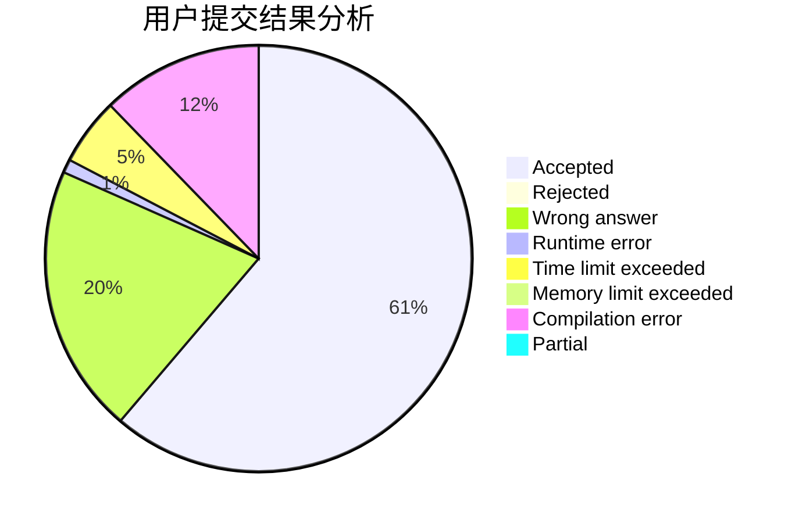
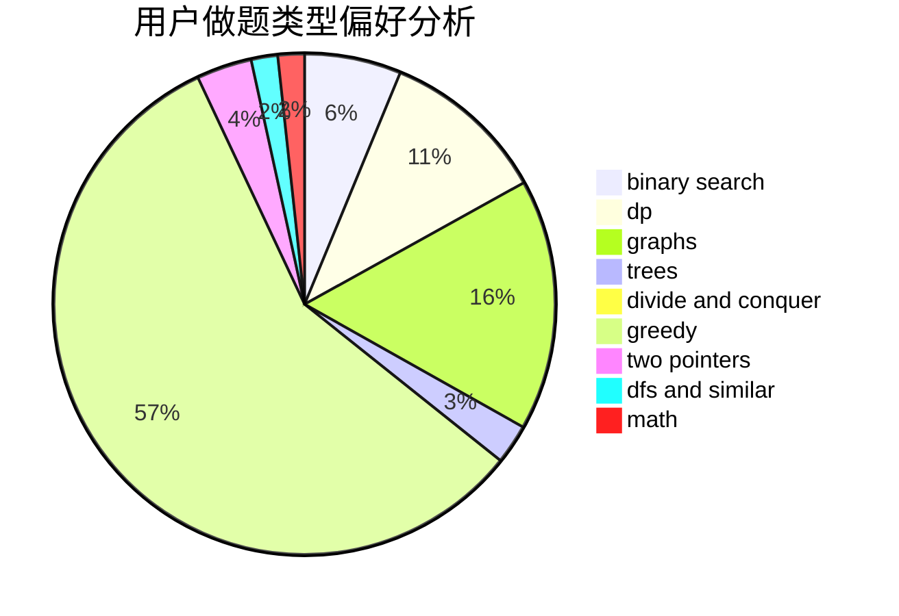

# lzr010506

<!-- tabs:start -->

#### **用户提交结果分析**

#### **用户做题类型偏好分析**

<!-- tabs:end -->
# 推荐题目
[110A](https://codeforces.com/contest/110/problem/A)
[1329C](https://codeforces.com/contest/1329/problem/C)
[1055E](https://codeforces.com/contest/1055/problem/E)
[1324F](https://codeforces.com/contest/1324/problem/F)
[1264A](https://codeforces.com/contest/1264/problem/A)
[593D](https://codeforces.com/contest/593/problem/D)
[724C](https://codeforces.com/contest/724/problem/C)
[1294A](https://codeforces.com/contest/1294/problem/A)
[682B](https://codeforces.com/contest/682/problem/B)
[494D](https://codeforces.com/contest/494/problem/D)
