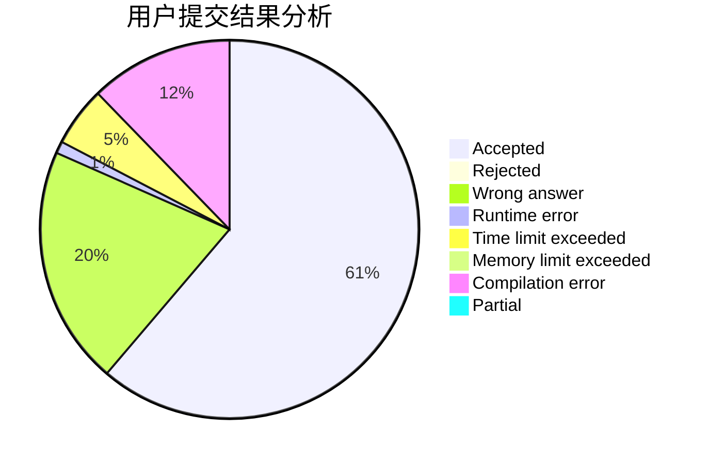
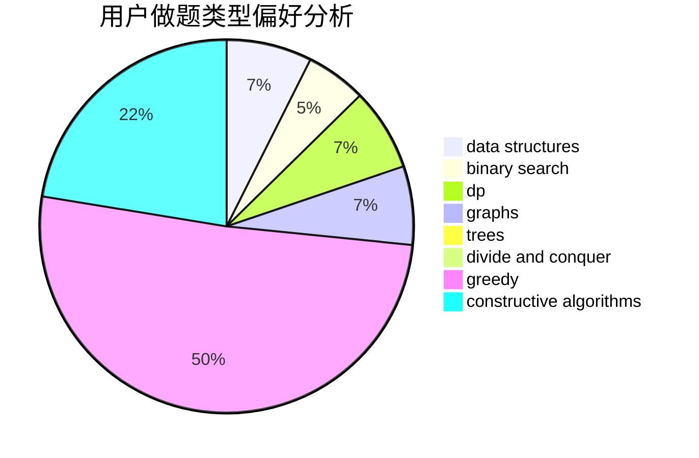

# lzr010506

<!-- tabs:start -->

#### **用户提交结果分析**

#### **用户做题类型偏好分析**

#### **用户错题知识点分析**

<!-- tabs:end -->
# 推荐题目
[1109D](https://codeforces.com/contest/1109/problem/D)		brute force,
                        combinatorics,
                        dp,
                        math,
                        trees		  
[1322D](https://codeforces.com/contest/1322/problem/D)		bitmasks,
                        dp		  
[1055B](https://codeforces.com/contest/1055/problem/B)		dsu,
                        implementation		  
[1315A](https://codeforces.com/contest/1315/problem/A)		implementation		  
[1257A](https://codeforces.com/contest/1257/problem/A)		greedy,
                        math		  
[573E](https://codeforces.com/contest/573/problem/E)		data structures,
                        greedy		  
[705B](https://codeforces.com/contest/705/problem/B)		games,
                        math		  
[1286D](https://codeforces.com/contest/1286/problem/D)		data structures,
                        math,
                        matrices,
                        probabilities		  
[662B](https://codeforces.com/contest/662/problem/B)		dfs and similar,
                        graphs		  
[475F](https://codeforces.com/contest/475/problem/F)		data structures		  
