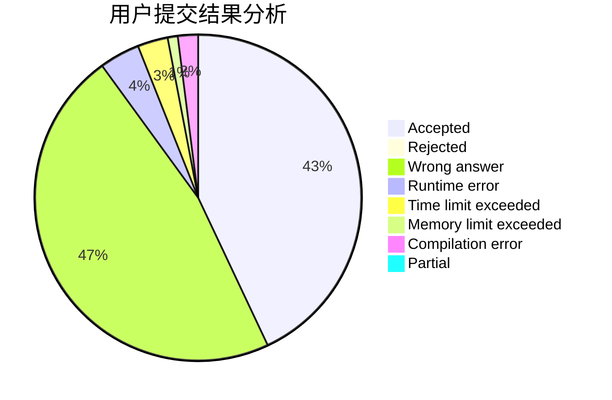
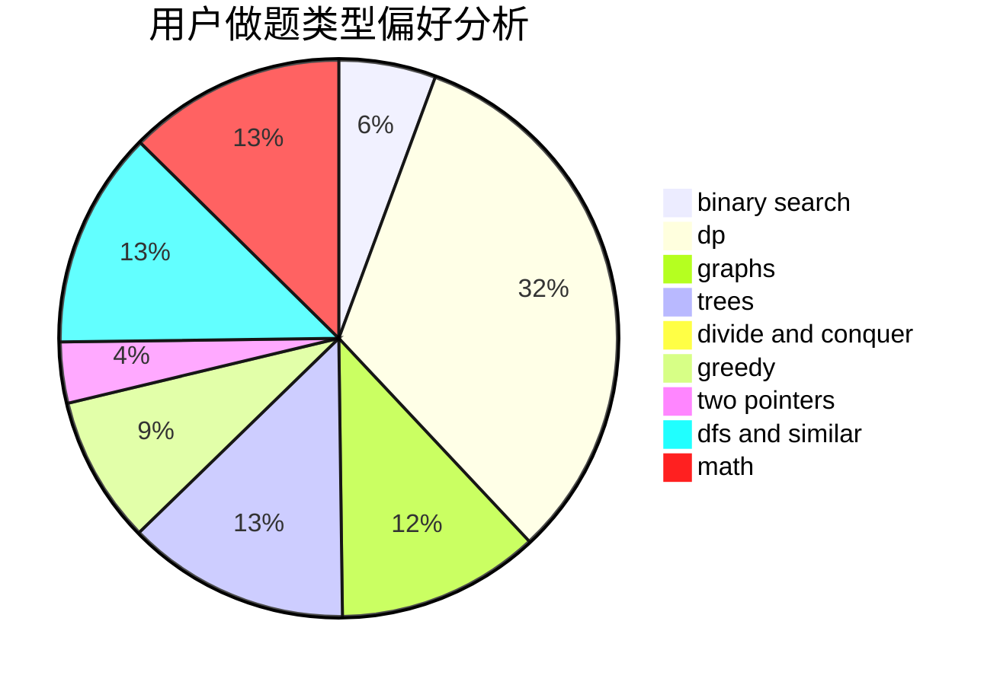

# lzr_010506

<!-- tabs:start -->

#### **用户提交结果分析**

#### **用户做题类型偏好分析**

<!-- tabs:end -->
# 推荐题目
[786D](https://codeforces.com/contest/786/problem/D)
[875F](https://codeforces.com/contest/875/problem/F)
[513C](https://codeforces.com/contest/513/problem/C)
[1223F](https://codeforces.com/contest/1223/problem/F)
[1361A](https://codeforces.com/contest/1361/problem/A)
[827F](https://codeforces.com/contest/827/problem/F)
[816E](https://codeforces.com/contest/816/problem/E)
[11722](https://codeforces.com/contest/1172/problem/2)
[297D](https://codeforces.com/contest/297/problem/D)
[1505G](https://codeforces.com/contest/1505/problem/G)
