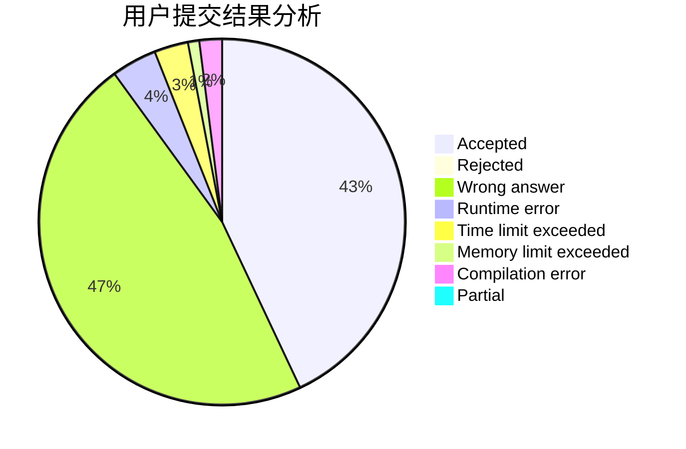
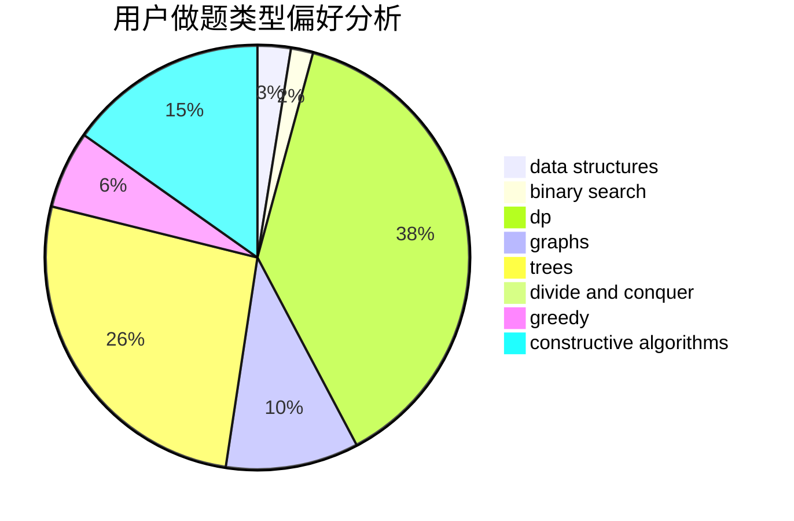
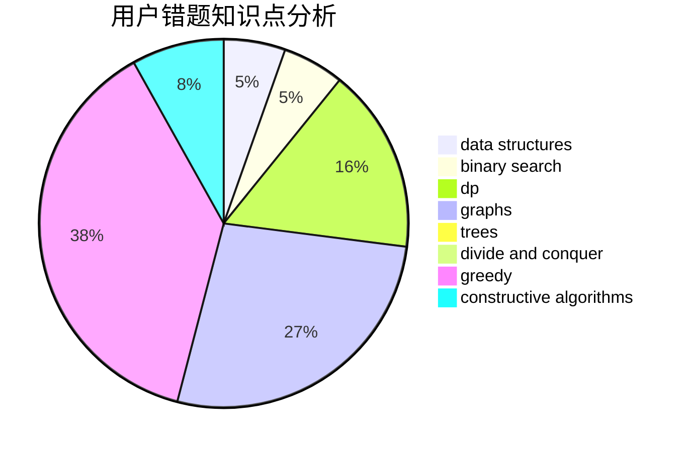

# lzr_010506

<!-- tabs:start -->

#### **用户提交结果分析**

#### **用户做题类型偏好分析**

#### **用户错题知识点分析**

<!-- tabs:end -->
# 推荐题目
[786D](https://codeforces.com/contest/786/problem/D)		data structures,
                        dfs and similar,
                        hashing,
                        strings,
                        trees		  
[875F](https://codeforces.com/contest/875/problem/F)		dsu,
                        graphs,
                        greedy		  
[513C](https://codeforces.com/contest/513/problem/C)		bitmasks,
                        probabilities		  
[1223F](https://codeforces.com/contest/1223/problem/F)		data structures,
                        divide and conquer,
                        dp,
                        hashing		  
[1361A](https://codeforces.com/contest/1361/problem/A)		constructive algorithms,
                        graphs,
                        greedy,
                        sortings		  
[827F](https://codeforces.com/contest/827/problem/F)		data structures,
                        dp,
                        graphs,
                        shortest paths		  
[816E](https://codeforces.com/contest/816/problem/E)		dsu,graphs,sortings,trees		  
[11722](https://codeforces.com/contest/1172/problem/2)		dsu,graphs,sortings,trees		  
[297D](https://codeforces.com/contest/297/problem/D)		constructive algorithms		  
[1505G](https://codeforces.com/contest/1505/problem/G)		implementation		  
