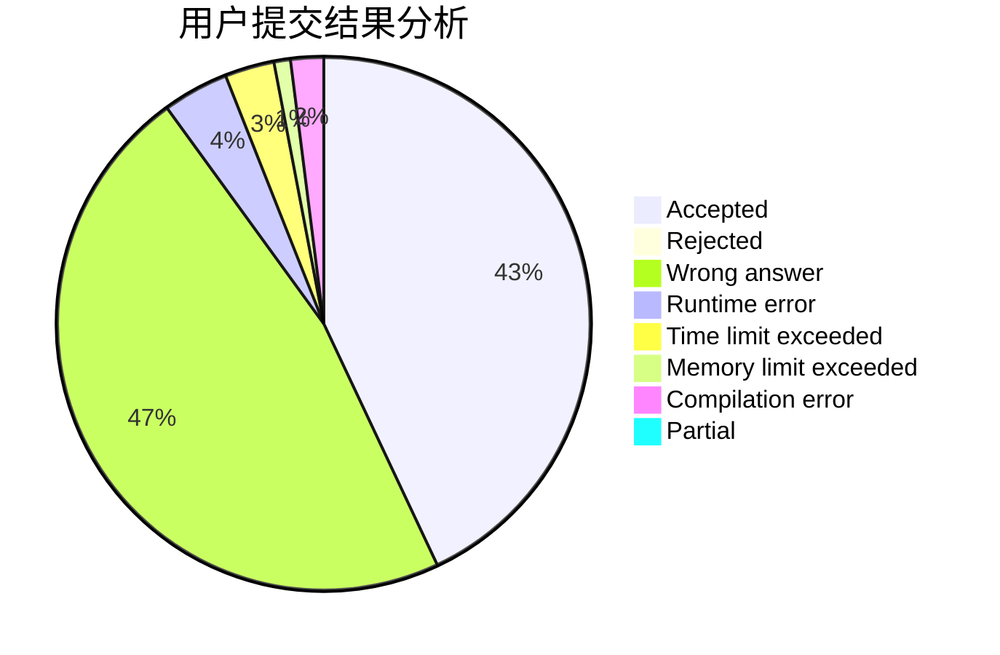
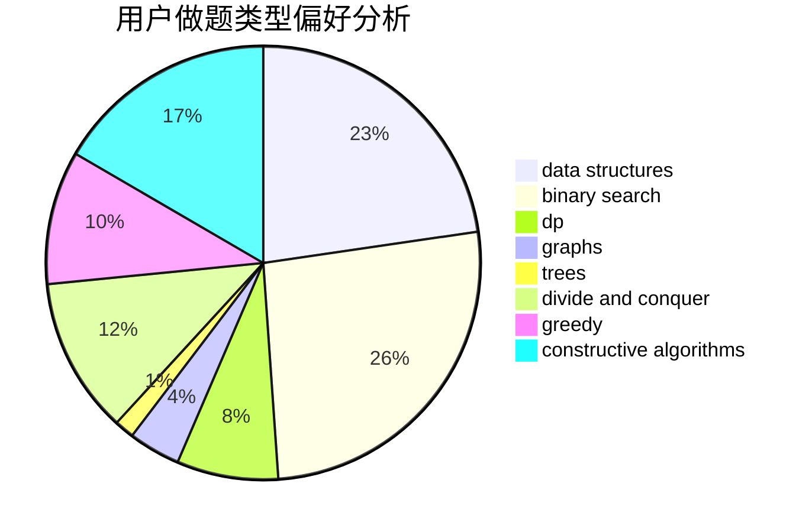
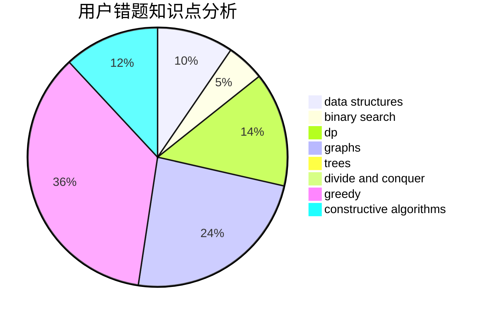

# lzr_010506

<!-- tabs:start -->

#### **用户提交结果分析**

#### **用户做题类型偏好分析**

#### **用户错题知识点分析**

<!-- tabs:end -->
# 推荐题目
[767B](https://codeforces.com/contest/767/problem/B)		brute force,
                        greedy		  
[856F](https://codeforces.com/contest/856/problem/F)		greedy		  
[493E](https://codeforces.com/contest/493/problem/E)		math		  
[1217B](https://codeforces.com/contest/1217/problem/B)		greedy,
                        math		  
[1354D](https://codeforces.com/contest/1354/problem/D)		binary search,
                        data structures		  
[80B](https://codeforces.com/contest/80/problem/B)		geometry,
                        math		  
[802A](https://codeforces.com/contest/802/problem/A)		greedy		  
[1167C](https://codeforces.com/contest/1167/problem/C)		dfs and similar,
                        dsu,
                        graphs		  
[281D](https://codeforces.com/contest/281/problem/D)		dsu,graphs,sortings,trees		  
[1497A](https://codeforces.com/contest/1497/problem/A)		brute force,
                        data structures,
                        greedy,
                        sortings		  
