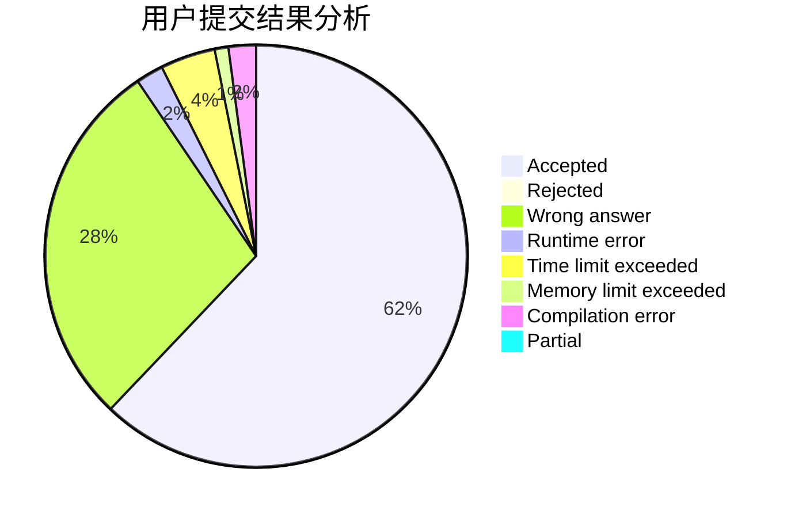
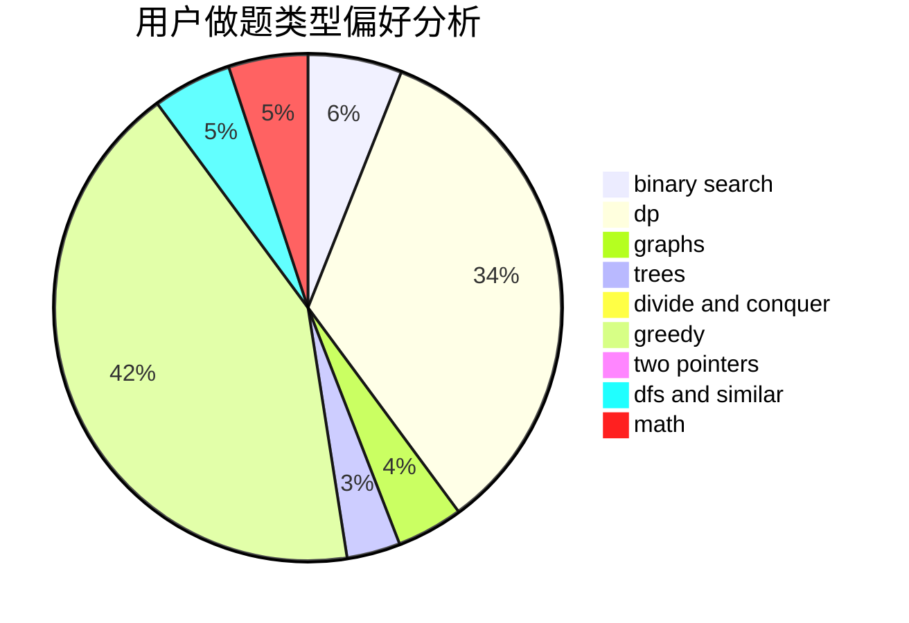

# lzyrapx

<!-- tabs:start -->

#### **用户提交结果分析**

#### **用户做题类型偏好分析**

<!-- tabs:end -->
# 推荐题目
[1073D](https://codeforces.com/contest/1073/problem/D)
[831F](https://codeforces.com/contest/831/problem/F)
[924D](https://codeforces.com/contest/924/problem/D)
[920E](https://codeforces.com/contest/920/problem/E)
[639D](https://codeforces.com/contest/639/problem/D)
[1070K](https://codeforces.com/contest/1070/problem/K)
[635A](https://codeforces.com/contest/635/problem/A)
[1059D](https://codeforces.com/contest/1059/problem/D)
[366D](https://codeforces.com/contest/366/problem/D)
[997E](https://codeforces.com/contest/997/problem/E)
