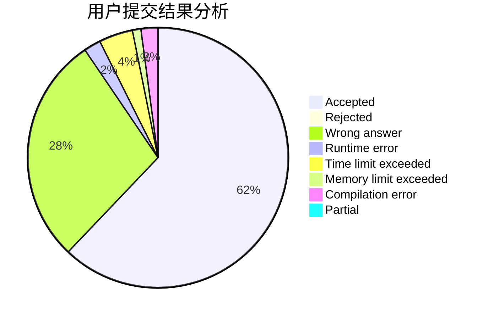
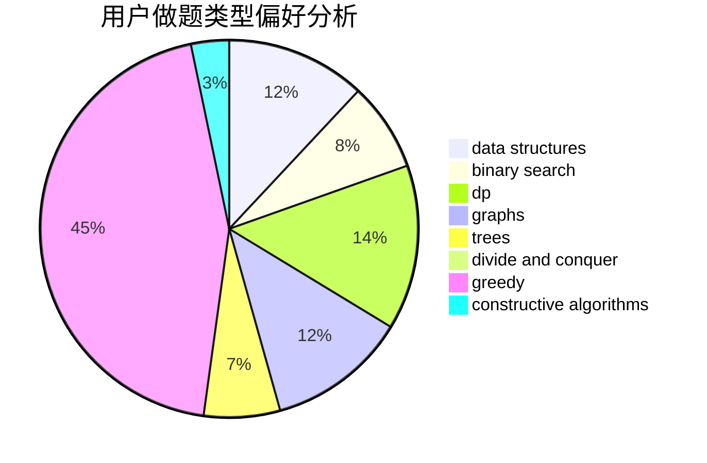
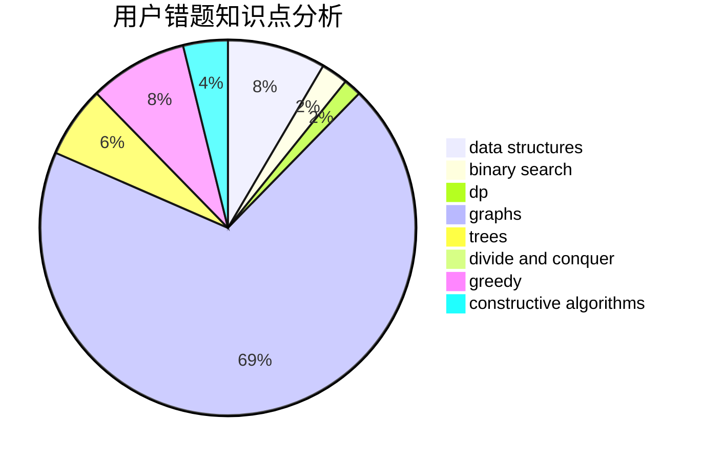

# lzyrapx

<!-- tabs:start -->

#### **用户提交结果分析**

#### **用户做题类型偏好分析**

#### **用户错题知识点分析**

<!-- tabs:end -->
# 推荐题目
[1073A](https://codeforces.com/contest/1073/problem/A)		implementation,
                        strings		  
[813D](https://codeforces.com/contest/813/problem/D)		dp,
                        flows		  
[909F](https://codeforces.com/contest/909/problem/F)		constructive algorithms		  
[907A](https://codeforces.com/contest/907/problem/A)		brute force,
                        implementation		  
[618E](https://codeforces.com/contest/618/problem/E)		data structures,
                        geometry		  
[1070H](https://codeforces.com/contest/1070/problem/H)		brute force,
                        implementation		  
[617B](https://codeforces.com/contest/617/problem/B)		combinatorics		  
[1059A](https://codeforces.com/contest/1059/problem/A)		implementation		  
[339D](https://codeforces.com/contest/339/problem/D)		data structures,
                        trees		  
[982B](https://codeforces.com/contest/982/problem/B)		data structures,
                        greedy,
                        implementation		  
