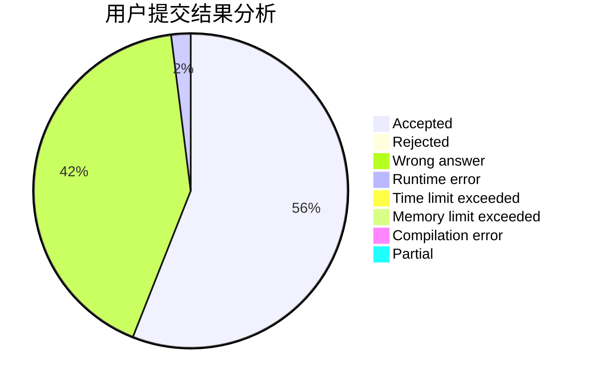
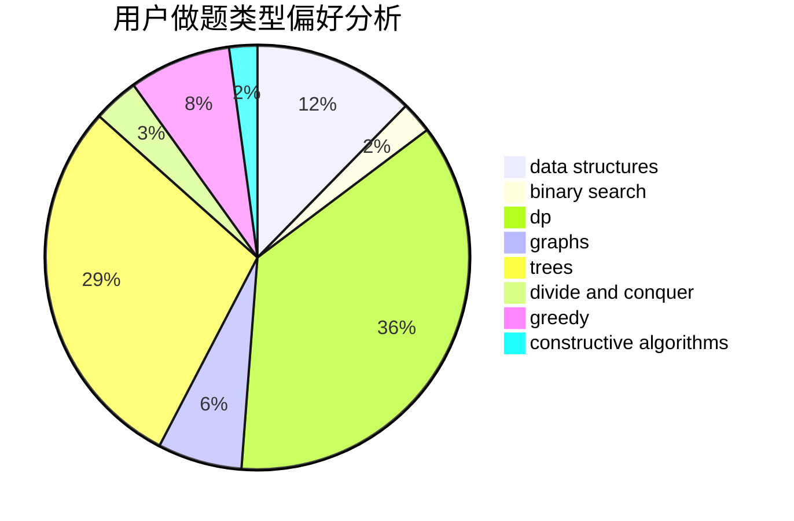
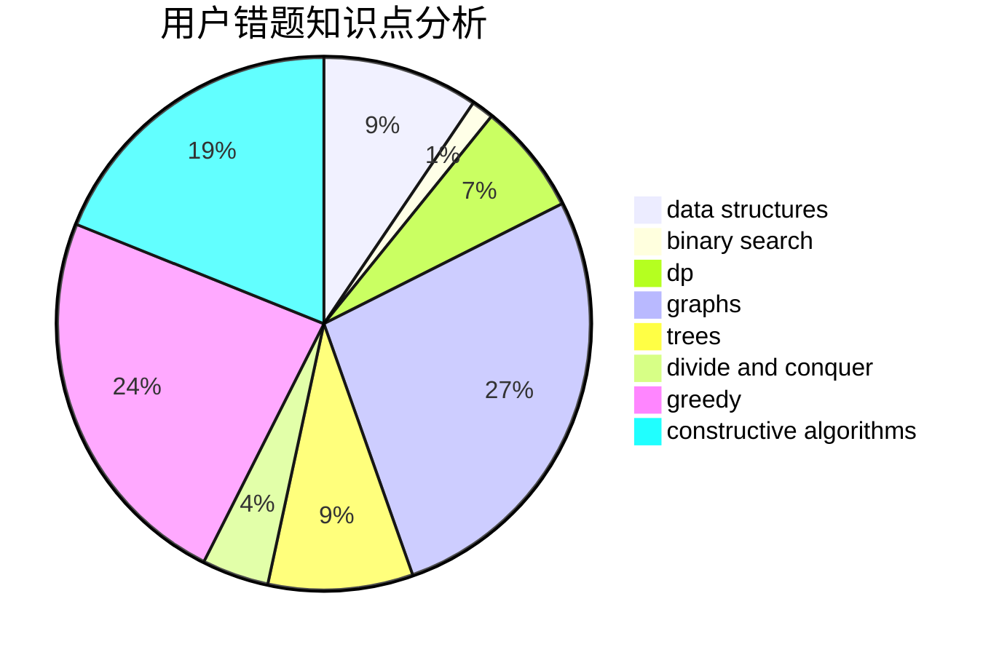

# maebyyyy

<!-- tabs:start -->

#### **用户提交结果分析**

#### **用户做题类型偏好分析**

#### **用户错题知识点分析**

<!-- tabs:end -->
# 推荐题目
[421A](https://codeforces.com/contest/421/problem/A)		constructive algorithms,
                        implementation		  
[94C](https://codeforces.com/contest/94/problem/C)		dsu,graphs,sortings,trees		  
[182D](https://codeforces.com/contest/182/problem/D)		brute force,
                        hashing,
                        implementation,
                        math,
                        strings		  
[976A](https://codeforces.com/contest/976/problem/A)		implementation		  
[551B](https://codeforces.com/contest/551/problem/B)		brute force,
                        constructive algorithms,
                        implementation,
                        strings		  
[1030A](https://codeforces.com/contest/1030/problem/A)		implementation		  
[1423C](https://codeforces.com/contest/1423/problem/C)		divide and conquer,
                        graphs,
                        trees		  
[1336D](https://codeforces.com/contest/1336/problem/D)		constructive algorithms,
                        interactive		  
[820C](https://codeforces.com/contest/820/problem/C)		dsu,graphs,sortings,trees		  
[1129E](https://codeforces.com/contest/1129/problem/E)		binary search,
                        interactive,
                        trees		  
