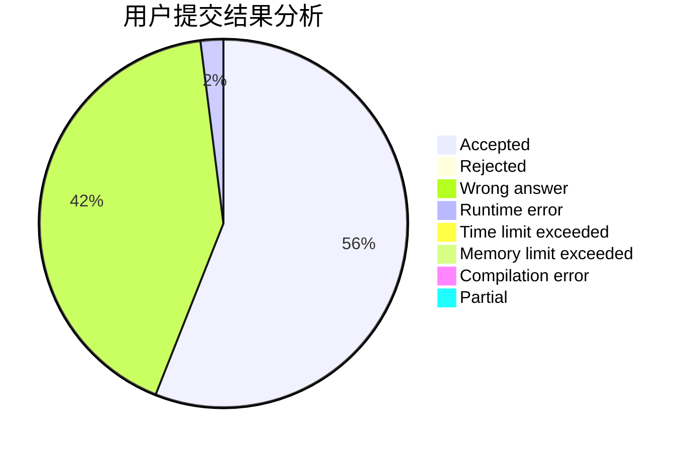
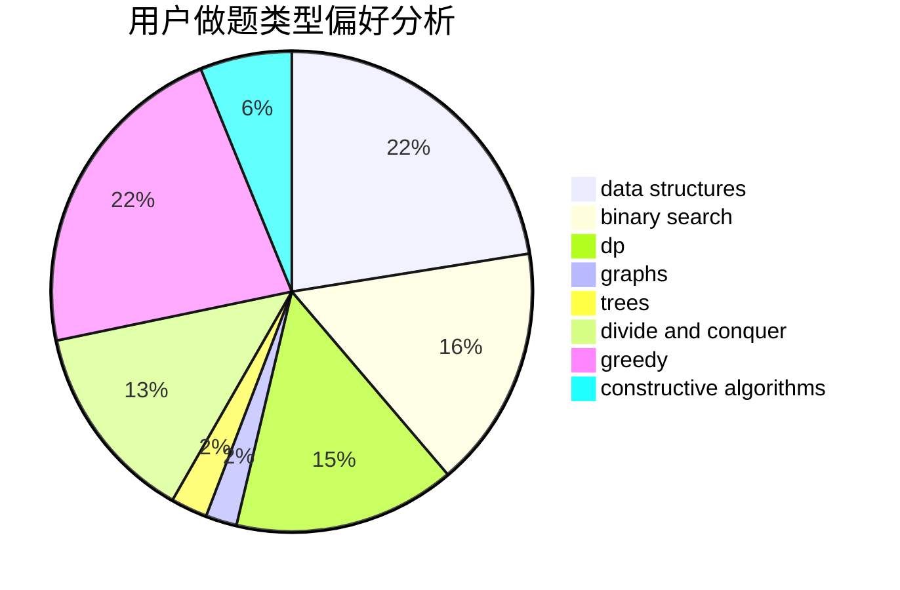
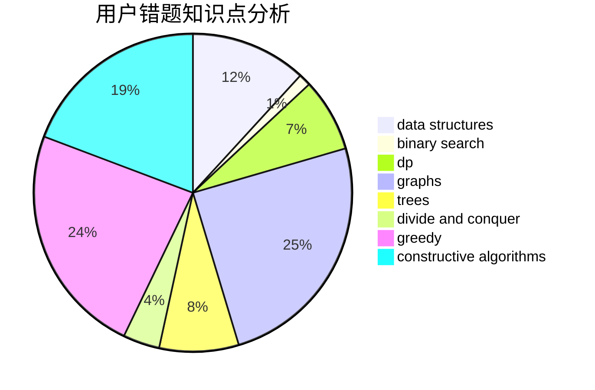

# maebyyyy

<!-- tabs:start -->

#### **用户提交结果分析**

#### **用户做题类型偏好分析**

#### **用户错题知识点分析**

<!-- tabs:end -->
# 推荐题目
[392B](https://codeforces.com/contest/392/problem/B)		dp		  
[930A](https://codeforces.com/contest/930/problem/A)		dfs and similar,
                        graphs,
                        trees		  
[15C](https://codeforces.com/contest/15/problem/C)		games		  
[954B](https://codeforces.com/contest/954/problem/B)		implementation,
                        strings		  
[527B](https://codeforces.com/contest/527/problem/B)		greedy		  
[1029F](https://codeforces.com/contest/1029/problem/F)		binary search,
                        brute force,
                        math,
                        number theory		  
[1413F](https://codeforces.com/contest/1413/problem/F)		data structures,
                        trees		  
[1330D](https://codeforces.com/contest/1330/problem/D)		dsu,graphs,sortings,trees		  
[804D](https://codeforces.com/contest/804/problem/D)		binary search,
                        brute force,
                        dfs and similar,
                        dp,
                        sortings,
                        trees		  
[1120A](https://codeforces.com/contest/1120/problem/A)		greedy,
                        implementation,
                        two pointers		  
