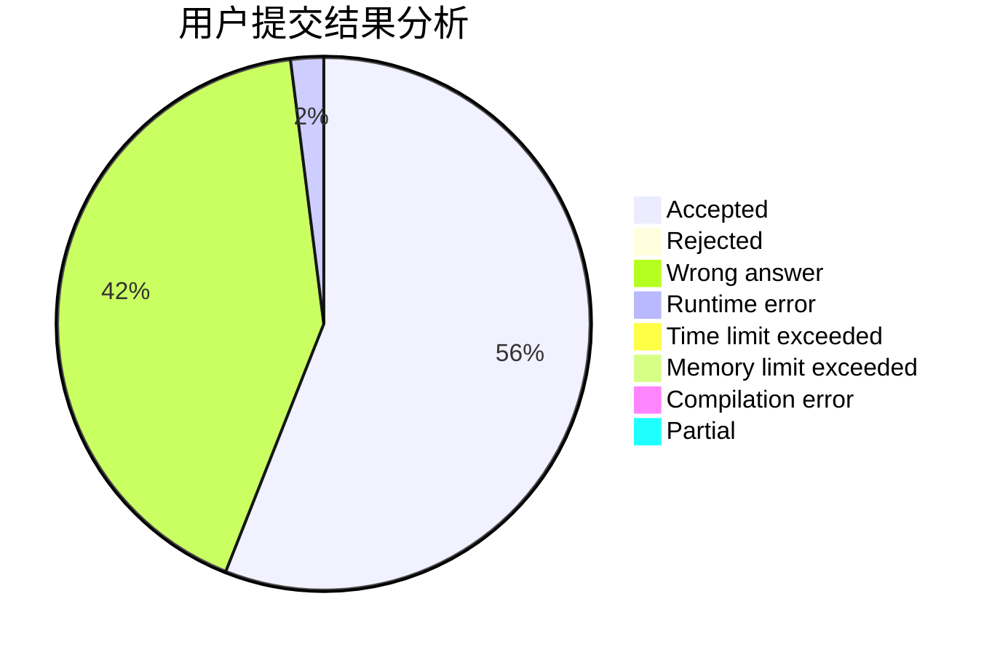
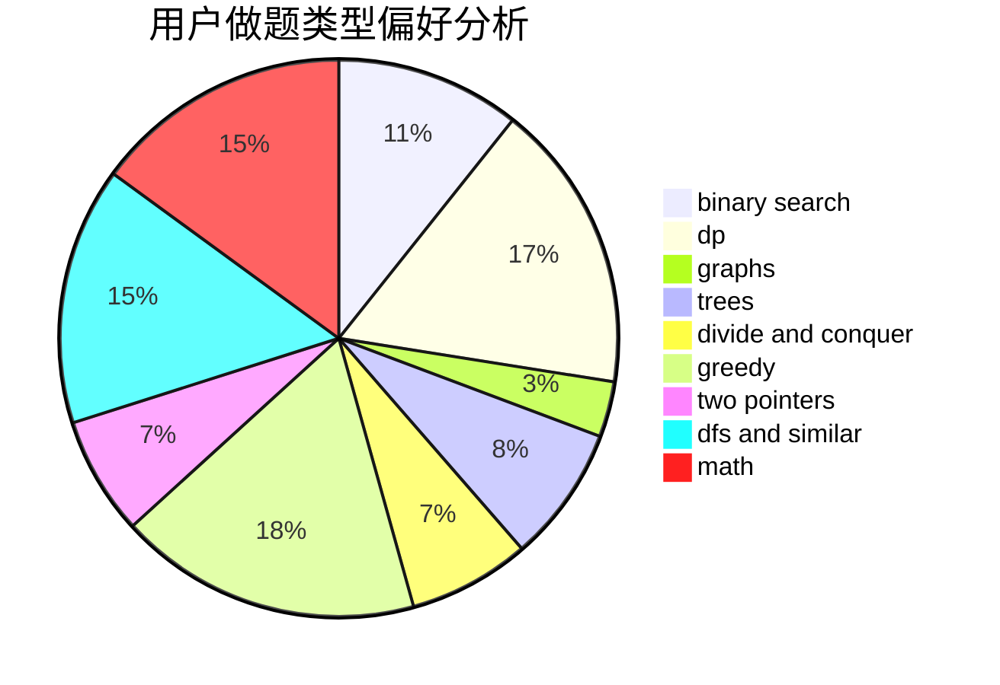

# maebyyyy

<!-- tabs:start -->

#### **用户提交结果分析**

#### **用户做题类型偏好分析**

<!-- tabs:end -->
# 推荐题目
[421A](https://codeforces.com/contest/421/problem/A)
[94C](https://codeforces.com/contest/94/problem/C)
[182D](https://codeforces.com/contest/182/problem/D)
[976A](https://codeforces.com/contest/976/problem/A)
[551B](https://codeforces.com/contest/551/problem/B)
[1030A](https://codeforces.com/contest/1030/problem/A)
[1423C](https://codeforces.com/contest/1423/problem/C)
[1336D](https://codeforces.com/contest/1336/problem/D)
[820C](https://codeforces.com/contest/820/problem/C)
[1129E](https://codeforces.com/contest/1129/problem/E)
