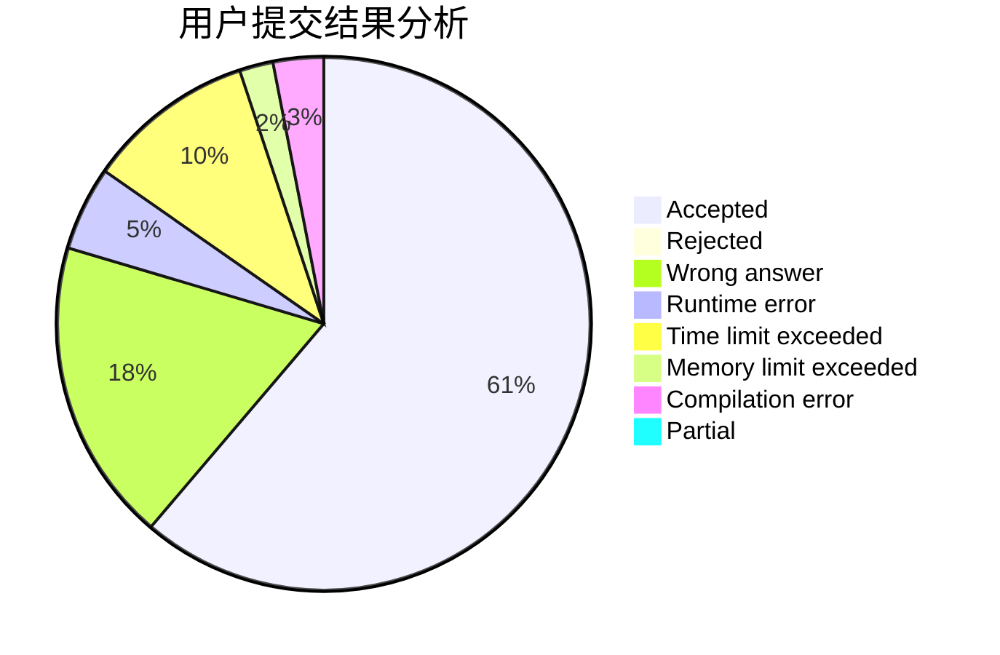
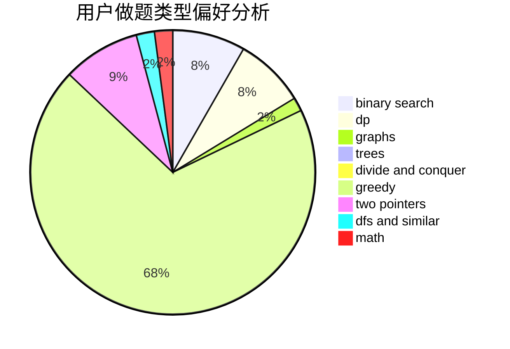

# maggch

<!-- tabs:start -->

#### **用户提交结果分析**

#### **用户做题类型偏好分析**

<!-- tabs:end -->
# 推荐题目
[630F](https://codeforces.com/contest/630/problem/F)
[198C](https://codeforces.com/contest/198/problem/C)
[1053B](https://codeforces.com/contest/1053/problem/B)
[274A](https://codeforces.com/contest/274/problem/A)
[12B](https://codeforces.com/contest/12/problem/B)
[821D](https://codeforces.com/contest/821/problem/D)
[345A](https://codeforces.com/contest/345/problem/A)
[442D](https://codeforces.com/contest/442/problem/D)
[623A](https://codeforces.com/contest/623/problem/A)
[1030C](https://codeforces.com/contest/1030/problem/C)
