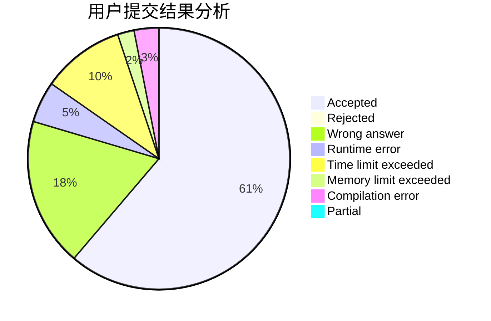
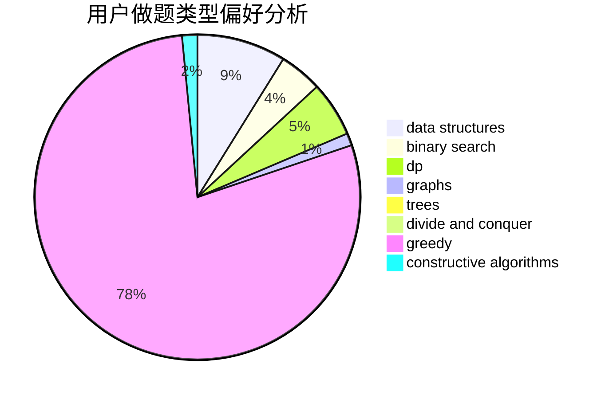
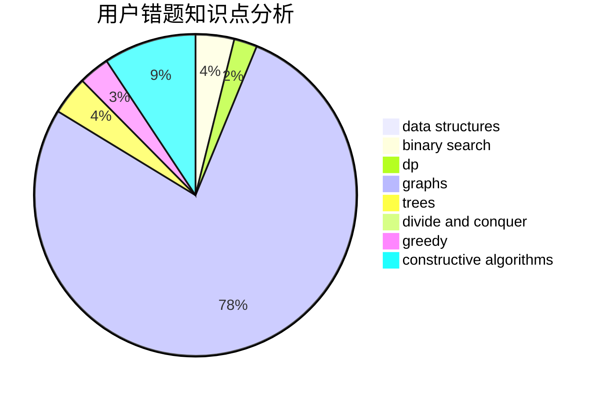

# maggch

<!-- tabs:start -->

#### **用户提交结果分析**

#### **用户做题类型偏好分析**

#### **用户错题知识点分析**

<!-- tabs:end -->
# 推荐题目
[630F](https://codeforces.com/contest/630/problem/F)		combinatorics,
                        math		  
[198C](https://codeforces.com/contest/198/problem/C)		binary search,
                        geometry		  
[1053B](https://codeforces.com/contest/1053/problem/B)		dsu,graphs,sortings,trees		  
[274A](https://codeforces.com/contest/274/problem/A)		binary search,
                        greedy,
                        sortings		  
[12B](https://codeforces.com/contest/12/problem/B)		implementation,
                        sortings		  
[821D](https://codeforces.com/contest/821/problem/D)		dfs and similar,
                        graphs,
                        shortest paths		  
[345A](https://codeforces.com/contest/345/problem/A)		*special problem,
                        probabilities		  
[442D](https://codeforces.com/contest/442/problem/D)		data structures,
                        trees		  
[623A](https://codeforces.com/contest/623/problem/A)		constructive algorithms,
                        graphs		  
[1030C](https://codeforces.com/contest/1030/problem/C)		implementation		  
