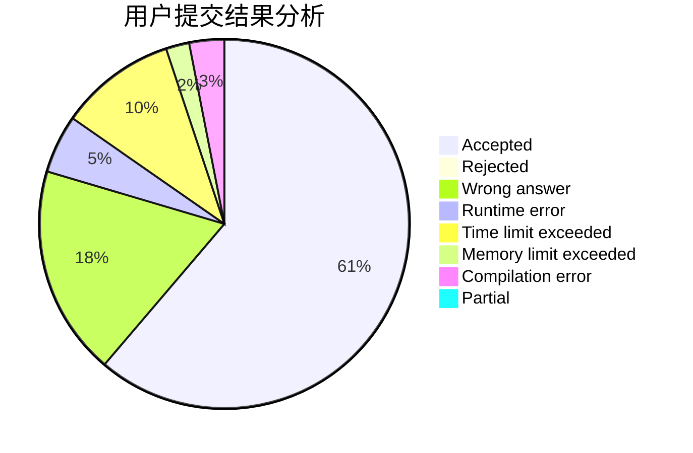
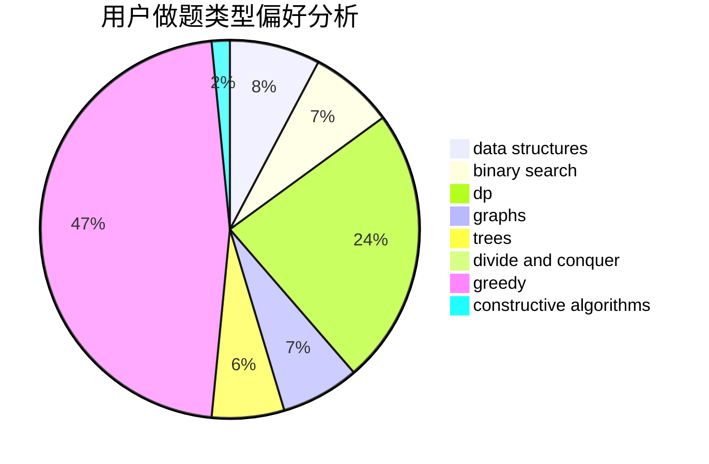
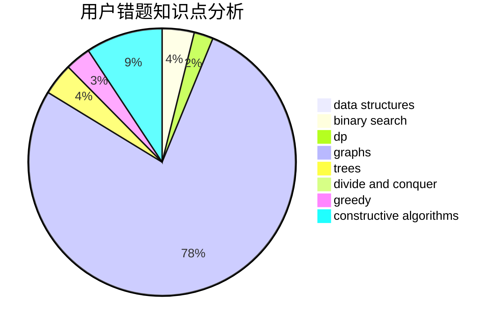

# maggch

<!-- tabs:start -->

#### **用户提交结果分析**

#### **用户做题类型偏好分析**

#### **用户错题知识点分析**

<!-- tabs:end -->
# 推荐题目
[611C](https://codeforces.com/contest/611/problem/C)		dp,
                        implementation		  
[171C](https://codeforces.com/contest/171/problem/C)		*special problem,
                        implementation		  
[1051F](https://codeforces.com/contest/1051/problem/F)		graphs,
                        shortest paths,
                        trees		  
[255D](https://codeforces.com/contest/255/problem/D)		binary search,
                        implementation,
                        math		  
[1293A](https://codeforces.com/contest/1293/problem/A)		binary search,
                        brute force,
                        implementation		  
[805C](https://codeforces.com/contest/805/problem/C)		dsu,graphs,sortings,trees		  
[316G2](https://codeforces.com/contest/316G/problem/2)		string suffix structures		  
[417E](https://codeforces.com/contest/417/problem/E)		constructive algorithms,
                        math,
                        probabilities		  
[605A](https://codeforces.com/contest/605/problem/A)		constructive algorithms,
                        greedy		  
[102B](https://codeforces.com/contest/102/problem/B)		implementation		  
