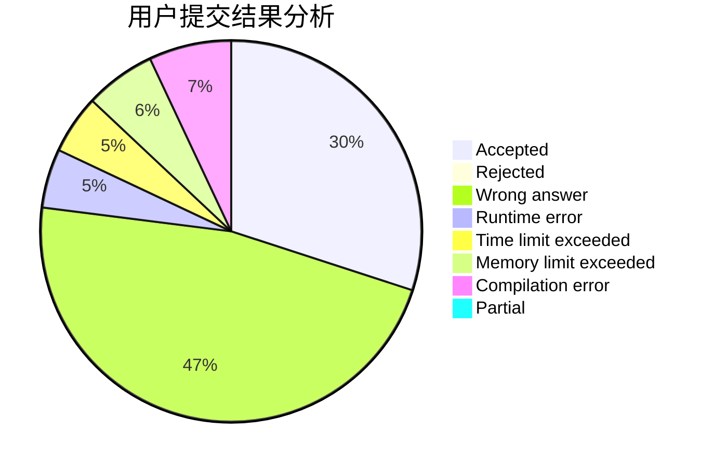
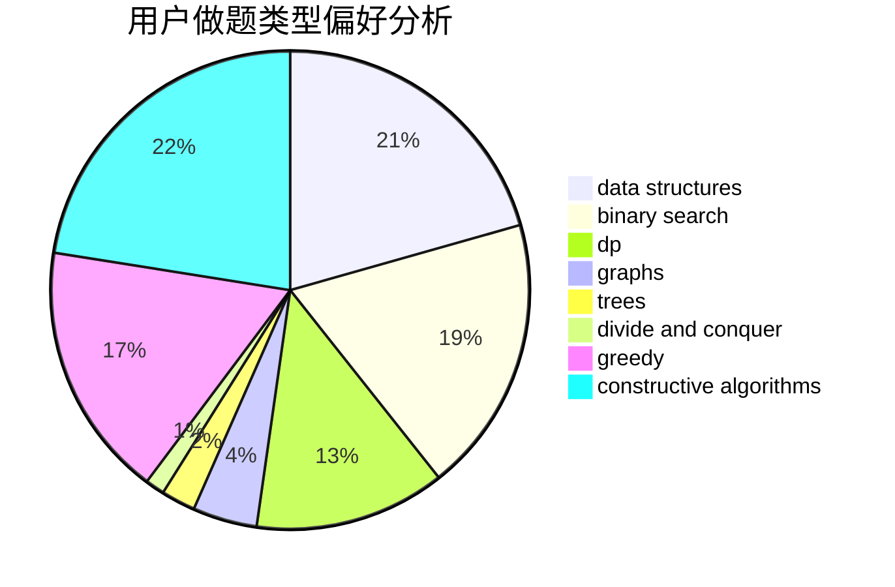
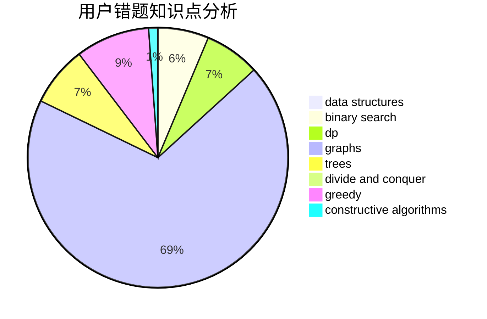

# maojiayi

<!-- tabs:start -->

#### **用户提交结果分析**

#### **用户做题类型偏好分析**

#### **用户错题知识点分析**

<!-- tabs:end -->
# 推荐题目
[1166A](https://codeforces.com/contest/1166/problem/A)		combinatorics,
                        greedy		  
[1059B](https://codeforces.com/contest/1059/problem/B)		implementation		  
[160A](https://codeforces.com/contest/160/problem/A)		greedy,
                        sortings		  
[158A](https://codeforces.com/contest/158/problem/A)		*special problem,
                        implementation		  
[820D](https://codeforces.com/contest/820/problem/D)		dsu,graphs,sortings,trees		  
[855F](https://codeforces.com/contest/855/problem/F)		binary search,
                        data structures		  
[810A](https://codeforces.com/contest/810/problem/A)		implementation,
                        math		  
[1251B](https://codeforces.com/contest/1251/problem/B)		greedy,
                        strings		  
[708C](https://codeforces.com/contest/708/problem/C)		data structures,
                        dfs and similar,
                        dp,
                        graphs,
                        greedy,
                        trees		  
[893D](https://codeforces.com/contest/893/problem/D)		data structures,
                        dp,
                        greedy,
                        implementation		  
