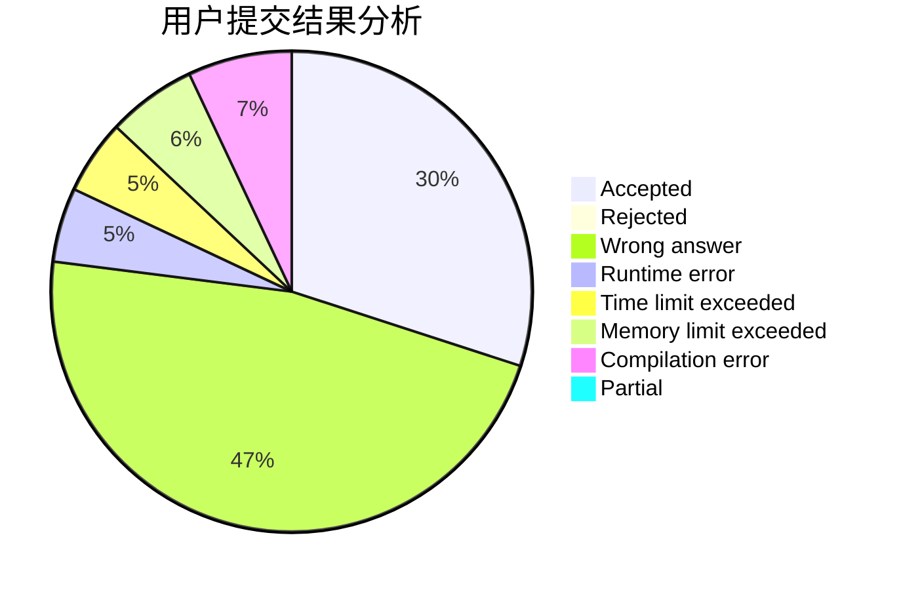
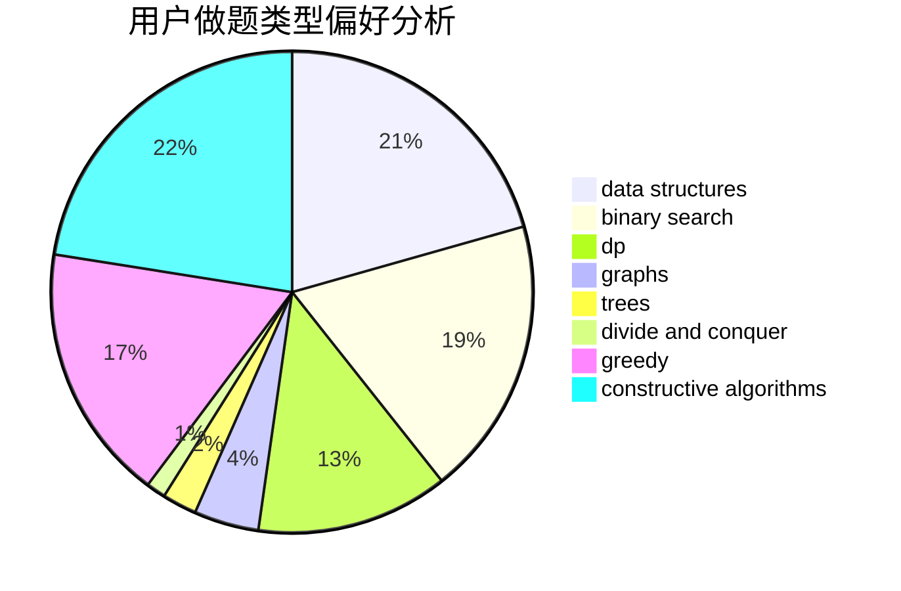
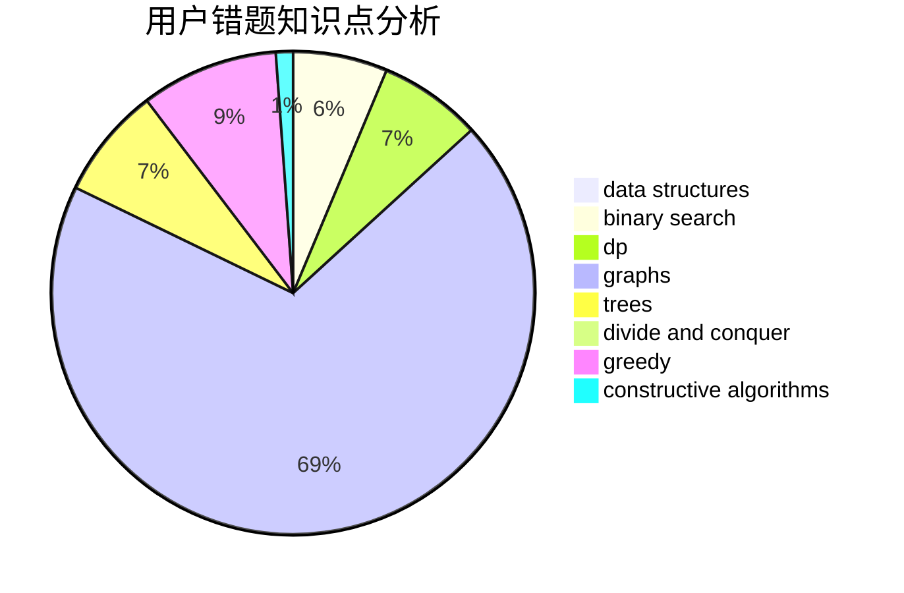

# maojiayi
<!-- tabs:start -->
#### **用户提交结果分析**

#### **用户做题类型偏好分析**

#### **用户错题知识点分析**

<!-- tabs:end -->
# 推荐题目
[Binary Palindromes](http://codeforces.com/problemset/problem/1251/B)		greedy,
                        strings		  
[Silent Classroom](http://codeforces.com/problemset/problem/1166/A)		combinatorics,
                        greedy		  
[Learning Languages](https://codeforces.com/contest/278/problem/C)		dfs and similar,
                        dsu		  
[Forgery](http://codeforces.com/problemset/problem/1059/B)		implementation		  
[GCD of Polynomials](https://codeforces.com/contest/902/problem/D)		constructive algorithms,
                        math		  
[Mister B and PR Shifts](https://codeforces.com/contest/820/problem/D)		data structures,
                        implementation,
                        math		  
[Credit Card](http://codeforces.com/problemset/problem/893/D)		data structures,
                        dp,
                        greedy,
                        implementation		  
[Robot Vacuum Cleaner](http://codeforces.com/problemset/problem/922/D)		greedy,
                        sortings		  
[Winning Strategy](http://codeforces.com/problemset/problem/97/C)		binary search,
                        graphs,
                        math,
                        shortest paths		  
[The Unbearable Lightness of Weights](https://codeforces.com/contest/1078/problem/B)		dp,
                        math		  
<!-- tabs:start -->
#### **data structures**
[Binary Palindromes](https://codeforces.com/contest/820/problem/D)		data structures,
                        implementation,
                        math		  
[Silent Classroom](http://codeforces.com/problemset/problem/893/D)		data structures,
                        dp,
                        greedy,
                        implementation		  
[Learning Languages](http://codeforces.com/problemset/problem/855/F)		binary search,
                        data structures		  
[Forgery](http://codeforces.com/problemset/problem/1344/E)		data structures,
                        trees		  
[GCD of Polynomials](http://codeforces.com/problemset/problem/195/B)		data structures,
                        implementation,
                        math		  
[Mister B and PR Shifts](http://codeforces.com/problemset/problem/1446/F)		binary search,
                        data structures,
                        geometry		  
[Credit Card](http://codeforces.com/problemset/problem/420/D)		data structures		  
[Robot Vacuum Cleaner](http://codeforces.com/problemset/problem/1060/G)		data structures		  
[Winning Strategy](http://codeforces.com/problemset/problem/1491/I)		brute force,
                        data structures		  
[The Unbearable Lightness of Weights](http://codeforces.com/problemset/problem/573/E)		data structures,
                        greedy		  
#### **binary search**
[Binary Palindromes](http://codeforces.com/problemset/problem/97/C)		binary search,
                        graphs,
                        math,
                        shortest paths		  
[Silent Classroom](http://codeforces.com/problemset/problem/855/F)		binary search,
                        data structures		  
[Learning Languages](http://codeforces.com/problemset/problem/1279/F)		binary search,
                        dp		  
[Forgery](https://codeforces.com/contest/966/problem/B)		binary search,
                        implementation,
                        sortings		  
[GCD of Polynomials](http://codeforces.com/problemset/problem/1238/D)		binary search,
                        combinatorics,
                        dp,
                        strings		  
[Mister B and PR Shifts](http://codeforces.com/problemset/problem/553/D)		binary search,
                        graphs,
                        greedy		  
[Credit Card](http://codeforces.com/problemset/problem/1446/F)		binary search,
                        data structures,
                        geometry		  
[Robot Vacuum Cleaner](https://codeforces.com/contest/672/problem/D)		binary search,
                        greedy		  
[Winning Strategy](http://codeforces.com/problemset/problem/1203/D2)		binary search,
                        greedy,
                        implementation,
                        two pointers		  
[The Unbearable Lightness of Weights](http://codeforces.com/problemset/problem/1466/I)		binary search,
                        data structures,
                        data structures,
                        interactive		  
#### **dp**
[Binary Palindromes](http://codeforces.com/problemset/problem/893/D)		data structures,
                        dp,
                        greedy,
                        implementation		  
[Silent Classroom](https://codeforces.com/contest/1078/problem/B)		dp,
                        math		  
[Learning Languages](http://codeforces.com/problemset/problem/1279/F)		binary search,
                        dp		  
[Forgery](http://codeforces.com/problemset/problem/794/G)		combinatorics,
                        dp,
                        math		  
[GCD of Polynomials](http://codeforces.com/problemset/problem/1238/D)		binary search,
                        combinatorics,
                        dp,
                        strings		  
[Mister B and PR Shifts](http://codeforces.com/problemset/problem/1200/B)		dp,
                        greedy		  
[Credit Card](http://codeforces.com/problemset/problem/375/E)		dp,
                        implementation,
                        math		  
[Robot Vacuum Cleaner](http://codeforces.com/problemset/problem/758/D)		constructive algorithms,
                        dp,
                        greedy,
                        math,
                        strings		  
[Winning Strategy](http://codeforces.com/problemset/problem/1194/F)		combinatorics,
                        dp,
                        number theory,
                        probabilities,
                        two pointers		  
[The Unbearable Lightness of Weights](http://codeforces.com/problemset/problem/708/C)		data structures,
                        dfs and similar,
                        dp,
                        graphs,
                        greedy,
                        trees		  
#### **graph**
[Binary Palindromes](http://codeforces.com/problemset/problem/97/C)		binary search,
                        graphs,
                        math,
                        shortest paths		  
[Silent Classroom](http://codeforces.com/problemset/problem/553/D)		binary search,
                        graphs,
                        greedy		  
[Learning Languages](http://codeforces.com/problemset/problem/788/C)		dfs and similar,
                        graphs,
                        shortest paths		  
[Forgery](http://codeforces.com/problemset/problem/708/C)		data structures,
                        dfs and similar,
                        dp,
                        graphs,
                        greedy,
                        trees		  
[GCD of Polynomials](http://codeforces.com/problemset/problem/1498/E)		brute force,
                        graphs,
                        greedy,
                        interactive,
                        sortings		  
[Mister B and PR Shifts](http://codeforces.com/problemset/problem/1005/F)		brute force,
                        dfs and similar,
                        graphs,
                        shortest paths		  
[Credit Card](http://codeforces.com/problemset/problem/1487/C)		brute force,
                        constructive algorithms,
                        dfs and similar,
                        graphs,
                        greedy,
                        implementation,
                        math		  
[Robot Vacuum Cleaner](http://codeforces.com/problemset/problem/1437/C)		dp,
                        flows,
                        graph matchings,
                        greedy,
                        math,
                        sortings		  
[Winning Strategy](http://codeforces.com/problemset/problem/1470/D)		constructive algorithms,
                        dfs and similar,
                        graph matchings,
                        graphs,
                        greedy		  
[The Unbearable Lightness of Weights](http://codeforces.com/problemset/problem/1476/C)		dp,
                        graphs,
                        greedy		  
#### **trees**
[Binary Palindromes](http://codeforces.com/problemset/problem/1344/E)		data structures,
                        trees		  
[Silent Classroom](http://codeforces.com/problemset/problem/708/C)		data structures,
                        dfs and similar,
                        dp,
                        graphs,
                        greedy,
                        trees		  
[Learning Languages](http://codeforces.com/problemset/problem/176/E)		data structures,
                        dfs and similar,
                        trees		  
[Forgery](http://codeforces.com/problemset/problem/1479/D)		binary search,
                        bitmasks,
                        brute force,
                        data structures,
                        probabilities,
                        trees		  
[GCD of Polynomials](http://codeforces.com/problemset/problem/1511/C)		brute force,
                        data structures,
                        implementation,
                        trees		  
[Mister B and PR Shifts](http://codeforces.com/problemset/problem/1499/F)		combinatorics,
                        dfs and similar,
                        dp,
                        trees		  
[Credit Card](http://codeforces.com/problemset/problem/1491/E)		brute force,
                        dfs and similar,
                        divide and conquer,
                        number theory,
                        trees		  
[Robot Vacuum Cleaner](http://codeforces.com/problemset/problem/1466/D)		data structures,
                        greedy,
                        sortings,
                        trees		  
[Winning Strategy](http://codeforces.com/problemset/problem/1495/D)		combinatorics,
                        dfs and similar,
                        graphs,
                        math,
                        shortest paths,
                        trees		  
[The Unbearable Lightness of Weights](http://codeforces.com/problemset/problem/1303/G)		data structures,
                        divide and conquer,
                        geometry,
                        trees		  
#### **divide and conquer**
[Binary Palindromes](http://codeforces.com/problemset/problem/438/E)		combinatorics,
                        divide and conquer,
                        fft,
                        number theory		  
[Silent Classroom](http://codeforces.com/problemset/problem/414/C)		combinatorics,
                        divide and conquer		  
[Learning Languages](http://codeforces.com/problemset/problem/1461/D)		binary search,
                        brute force,
                        data structures,
                        divide and conquer,
                        implementation,
                        sortings		  
[Forgery](http://codeforces.com/problemset/problem/1466/G)		combinatorics,
                        divide and conquer,
                        hashing,
                        math,
                        string suffix structures,
                        strings		  
[GCD of Polynomials](http://codeforces.com/problemset/problem/1490/D)		dfs and similar,
                        divide and conquer,
                        implementation		  
[Mister B and PR Shifts](https://codeforces.com/contest/1483/problem/C)		data structures,
                        divide and conquer,
                        dp		  
[Credit Card](http://codeforces.com/problemset/problem/1491/E)		brute force,
                        dfs and similar,
                        divide and conquer,
                        number theory,
                        trees		  
[Robot Vacuum Cleaner](http://codeforces.com/problemset/problem/1303/G)		data structures,
                        divide and conquer,
                        geometry,
                        trees		  
[Winning Strategy](http://codeforces.com/problemset/problem/1494/D)		constructive algorithms,
                        data structures,
                        dfs and similar,
                        divide and conquer,
                        dsu,
                        greedy,
                        sortings,
                        trees		  
[The Unbearable Lightness of Weights](http://codeforces.com/problemset/problem/1482/E)		data structures,
                        divide and conquer,
                        dp		  
#### **greedy**
[Binary Palindromes](http://codeforces.com/problemset/problem/1251/B)		greedy,
                        strings		  
[Silent Classroom](http://codeforces.com/problemset/problem/1166/A)		combinatorics,
                        greedy		  
[Learning Languages](http://codeforces.com/problemset/problem/893/D)		data structures,
                        dp,
                        greedy,
                        implementation		  
[Forgery](http://codeforces.com/problemset/problem/922/D)		greedy,
                        sortings		  
[GCD of Polynomials](http://codeforces.com/problemset/problem/946/E)		greedy,
                        implementation		  
[Mister B and PR Shifts](https://codeforces.com/contest/1501/problem/E)		bitmasks,
                        brute force,
                        constructive algorithms,
                        greedy,
                        two pointers		  
[Credit Card](http://codeforces.com/problemset/problem/1092/D1)		greedy,
                        implementation,
                        math		  
[Robot Vacuum Cleaner](http://codeforces.com/problemset/problem/588/A)		greedy		  
[Winning Strategy](http://codeforces.com/problemset/problem/160/A)		greedy,
                        sortings		  
[The Unbearable Lightness of Weights](http://codeforces.com/problemset/problem/553/D)		binary search,
                        graphs,
                        greedy		  
#### **constructive algorithms**
[Binary Palindromes](https://codeforces.com/contest/902/problem/D)		constructive algorithms,
                        math		  
[Silent Classroom](https://codeforces.com/contest/1501/problem/E)		bitmasks,
                        brute force,
                        constructive algorithms,
                        greedy,
                        two pointers		  
[Learning Languages](http://codeforces.com/problemset/problem/732/A)		brute force,
                        constructive algorithms,
                        implementation,
                        math		  
[Forgery](http://codeforces.com/problemset/problem/1334/C)		brute force,
                        constructive algorithms,
                        greedy,
                        math		  
[GCD of Polynomials](http://codeforces.com/problemset/problem/644/B)		*special problem,
                        constructive algorithms,
                        data structures,
                        two pointers		  
[Mister B and PR Shifts](http://codeforces.com/problemset/problem/758/D)		constructive algorithms,
                        dp,
                        greedy,
                        math,
                        strings		  
[Credit Card](http://codeforces.com/problemset/problem/1333/A)		constructive algorithms		  
[Robot Vacuum Cleaner](http://codeforces.com/problemset/problem/1493/A)		constructive algorithms,
                        greedy		  
[Winning Strategy](http://codeforces.com/problemset/problem/1463/D)		binary search,
                        constructive algorithms,
                        greedy,
                        two pointers		  
[The Unbearable Lightness of Weights](https://codeforces.com/contest/1456/problem/B)		bitmasks,
                        brute force,
                        constructive algorithms		  
#### **sortings**
[Binary Palindromes](http://codeforces.com/problemset/problem/922/D)		greedy,
                        sortings		  
[Silent Classroom](https://codeforces.com/contest/966/problem/B)		binary search,
                        implementation,
                        sortings		  
[Learning Languages](http://codeforces.com/problemset/problem/160/A)		greedy,
                        sortings		  
[Forgery](http://codeforces.com/problemset/problem/1498/E)		brute force,
                        graphs,
                        greedy,
                        interactive,
                        sortings		  
[GCD of Polynomials](https://codeforces.com/contest/1496/problem/C)		geometry,
                        greedy,
                        math,
                        sortings		  
[Mister B and PR Shifts](http://codeforces.com/problemset/problem/1495/A)		geometry,
                        greedy,
                        math,
                        sortings		  
[Credit Card](http://codeforces.com/problemset/problem/1497/A)		brute force,
                        data structures,
                        greedy,
                        sortings		  
[Robot Vacuum Cleaner](http://codeforces.com/problemset/problem/1427/A)		math,
                        sortings		  
[Winning Strategy](http://codeforces.com/problemset/problem/1461/D)		binary search,
                        brute force,
                        data structures,
                        divide and conquer,
                        implementation,
                        sortings		  
[The Unbearable Lightness of Weights](http://codeforces.com/problemset/problem/1437/C)		dp,
                        flows,
                        graph matchings,
                        greedy,
                        math,
                        sortings		  
<!-- tabs:end -->
