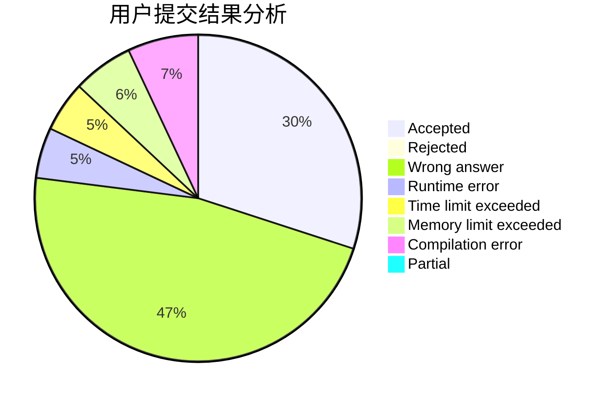
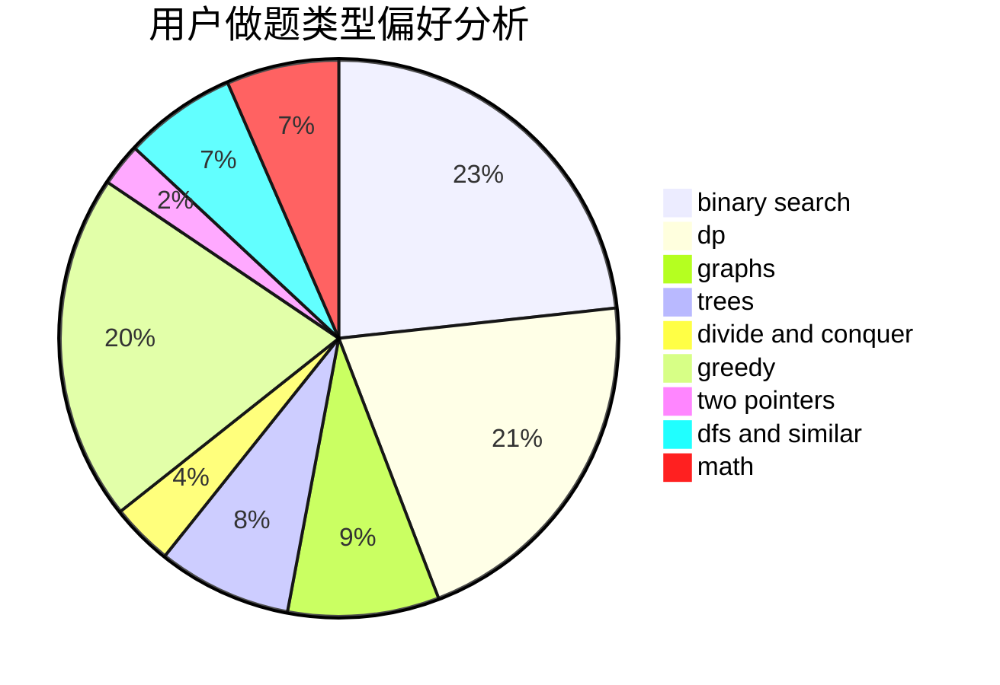

# maojiayi

<!-- tabs:start -->

#### **用户提交结果分析**

#### **用户做题类型偏好分析**

<!-- tabs:end -->
# 推荐题目
[1168E](https://codeforces.com/contest/1168/problem/E)
[1059E](https://codeforces.com/contest/1059/problem/E)
[183D](https://codeforces.com/contest/183/problem/D)
[17C](https://codeforces.com/contest/17/problem/C)
[840D](https://codeforces.com/contest/840/problem/D)
[875A](https://codeforces.com/contest/875/problem/A)
[828A](https://codeforces.com/contest/828/problem/A)
[1256C](https://codeforces.com/contest/1256/problem/C)
[727E](https://codeforces.com/contest/727/problem/E)
[911D](https://codeforces.com/contest/911/problem/D)
