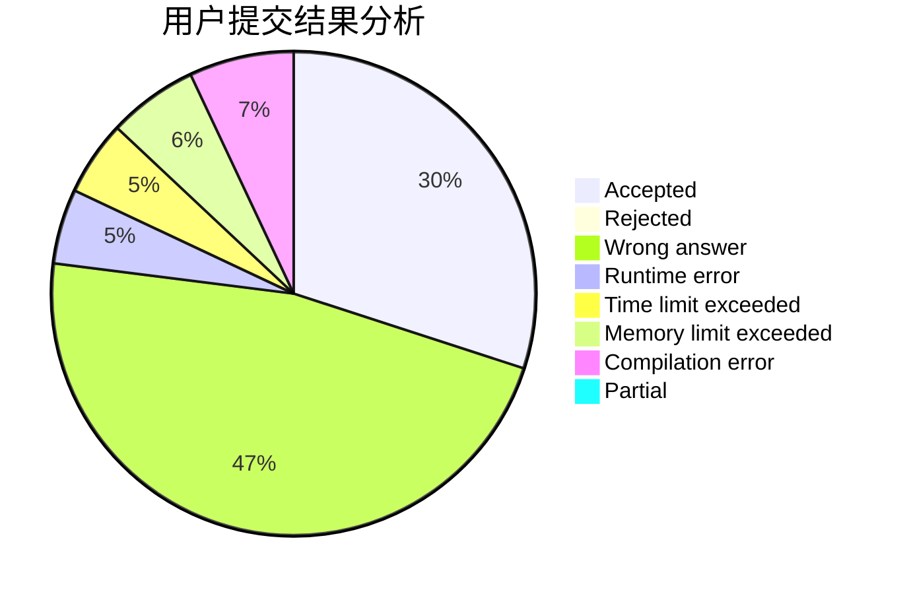
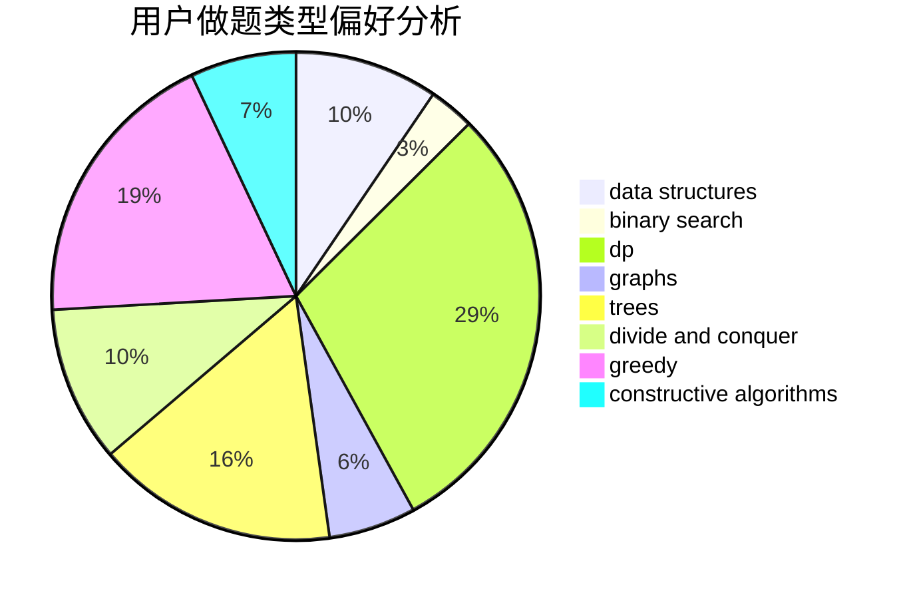
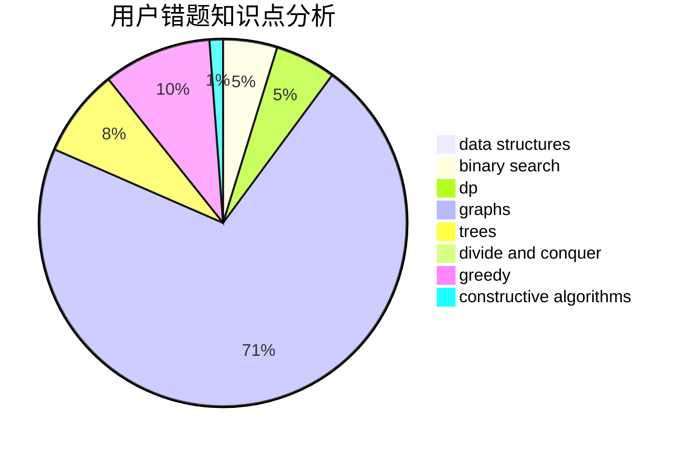

# maojiayi

<!-- tabs:start -->

#### **用户提交结果分析**

#### **用户做题类型偏好分析**

#### **用户错题知识点分析**

<!-- tabs:end -->
# 推荐题目
[1168E](https://codeforces.com/contest/1168/problem/E)		constructive algorithms,
                        math		  
[1059E](https://codeforces.com/contest/1059/problem/E)		binary search,
                        data structures,
                        dp,
                        greedy,
                        trees		  
[183D](https://codeforces.com/contest/183/problem/D)		dp,
                        greedy,
                        probabilities		  
[17C](https://codeforces.com/contest/17/problem/C)		dp		  
[840D](https://codeforces.com/contest/840/problem/D)		data structures,
                        probabilities		  
[875A](https://codeforces.com/contest/875/problem/A)		brute force,
                        math		  
[828A](https://codeforces.com/contest/828/problem/A)		implementation		  
[1256C](https://codeforces.com/contest/1256/problem/C)		greedy		  
[727E](https://codeforces.com/contest/727/problem/E)		data structures,
                        hashing,
                        string suffix structures,
                        strings		  
[911D](https://codeforces.com/contest/911/problem/D)		brute force,
                        math		  
