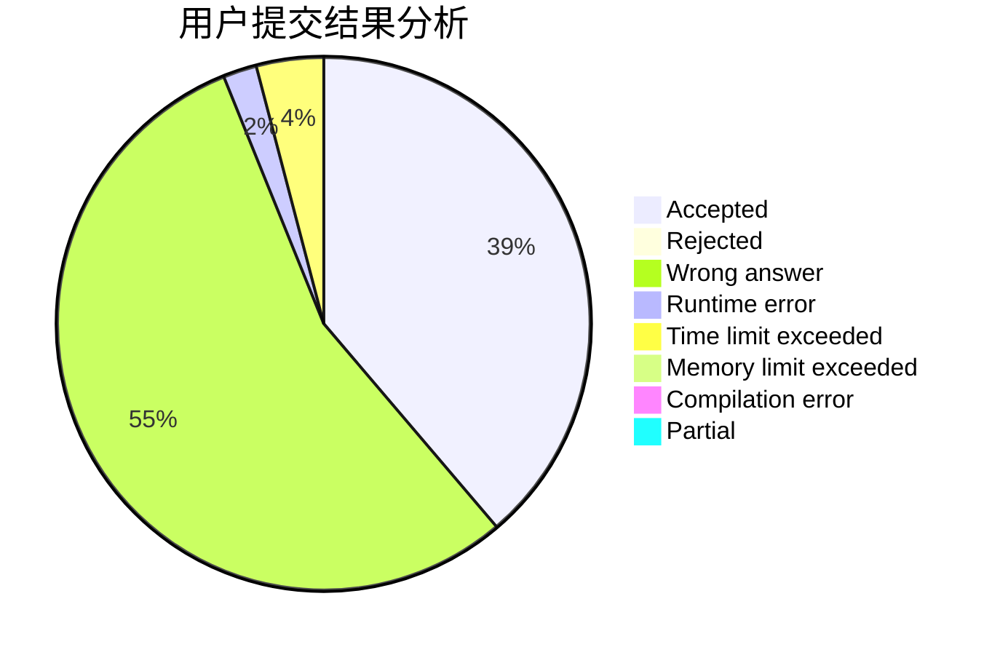
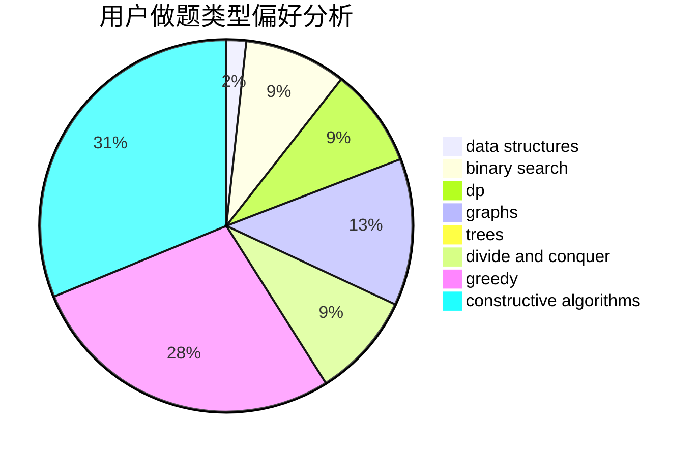

# maplefallfrost

<!-- tabs:start -->

#### **用户提交结果分析**

#### **用户做题类型偏好分析**

#### **用户错题知识点分析**

<!-- tabs:end -->
# 推荐题目
[431A](https://codeforces.com/contest/431/problem/A)		implementation		  
[3162](https://codeforces.com/contest/316/problem/2)		dsu,graphs,sortings,trees		  
[249E](https://codeforces.com/contest/249/problem/E)		math		  
[691D](https://codeforces.com/contest/691/problem/D)		dfs and similar,
                        dsu,
                        math		  
[814D](https://codeforces.com/contest/814/problem/D)		dfs and similar,
                        dp,
                        geometry,
                        greedy,
                        trees		  
[385E](https://codeforces.com/contest/385/problem/E)		math,
                        matrices		  
[1165C](https://codeforces.com/contest/1165/problem/C)		greedy		  
[504A](https://codeforces.com/contest/504/problem/A)		dsu,graphs,sortings,trees		  
[164C](https://codeforces.com/contest/164/problem/C)		flows,
                        graphs		  
[404C](https://codeforces.com/contest/404/problem/C)		dfs and similar,
                        graphs,
                        sortings		  
