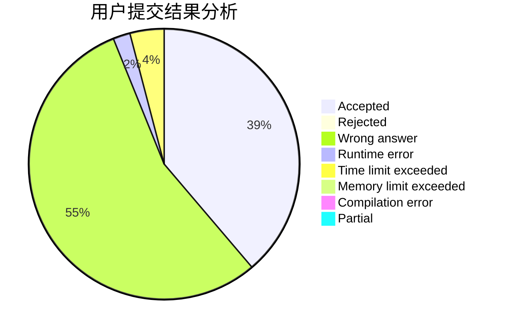
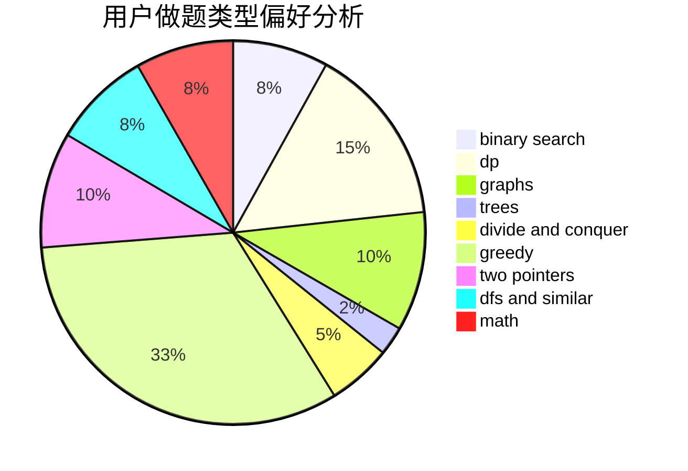

# maplefallfrost

<!-- tabs:start -->

#### **用户提交结果分析**

#### **用户做题类型偏好分析**

<!-- tabs:end -->
# 推荐题目
[431A](https://codeforces.com/contest/431/problem/A)
[3162](https://codeforces.com/contest/316/problem/2)
[249E](https://codeforces.com/contest/249/problem/E)
[691D](https://codeforces.com/contest/691/problem/D)
[814D](https://codeforces.com/contest/814/problem/D)
[385E](https://codeforces.com/contest/385/problem/E)
[1165C](https://codeforces.com/contest/1165/problem/C)
[504A](https://codeforces.com/contest/504/problem/A)
[164C](https://codeforces.com/contest/164/problem/C)
[404C](https://codeforces.com/contest/404/problem/C)
