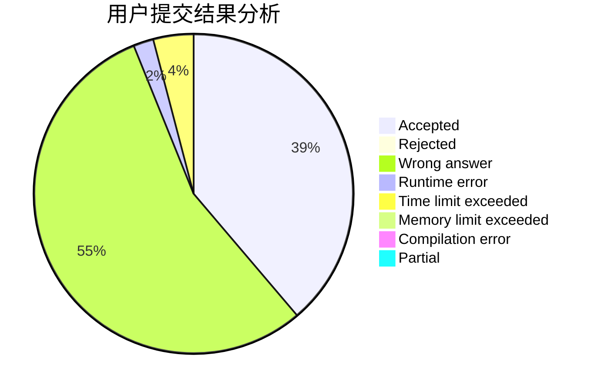
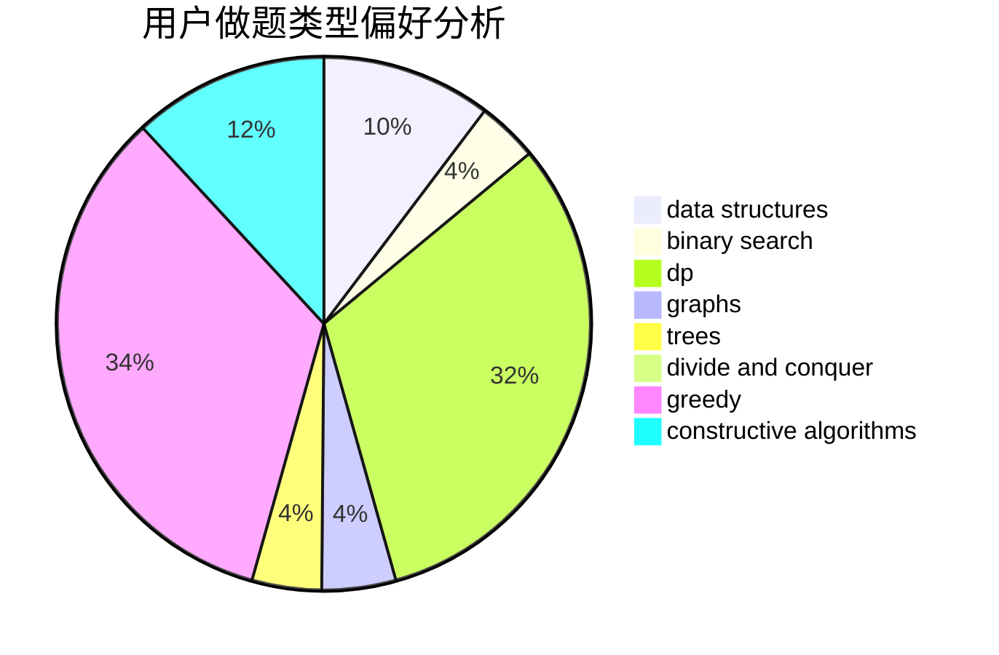

# maplefallfrost

<!-- tabs:start -->

#### **用户提交结果分析**

#### **用户做题类型偏好分析**

#### **用户错题知识点分析**

<!-- tabs:end -->
# 推荐题目
[402D](https://codeforces.com/contest/402/problem/D)		dp,
                        greedy,
                        math,
                        number theory		  
[299C](https://codeforces.com/contest/299/problem/C)		dsu,graphs,sortings,trees		  
[229D](https://codeforces.com/contest/229/problem/D)		dp,
                        greedy,
                        two pointers		  
[669D](https://codeforces.com/contest/669/problem/D)		dsu,graphs,sortings,trees		  
[7C](https://codeforces.com/contest/7/problem/C)		math,
                        number theory		  
[359B](https://codeforces.com/contest/359/problem/B)		constructive algorithms,
                        dp,
                        math		  
[1164F](https://codeforces.com/contest/1164/problem/F)		dsu,graphs,sortings,trees		  
[483B](https://codeforces.com/contest/483/problem/B)		binary search,
                        math		  
[1510D](https://codeforces.com/contest/1510/problem/D)		dp,
                        math,
                        number theory		  
[376A](https://codeforces.com/contest/376/problem/A)		implementation,
                        math		  
