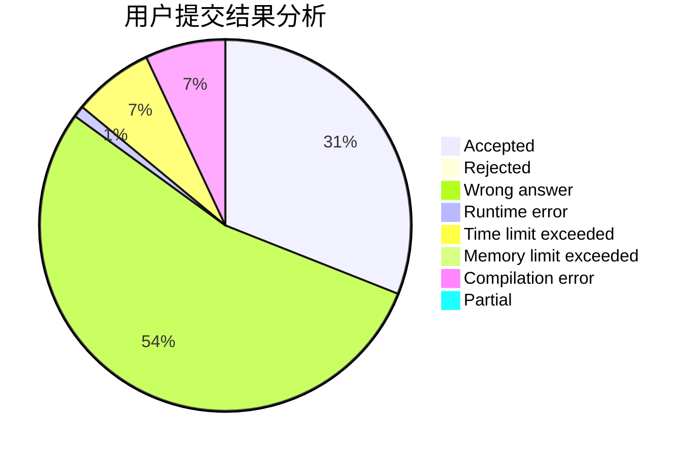
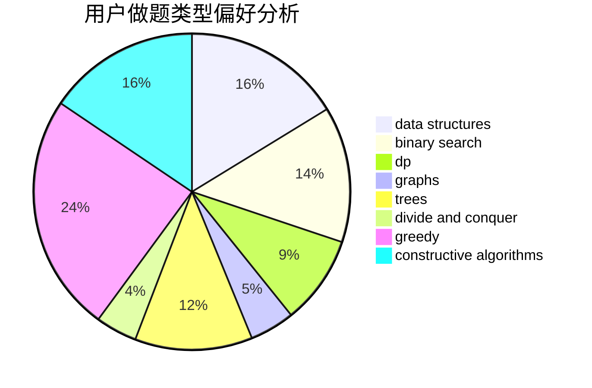

# BlueMoon

<!-- tabs:start -->

#### **用户提交结果分析**

#### **用户做题类型偏好分析**

#### **用户错题知识点分析**

<!-- tabs:end -->
# 推荐题目
[1496A](https://codeforces.com/contest/1496/problem/A)		brute force,
                        constructive algorithms,
                        greedy,
                        strings		  
[1296A](https://codeforces.com/contest/1296/problem/A)		math		  
[1293B](https://codeforces.com/contest/1293/problem/B)		combinatorics,
                        greedy,
                        math		  
[1321E](https://codeforces.com/contest/1321/problem/E)		dsu,graphs,sortings,trees		  
[548A](https://codeforces.com/contest/548/problem/A)		brute force,
                        implementation,
                        strings		  
[547A](https://codeforces.com/contest/547/problem/A)		brute force,
                        greedy,
                        implementation,
                        math		  
[546E](https://codeforces.com/contest/546/problem/E)		flows,
                        graphs,
                        math		  
[123E](https://codeforces.com/contest/123/problem/E)		dfs and similar,
                        dp,
                        probabilities,
                        trees		  
[113B](https://codeforces.com/contest/113/problem/B)		brute force,
                        data structures,
                        hashing,
                        strings		  
[547D](https://codeforces.com/contest/547/problem/D)		constructive algorithms,
                        dfs and similar,
                        graphs		  
