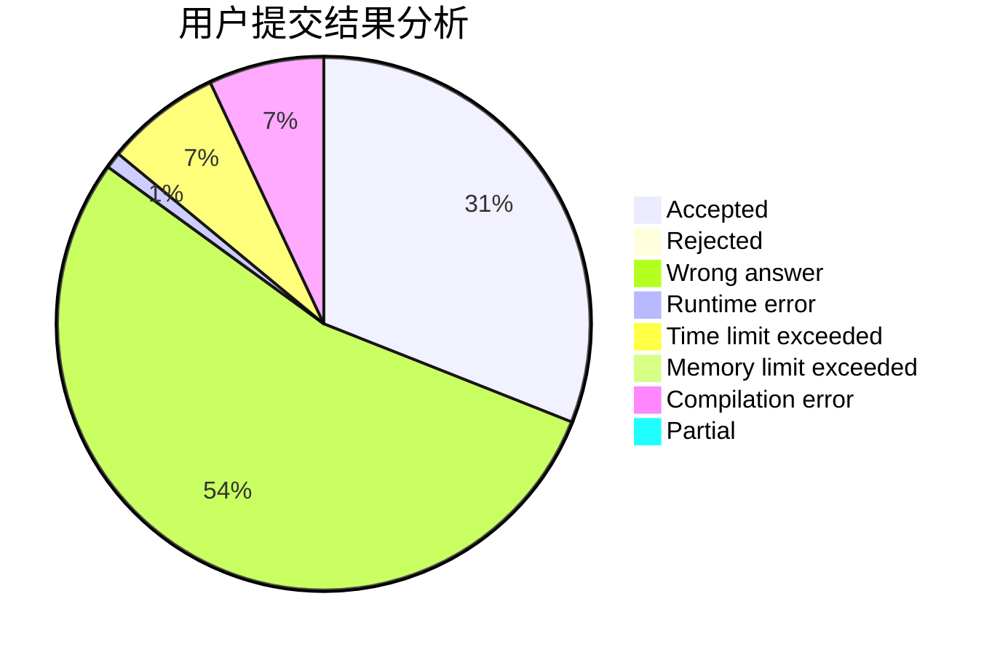
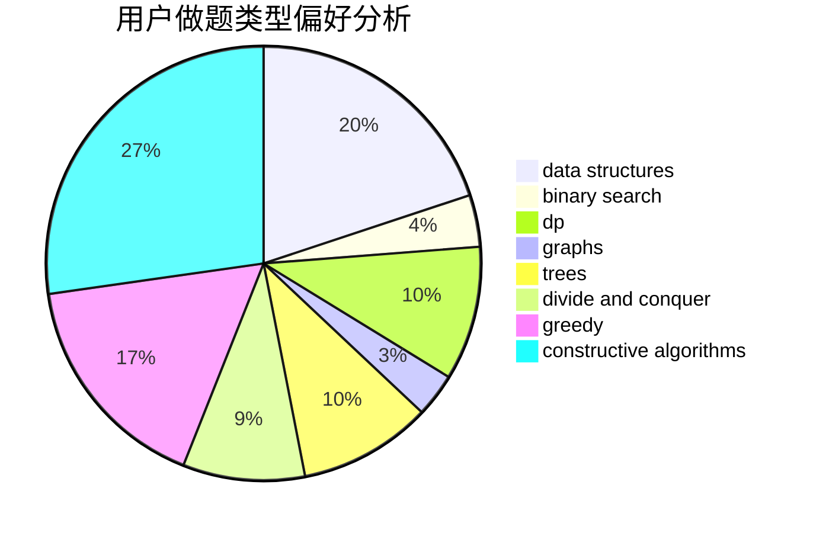

# BlueMoon

<!-- tabs:start -->

#### **用户提交结果分析**

#### **用户做题类型偏好分析**

#### **用户错题知识点分析**

<!-- tabs:end -->
# 推荐题目
[1505A](https://codeforces.com/contest/1505/problem/A)		implementation,
                        interactive		  
[1303C](https://codeforces.com/contest/1303/problem/C)		dfs and similar,
                        greedy,
                        implementation		  
[12C](https://codeforces.com/contest/12/problem/C)		greedy,
                        implementation,
                        sortings		  
[1328D](https://codeforces.com/contest/1328/problem/D)		constructive algorithms,
                        dp,
                        graphs,
                        greedy,
                        math		  
[573C](https://codeforces.com/contest/573/problem/C)		constructive algorithms,
                        dfs and similar,
                        trees		  
[571C](https://codeforces.com/contest/571/problem/C)		constructive algorithms,
                        dfs and similar,
                        graphs,
                        greedy		  
[571A](https://codeforces.com/contest/571/problem/A)		combinatorics,
                        implementation,
                        math		  
[1245C](https://codeforces.com/contest/1245/problem/C)		dp		  
[1141B](https://codeforces.com/contest/1141/problem/B)		implementation		  
[572A](https://codeforces.com/contest/572/problem/A)		sortings		  
