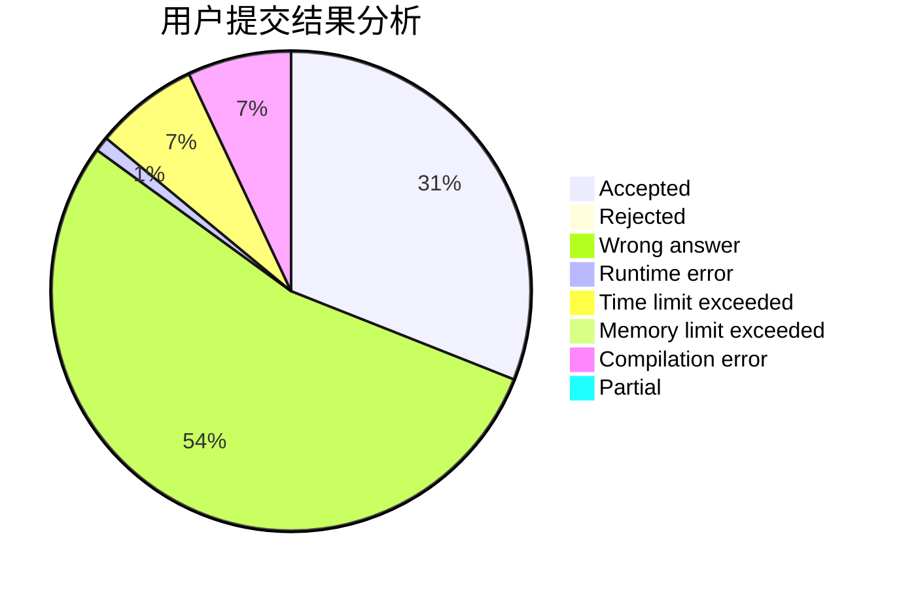
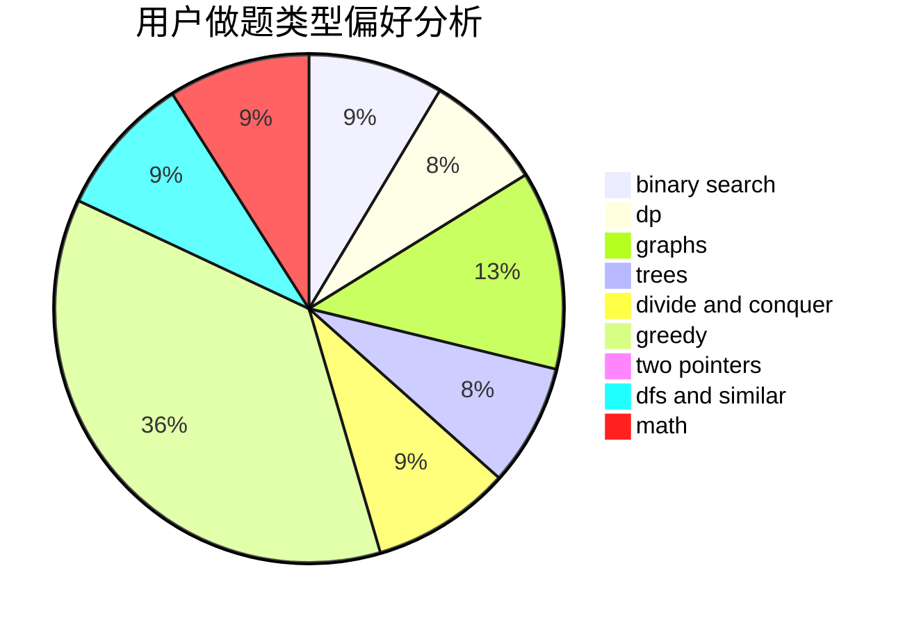

# BlueMoon

<!-- tabs:start -->

#### **用户提交结果分析**

#### **用户做题类型偏好分析**

<!-- tabs:end -->
# 推荐题目
[1505A](https://codeforces.com/contest/1505/problem/A)
[1303C](https://codeforces.com/contest/1303/problem/C)
[12C](https://codeforces.com/contest/12/problem/C)
[1328D](https://codeforces.com/contest/1328/problem/D)
[573C](https://codeforces.com/contest/573/problem/C)
[571C](https://codeforces.com/contest/571/problem/C)
[571A](https://codeforces.com/contest/571/problem/A)
[1245C](https://codeforces.com/contest/1245/problem/C)
[1141B](https://codeforces.com/contest/1141/problem/B)
[572A](https://codeforces.com/contest/572/problem/A)
