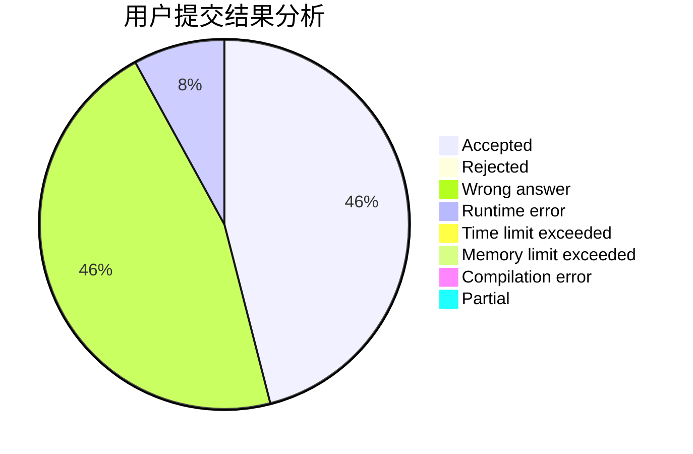
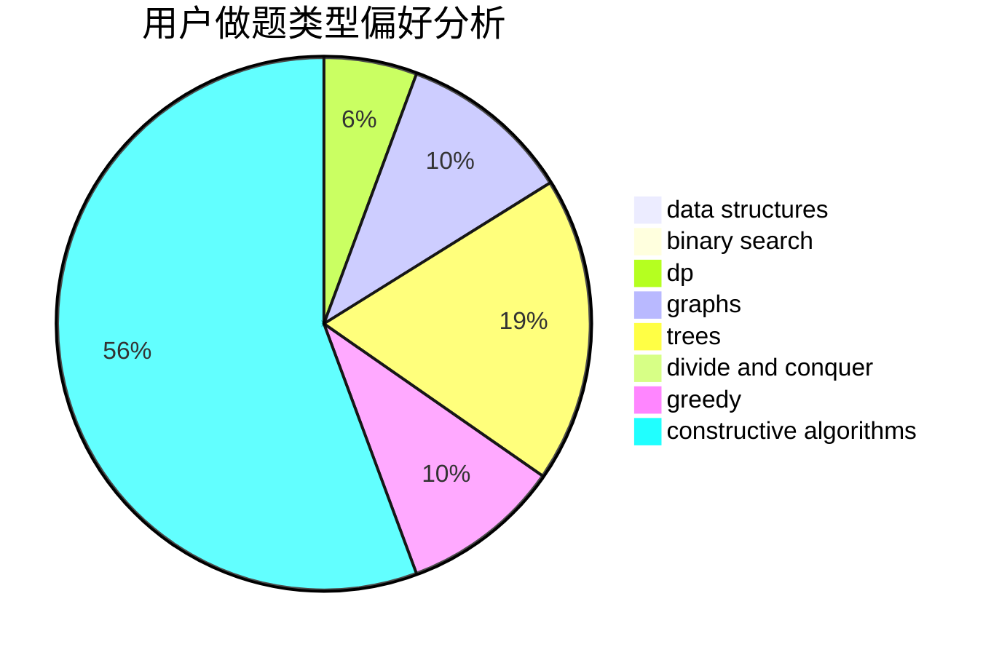
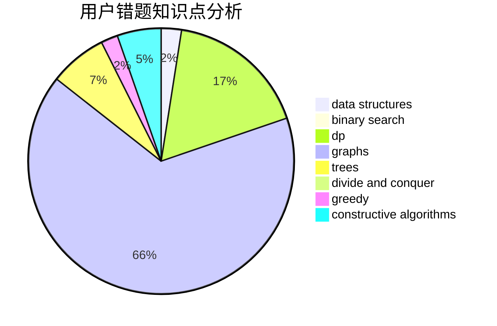

# maskey

<!-- tabs:start -->

#### **用户提交结果分析**

#### **用户做题类型偏好分析**

#### **用户错题知识点分析**

<!-- tabs:end -->
# 推荐题目
[1437E](https://codeforces.com/contest/1437/problem/E)		binary search,
                        constructive algorithms,
                        data structures,
                        dp,
                        implementation		  
[911C](https://codeforces.com/contest/911/problem/C)		brute force,
                        constructive algorithms		  
[903B](https://codeforces.com/contest/903/problem/B)		greedy,
                        implementation		  
[809E](https://codeforces.com/contest/809/problem/E)		divide and conquer,
                        math,
                        number theory,
                        trees		  
[1216B](https://codeforces.com/contest/1216/problem/B)		greedy,
                        implementation,
                        sortings		  
[1251B](https://codeforces.com/contest/1251/problem/B)		greedy,
                        strings		  
[875D](https://codeforces.com/contest/875/problem/D)		binary search,
                        bitmasks,
                        combinatorics,
                        data structures,
                        divide and conquer		  
[1119E](https://codeforces.com/contest/1119/problem/E)		brute force,
                        dp,
                        fft,
                        greedy,
                        ternary search		  
[509D](https://codeforces.com/contest/509/problem/D)		constructive algorithms,
                        math		  
[1102E](https://codeforces.com/contest/1102/problem/E)		combinatorics,
                        sortings		  
