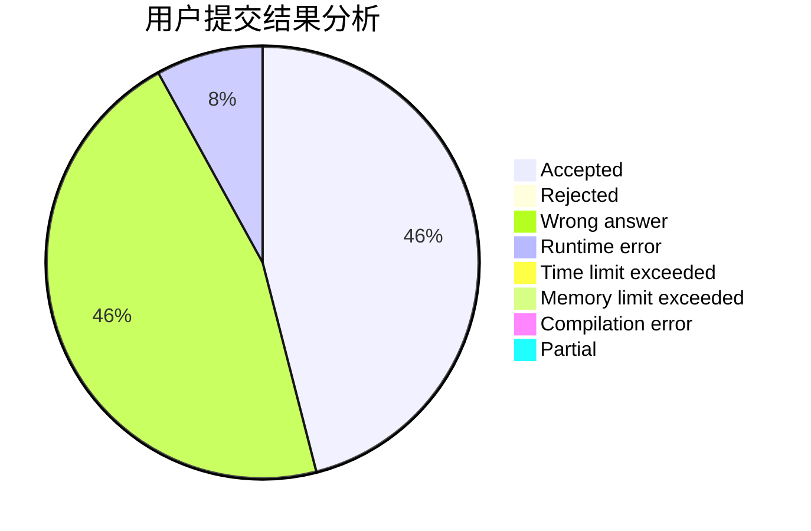
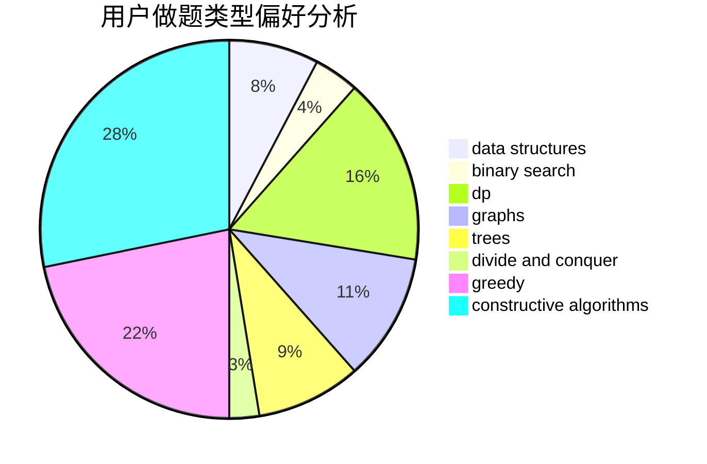
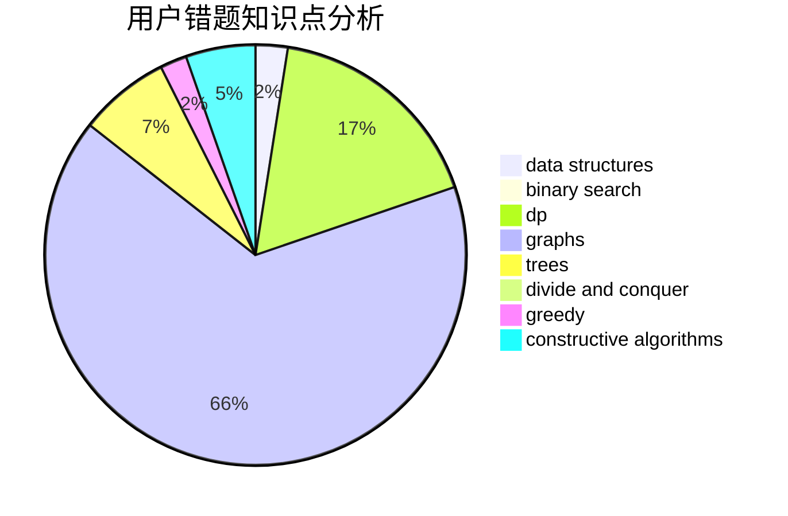

# maskey

<!-- tabs:start -->

#### **用户提交结果分析**

#### **用户做题类型偏好分析**

#### **用户错题知识点分析**

<!-- tabs:end -->
# 推荐题目
[1447B](https://codeforces.com/contest/1447/problem/B)		greedy,
                        math		  
[928B](https://codeforces.com/contest/928/problem/B)		*special problem,
                        dp		  
[919C](https://codeforces.com/contest/919/problem/C)		brute force,
                        implementation		  
[827D](https://codeforces.com/contest/827/problem/D)		data structures,
                        dfs and similar,
                        graphs,
                        trees		  
[1221F](https://codeforces.com/contest/1221/problem/F)		binary search,
                        data structures,
                        sortings		  
[1256C](https://codeforces.com/contest/1256/problem/C)		greedy		  
[895D](https://codeforces.com/contest/895/problem/D)		combinatorics,
                        math,
                        strings		  
[11292](https://codeforces.com/contest/1129/problem/2)		dsu,graphs,sortings,trees		  
[52C](https://codeforces.com/contest/52/problem/C)		data structures		  
[1103B](https://codeforces.com/contest/1103/problem/B)		binary search,
                        constructive algorithms,
                        interactive		  
