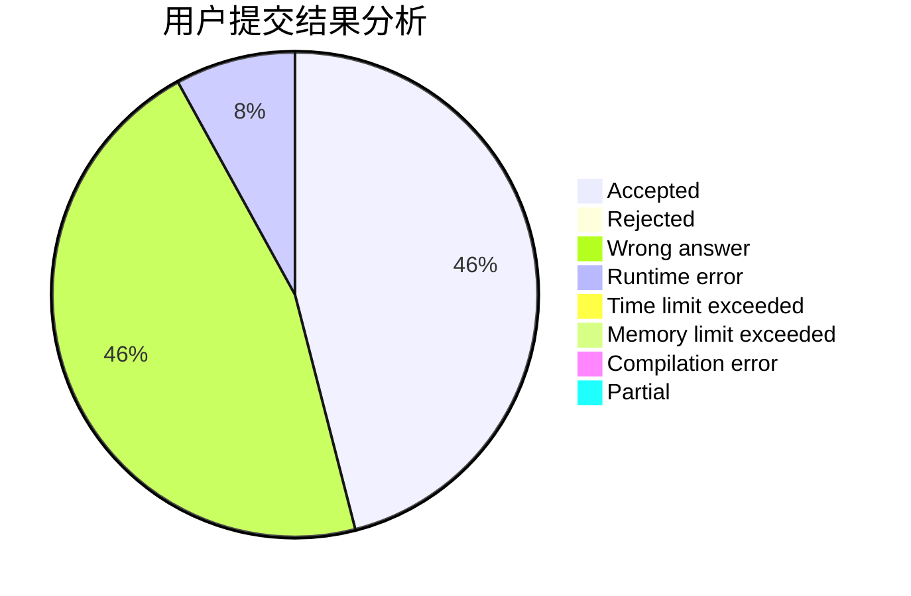
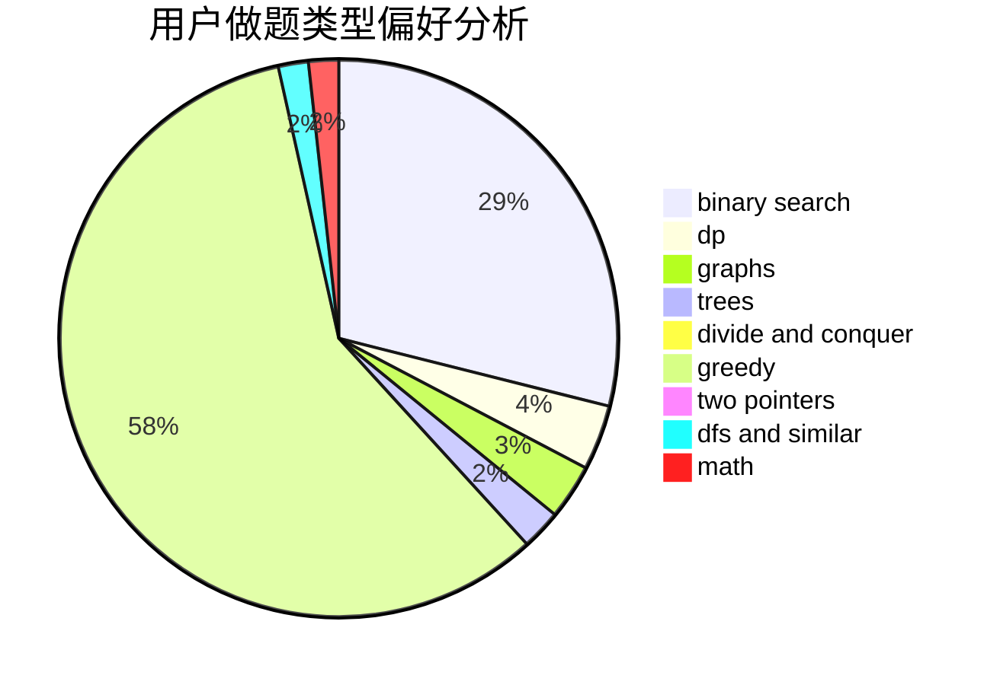

# maskey

<!-- tabs:start -->

#### **用户提交结果分析**

#### **用户做题类型偏好分析**

<!-- tabs:end -->
# 推荐题目
[1447B](https://codeforces.com/contest/1447/problem/B)
[928B](https://codeforces.com/contest/928/problem/B)
[919C](https://codeforces.com/contest/919/problem/C)
[827D](https://codeforces.com/contest/827/problem/D)
[1221F](https://codeforces.com/contest/1221/problem/F)
[1256C](https://codeforces.com/contest/1256/problem/C)
[895D](https://codeforces.com/contest/895/problem/D)
[11292](https://codeforces.com/contest/1129/problem/2)
[52C](https://codeforces.com/contest/52/problem/C)
[1103B](https://codeforces.com/contest/1103/problem/B)
