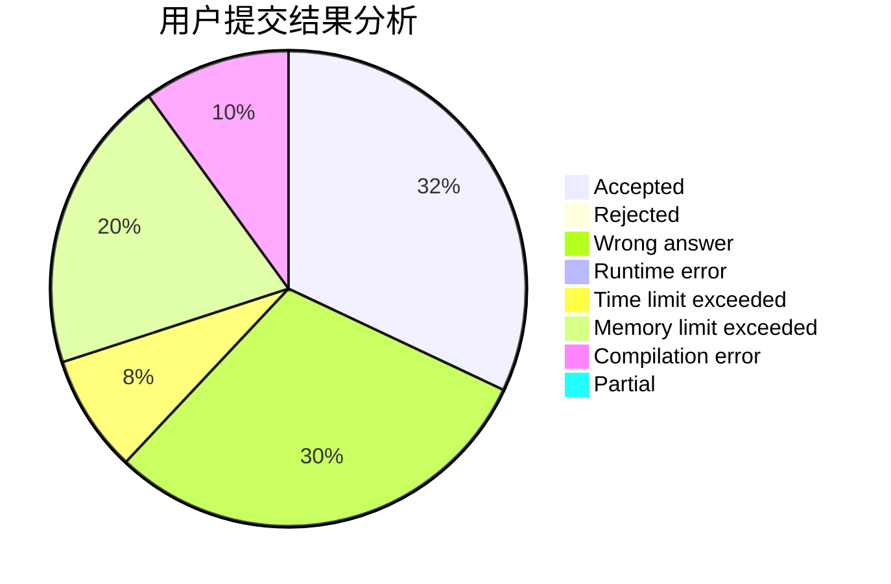
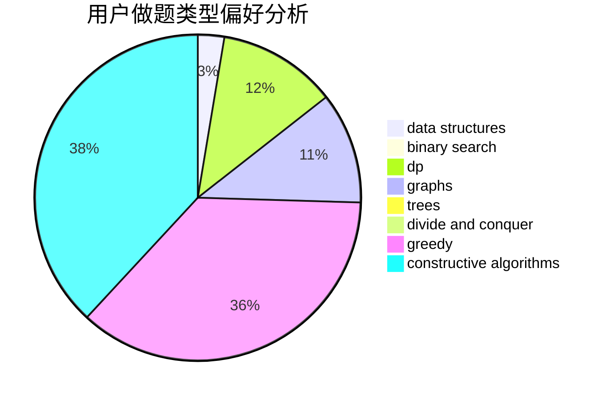
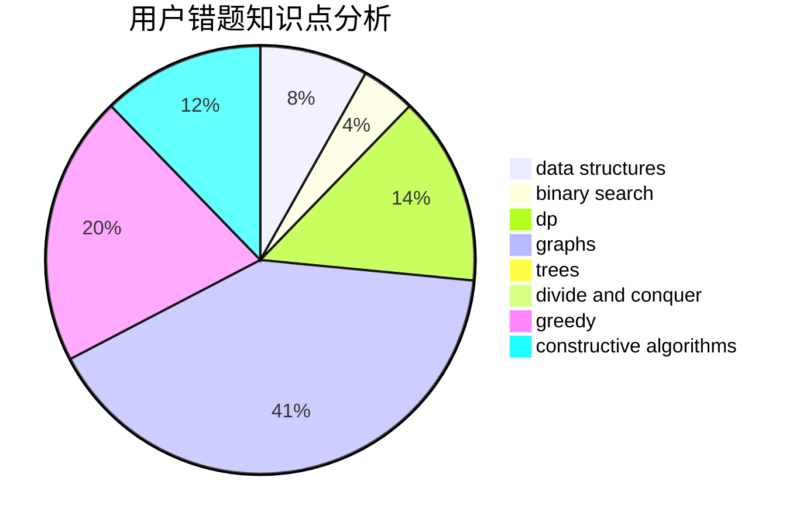

# mathlover

<!-- tabs:start -->

#### **用户提交结果分析**

#### **用户做题类型偏好分析**

#### **用户错题知识点分析**

<!-- tabs:end -->
# 推荐题目
[1335A](https://codeforces.com/contest/1335/problem/A)		math		  
[716A](https://codeforces.com/contest/716/problem/A)		implementation		  
[1292F](https://codeforces.com/contest/1292/problem/F)		bitmasks,
                        combinatorics,
                        dp		  
[603A](https://codeforces.com/contest/603/problem/A)		dp,
                        greedy,
                        math		  
[1033B](https://codeforces.com/contest/1033/problem/B)		math,
                        number theory		  
[557B](https://codeforces.com/contest/557/problem/B)		constructive algorithms,
                        implementation,
                        math,
                        sortings		  
[3C](https://codeforces.com/contest/3/problem/C)		brute force,
                        games,
                        implementation		  
[218B](https://codeforces.com/contest/218/problem/B)		implementation		  
[100A](https://codeforces.com/contest/100/problem/A)		*special problem,
                        implementation		  
[1489C](https://codeforces.com/contest/1489/problem/C)		dsu,graphs,sortings,trees		  
