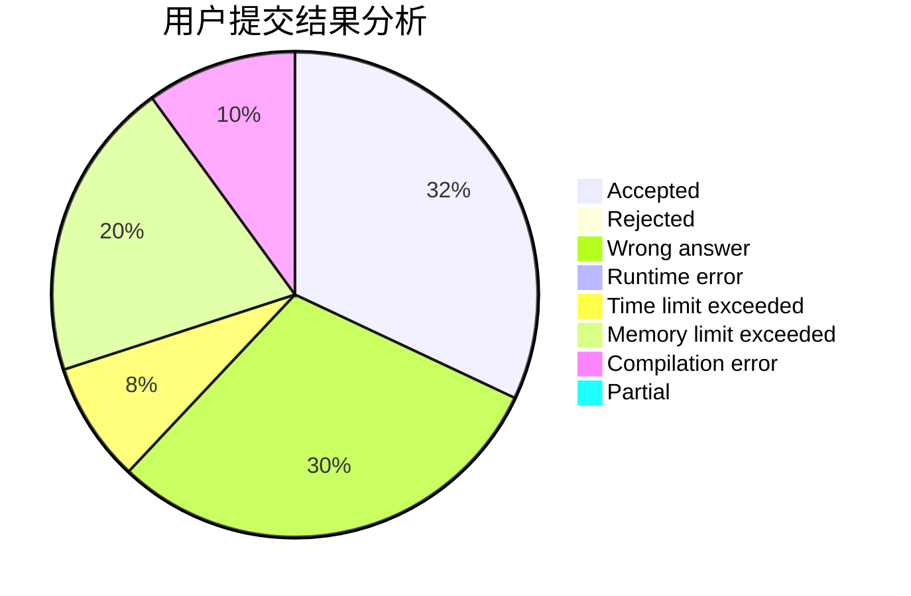
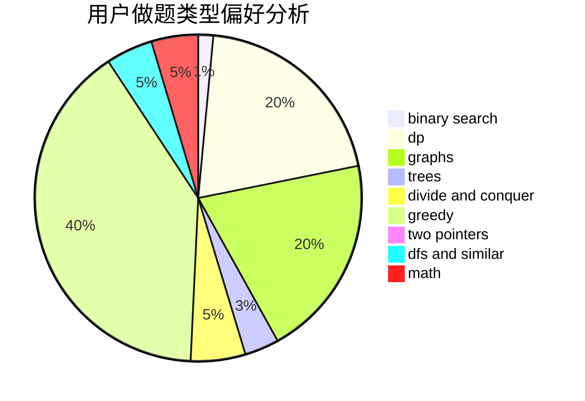

# mathlover

<!-- tabs:start -->

#### **用户提交结果分析**

#### **用户做题类型偏好分析**

<!-- tabs:end -->
# 推荐题目
[1335A](https://codeforces.com/contest/1335/problem/A)
[716A](https://codeforces.com/contest/716/problem/A)
[1292F](https://codeforces.com/contest/1292/problem/F)
[603A](https://codeforces.com/contest/603/problem/A)
[1033B](https://codeforces.com/contest/1033/problem/B)
[557B](https://codeforces.com/contest/557/problem/B)
[3C](https://codeforces.com/contest/3/problem/C)
[218B](https://codeforces.com/contest/218/problem/B)
[100A](https://codeforces.com/contest/100/problem/A)
[1489C](https://codeforces.com/contest/1489/problem/C)
