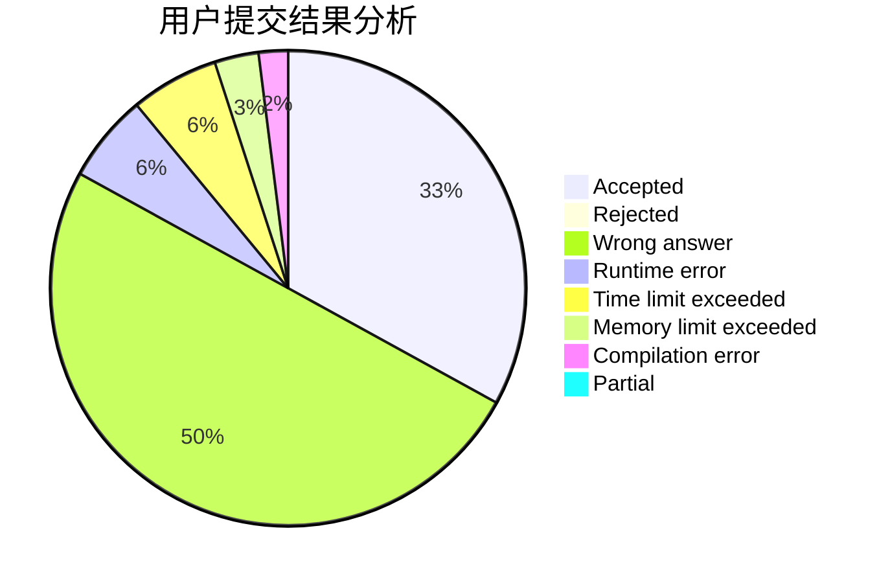
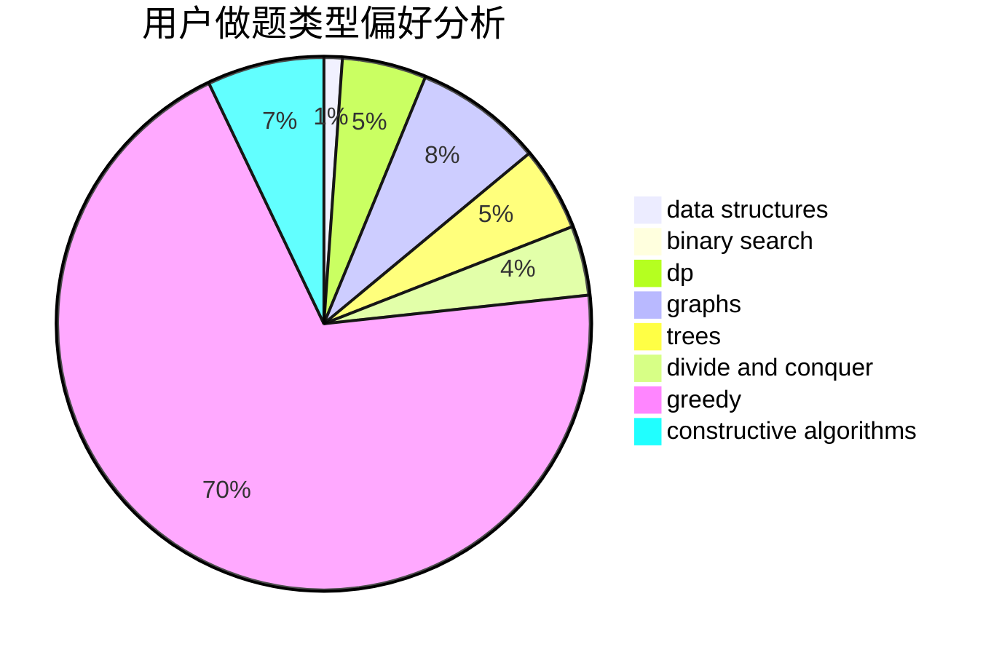
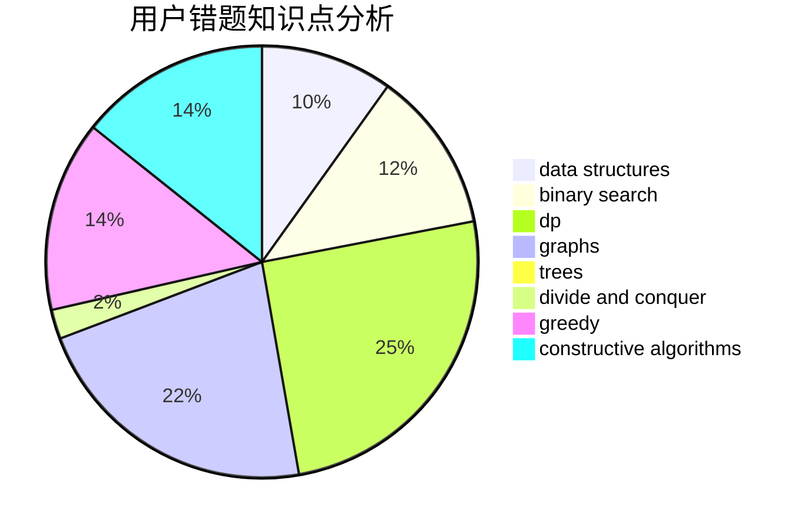

# mch

<!-- tabs:start -->

#### **用户提交结果分析**

#### **用户做题类型偏好分析**

#### **用户错题知识点分析**

<!-- tabs:end -->
# 推荐题目
[1399C](https://codeforces.com/contest/1399/problem/C)		brute force,
                        greedy,
                        two pointers		  
[1450H2](https://codeforces.com/contest/1450H/problem/2)		combinatorics,
                        implementation,
                        math		  
[254D](https://codeforces.com/contest/254/problem/D)		brute force,
                        dfs and similar,
                        graphs,
                        implementation,
                        shortest paths		  
[620B](https://codeforces.com/contest/620/problem/B)		implementation		  
[909C](https://codeforces.com/contest/909/problem/C)		dp		  
[26A](https://codeforces.com/contest/26/problem/A)		number theory		  
[592C](https://codeforces.com/contest/592/problem/C)		math		  
[223B](https://codeforces.com/contest/223/problem/B)		data structures,
                        dp,
                        strings		  
[1185G1](https://codeforces.com/contest/1185G/problem/1)		bitmasks,
                        combinatorics,
                        dp		  
[1344B](https://codeforces.com/contest/1344/problem/B)		constructive algorithms,
                        dfs and similar,
                        dsu,
                        graphs		  
