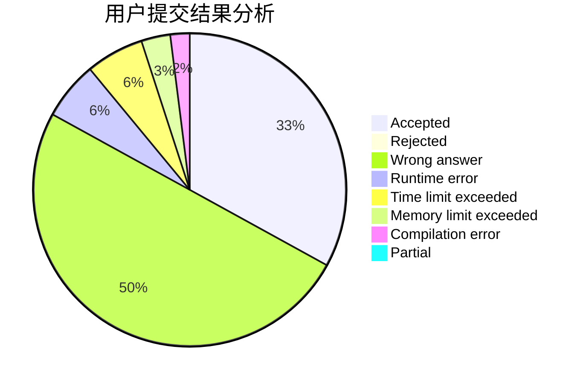
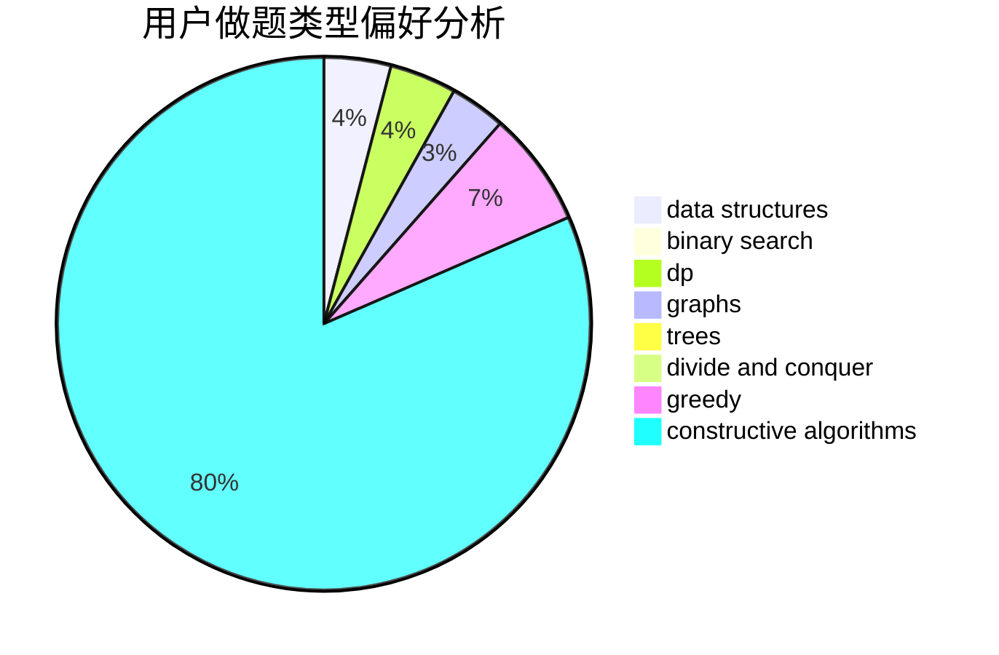
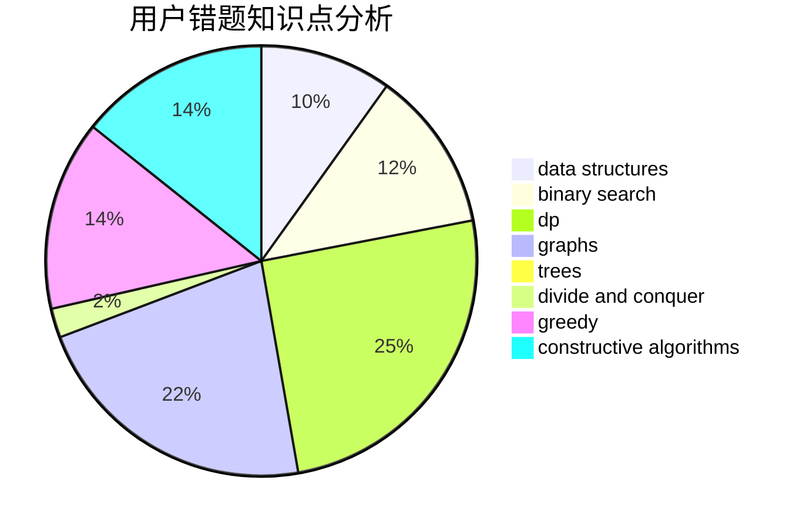

# mch

<!-- tabs:start -->

#### **用户提交结果分析**

#### **用户做题类型偏好分析**

#### **用户错题知识点分析**

<!-- tabs:end -->
# 推荐题目
[1408D](https://codeforces.com/contest/1408/problem/D)		binary search,
                        brute force,
                        data structures,
                        dp,
                        implementation,
                        sortings,
                        two pointers		  
[1459F](https://codeforces.com/contest/1459/problem/F)		dsu,graphs,sortings,trees		  
[273D](https://codeforces.com/contest/273/problem/D)		dp		  
[643E](https://codeforces.com/contest/643/problem/E)		dp,
                        math,
                        probabilities,
                        trees		  
[924A](https://codeforces.com/contest/924/problem/A)		greedy,
                        implementation		  
[286B](https://codeforces.com/contest/286/problem/B)		implementation		  
[611E](https://codeforces.com/contest/611/problem/E)		data structures,
                        greedy,
                        sortings		  
[241D](https://codeforces.com/contest/241/problem/D)		nan		  
[118B](https://codeforces.com/contest/118/problem/B)		constructive algorithms,
                        implementation		  
[1351A](https://codeforces.com/contest/1351/problem/A)		implementation		  
