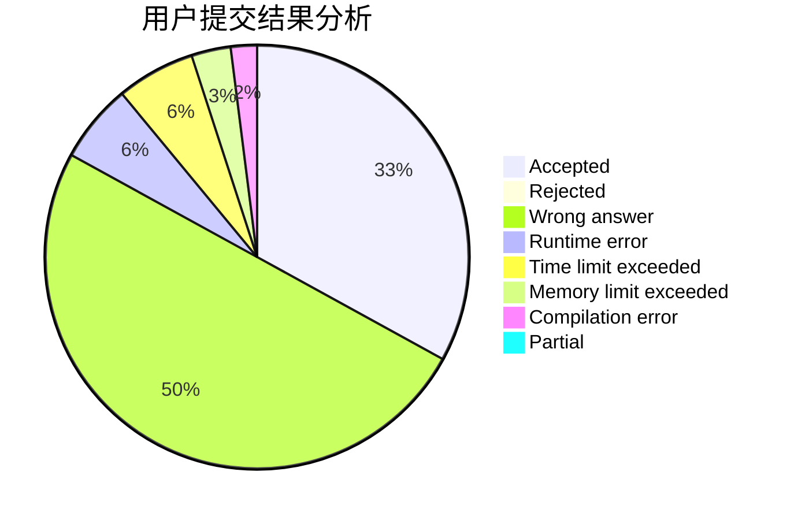
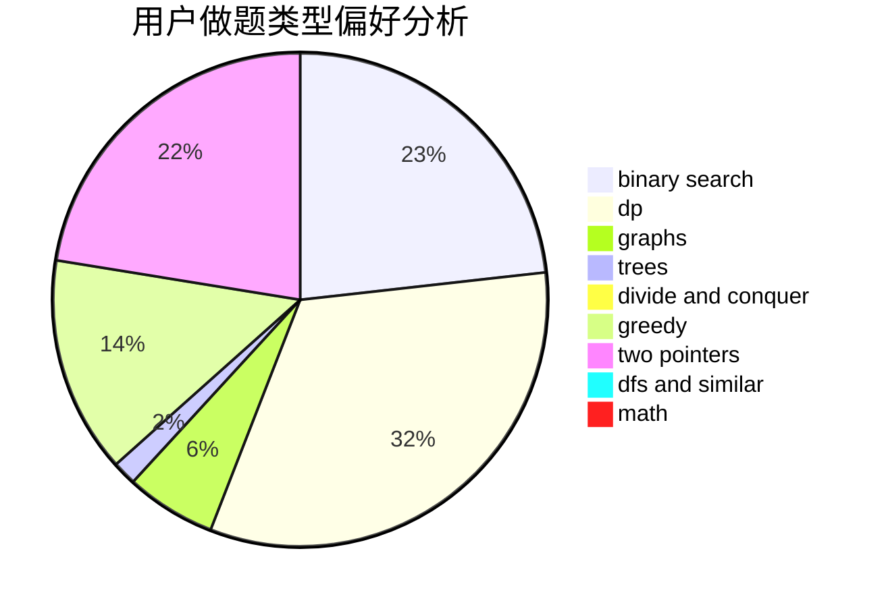

# mch

<!-- tabs:start -->

#### **用户提交结果分析**

#### **用户做题类型偏好分析**

<!-- tabs:end -->
# 推荐题目
[1408D](https://codeforces.com/contest/1408/problem/D)
[1459F](https://codeforces.com/contest/1459/problem/F)
[273D](https://codeforces.com/contest/273/problem/D)
[643E](https://codeforces.com/contest/643/problem/E)
[924A](https://codeforces.com/contest/924/problem/A)
[286B](https://codeforces.com/contest/286/problem/B)
[611E](https://codeforces.com/contest/611/problem/E)
[241D](https://codeforces.com/contest/241/problem/D)
[118B](https://codeforces.com/contest/118/problem/B)
[1351A](https://codeforces.com/contest/1351/problem/A)
