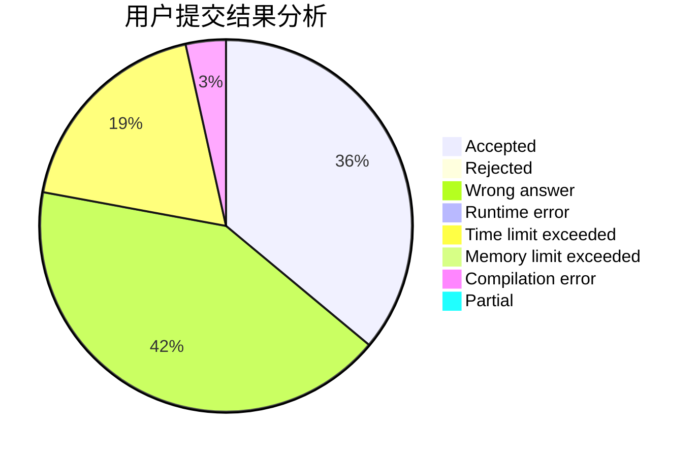
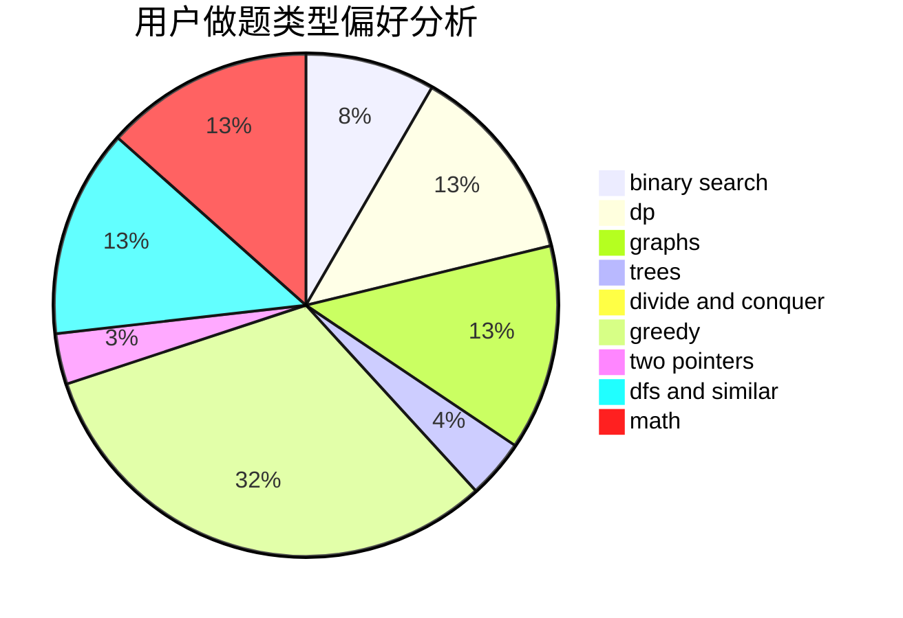

# mckm2000

<!-- tabs:start -->

#### **用户提交结果分析**

#### **用户做题类型偏好分析**

<!-- tabs:end -->
# 推荐题目
[1038E](https://codeforces.com/contest/1038/problem/E)
[1119D](https://codeforces.com/contest/1119/problem/D)
[659G](https://codeforces.com/contest/659/problem/G)
[166E](https://codeforces.com/contest/166/problem/E)
[1133A](https://codeforces.com/contest/1133/problem/A)
[920A](https://codeforces.com/contest/920/problem/A)
[5132](https://codeforces.com/contest/513/problem/2)
[1151F](https://codeforces.com/contest/1151/problem/F)
[81C](https://codeforces.com/contest/81/problem/C)
[755C](https://codeforces.com/contest/755/problem/C)
