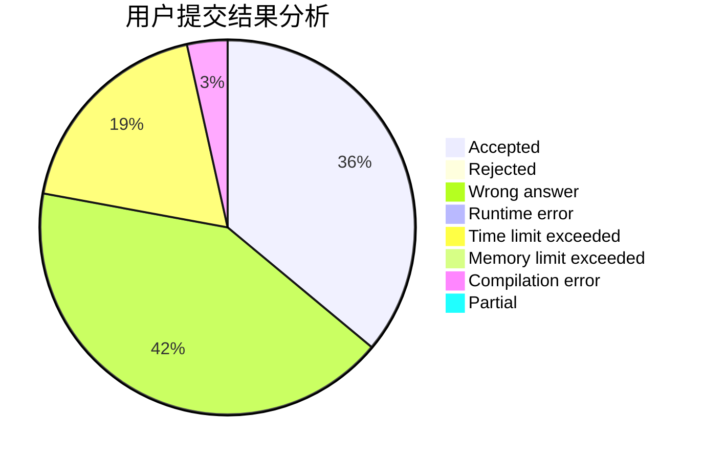
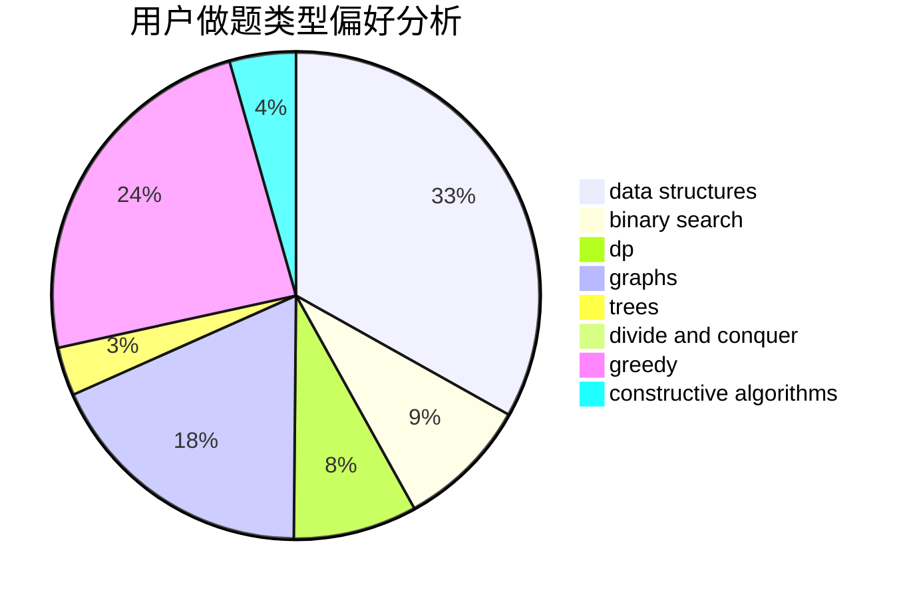
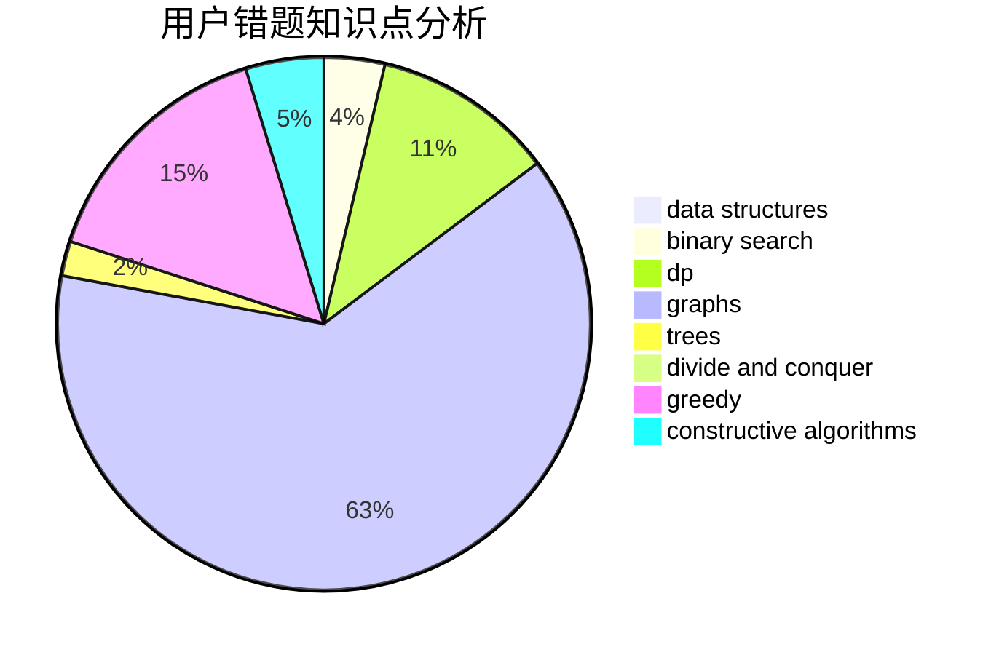

# mckm2000

<!-- tabs:start -->

#### **用户提交结果分析**

#### **用户做题类型偏好分析**

#### **用户错题知识点分析**

<!-- tabs:end -->
# 推荐题目
[1038E](https://codeforces.com/contest/1038/problem/E)		bitmasks,
                        brute force,
                        dfs and similar,
                        dp,
                        graphs		  
[1119D](https://codeforces.com/contest/1119/problem/D)		binary search,
                        sortings		  
[659G](https://codeforces.com/contest/659/problem/G)		combinatorics,
                        dp,
                        number theory		  
[166E](https://codeforces.com/contest/166/problem/E)		dp,
                        math,
                        matrices		  
[1133A](https://codeforces.com/contest/1133/problem/A)		implementation		  
[920A](https://codeforces.com/contest/920/problem/A)		implementation		  
[5132](https://codeforces.com/contest/513/problem/2)		dsu,graphs,sortings,trees		  
[1151F](https://codeforces.com/contest/1151/problem/F)		combinatorics,
                        dp,
                        matrices,
                        probabilities		  
[81C](https://codeforces.com/contest/81/problem/C)		greedy,
                        math,
                        sortings		  
[755C](https://codeforces.com/contest/755/problem/C)		dfs and similar,
                        dsu,
                        graphs,
                        interactive,
                        trees		  
