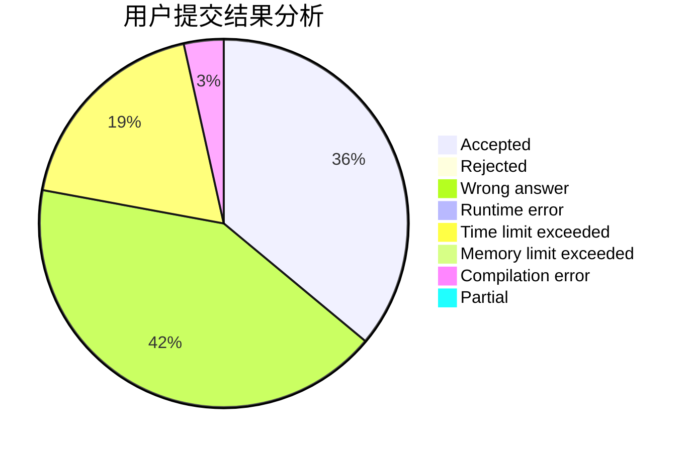
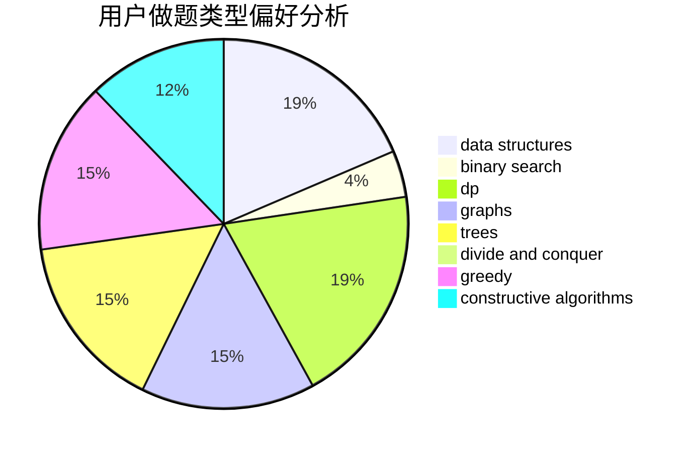
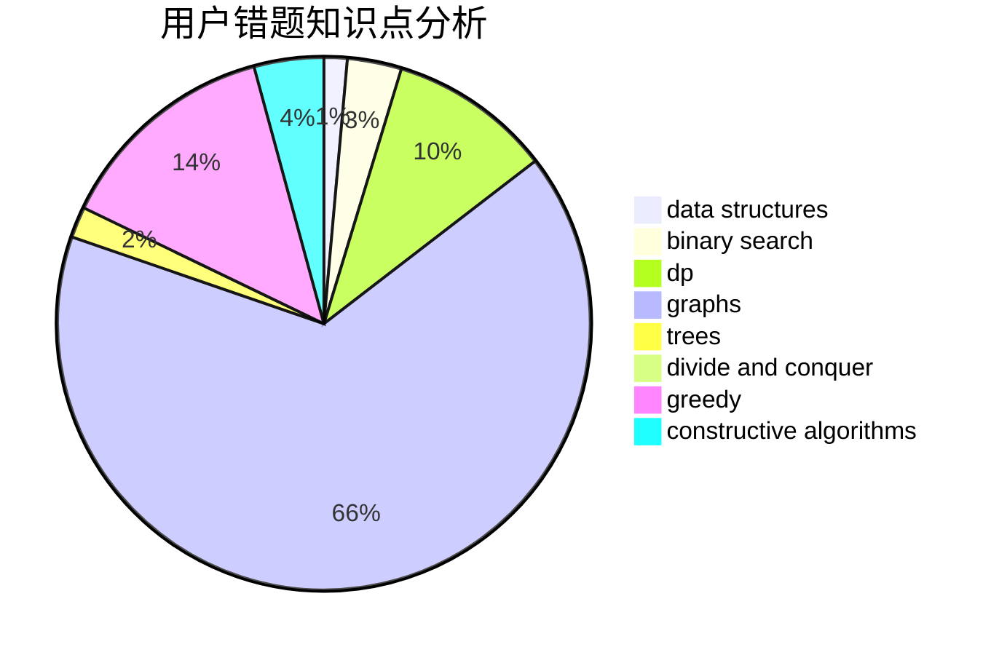

# mckm2000

<!-- tabs:start -->

#### **用户提交结果分析**

#### **用户做题类型偏好分析**

#### **用户错题知识点分析**

<!-- tabs:end -->
# 推荐题目
[1038B](https://codeforces.com/contest/1038/problem/B)		constructive algorithms,
                        math		  
[1117F](https://codeforces.com/contest/1117/problem/F)		bitmasks,
                        dp		  
[62E](https://codeforces.com/contest/62/problem/E)		dp,
                        flows		  
[1510K](https://codeforces.com/contest/1510/problem/K)		brute force,
                        graphs,
                        implementation		  
[1131D](https://codeforces.com/contest/1131/problem/D)		dfs and similar,
                        dp,
                        dsu,
                        graphs,
                        greedy		  
[906C](https://codeforces.com/contest/906/problem/C)		bitmasks,
                        brute force,
                        dp,
                        graphs		  
[492E](https://codeforces.com/contest/492/problem/E)		math		  
[114C](https://codeforces.com/contest/114/problem/C)		dsu,graphs,sortings,trees		  
[803G](https://codeforces.com/contest/803/problem/G)		data structures		  
[734D](https://codeforces.com/contest/734/problem/D)		implementation		  
