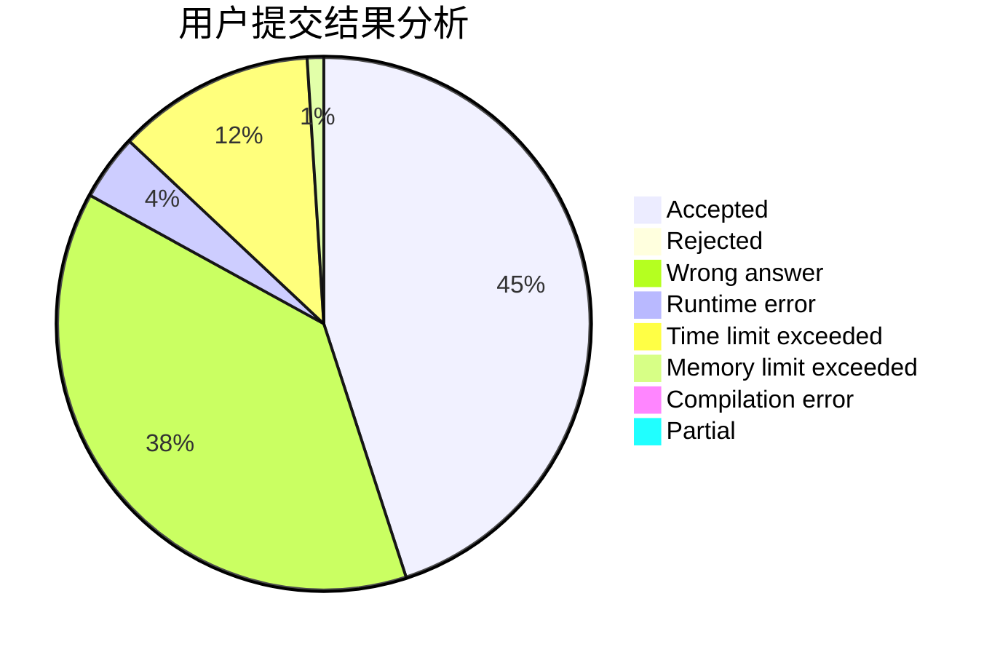
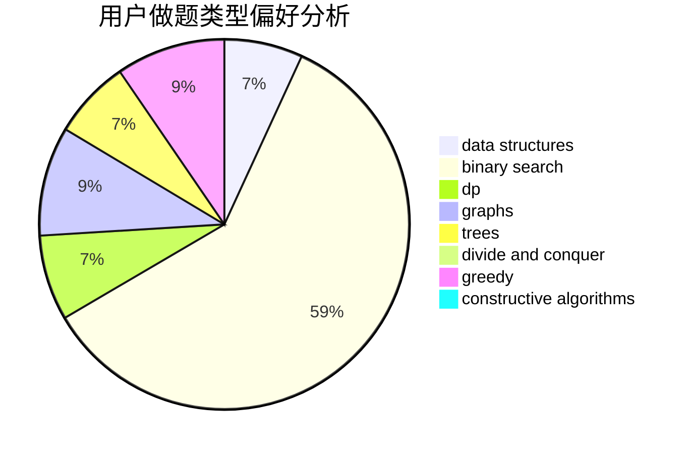
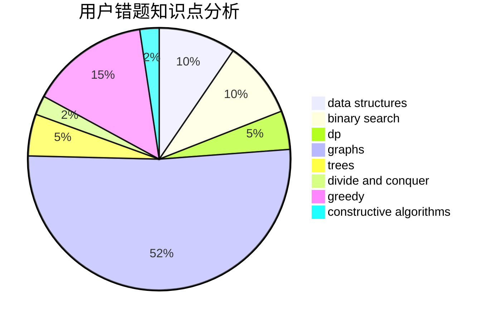

# mcqueen1

<!-- tabs:start -->

#### **用户提交结果分析**

#### **用户做题类型偏好分析**

#### **用户错题知识点分析**

<!-- tabs:end -->
# 推荐题目
[659G](https://codeforces.com/contest/659/problem/G)		combinatorics,
                        dp,
                        number theory		  
[877A](https://codeforces.com/contest/877/problem/A)		implementation,
                        strings		  
[746C](https://codeforces.com/contest/746/problem/C)		constructive algorithms,
                        implementation,
                        math		  
[630A](https://codeforces.com/contest/630/problem/A)		number theory		  
[439C](https://codeforces.com/contest/439/problem/C)		brute force,
                        constructive algorithms,
                        implementation,
                        number theory		  
[1383E](https://codeforces.com/contest/1383/problem/E)		combinatorics,
                        data structures,
                        dp		  
[1031D](https://codeforces.com/contest/1031/problem/D)		greedy		  
[1316A](https://codeforces.com/contest/1316/problem/A)		implementation		  
[1291C](https://codeforces.com/contest/1291/problem/C)		dsu,graphs,sortings,trees		  
[506C](https://codeforces.com/contest/506/problem/C)		dsu,graphs,sortings,trees		  
