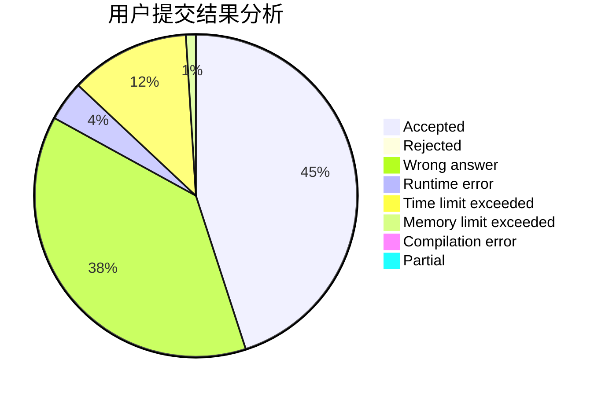
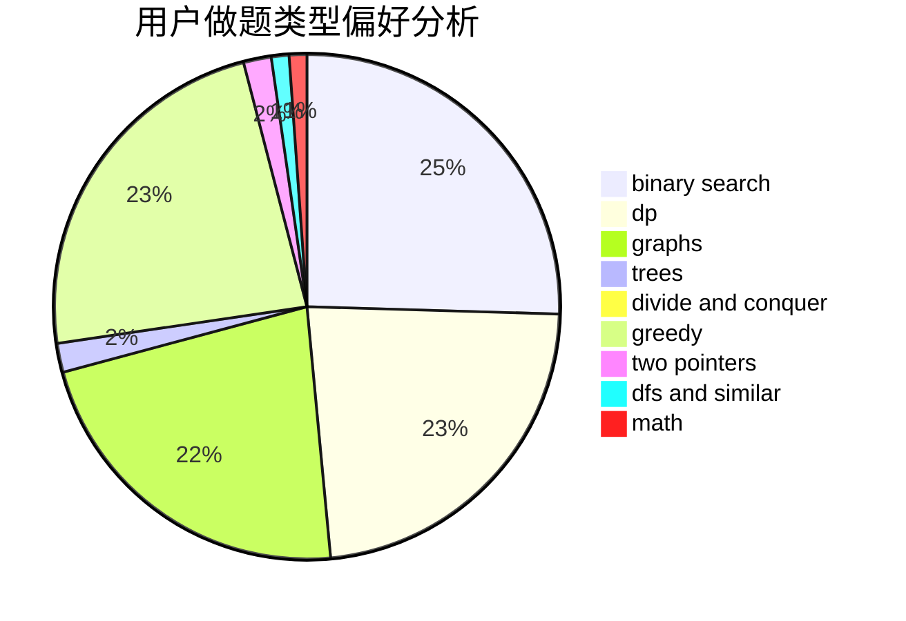

# mcqueen1

<!-- tabs:start -->

#### **用户提交结果分析**

#### **用户做题类型偏好分析**

<!-- tabs:end -->
# 推荐题目
[659G](https://codeforces.com/contest/659/problem/G)
[877A](https://codeforces.com/contest/877/problem/A)
[746C](https://codeforces.com/contest/746/problem/C)
[630A](https://codeforces.com/contest/630/problem/A)
[439C](https://codeforces.com/contest/439/problem/C)
[1383E](https://codeforces.com/contest/1383/problem/E)
[1031D](https://codeforces.com/contest/1031/problem/D)
[1316A](https://codeforces.com/contest/1316/problem/A)
[1291C](https://codeforces.com/contest/1291/problem/C)
[506C](https://codeforces.com/contest/506/problem/C)
