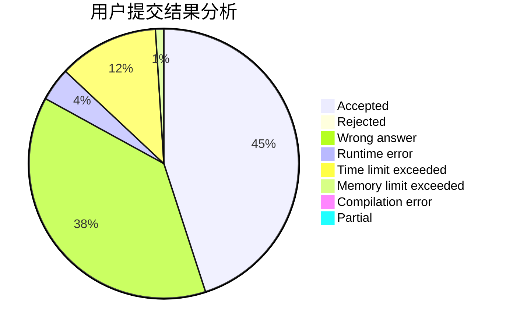
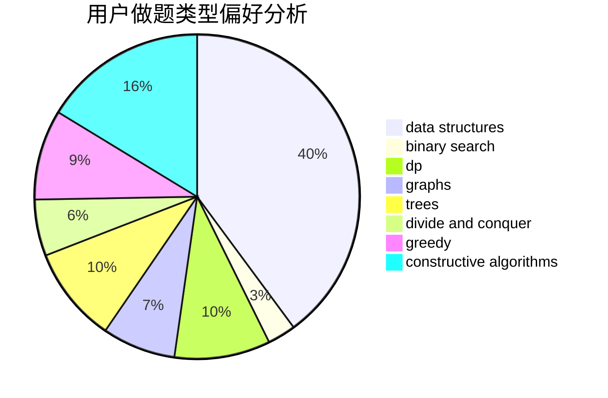
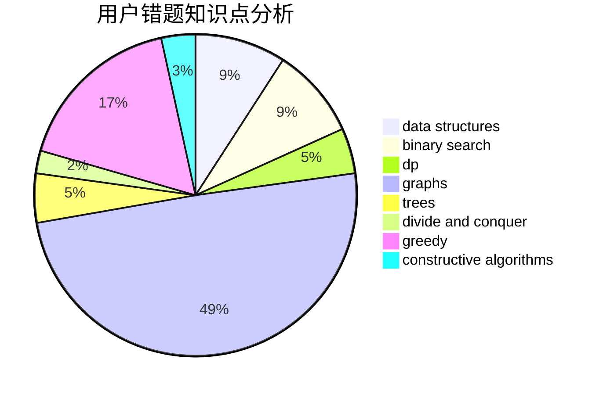

# mcqueen1

<!-- tabs:start -->

#### **用户提交结果分析**

#### **用户做题类型偏好分析**

#### **用户错题知识点分析**

<!-- tabs:end -->
# 推荐题目
[62E](https://codeforces.com/contest/62/problem/E)		dp,
                        flows		  
[859C](https://codeforces.com/contest/859/problem/C)		dp,
                        games		  
[729C](https://codeforces.com/contest/729/problem/C)		binary search,
                        greedy,
                        sortings		  
[611A](https://codeforces.com/contest/611/problem/A)		implementation		  
[413E](https://codeforces.com/contest/413/problem/E)		data structures,
                        divide and conquer		  
[1374E2](https://codeforces.com/contest/1374E/problem/2)		data structures,
                        greedy,
                        implementation,
                        sortings,
                        ternary search,
                        two pointers		  
[1031A](https://codeforces.com/contest/1031/problem/A)		implementation,
                        math		  
[1307E](https://codeforces.com/contest/1307/problem/E)		binary search,
                        combinatorics,
                        dp,
                        greedy,
                        implementation,
                        math		  
[1284C](https://codeforces.com/contest/1284/problem/C)		combinatorics,
                        math		  
[485D](https://codeforces.com/contest/485/problem/D)		dsu,graphs,sortings,trees		  
