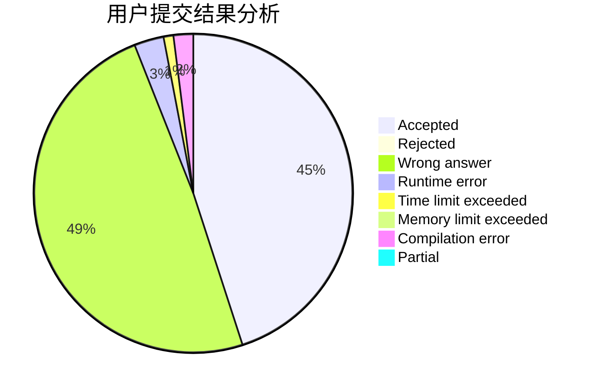
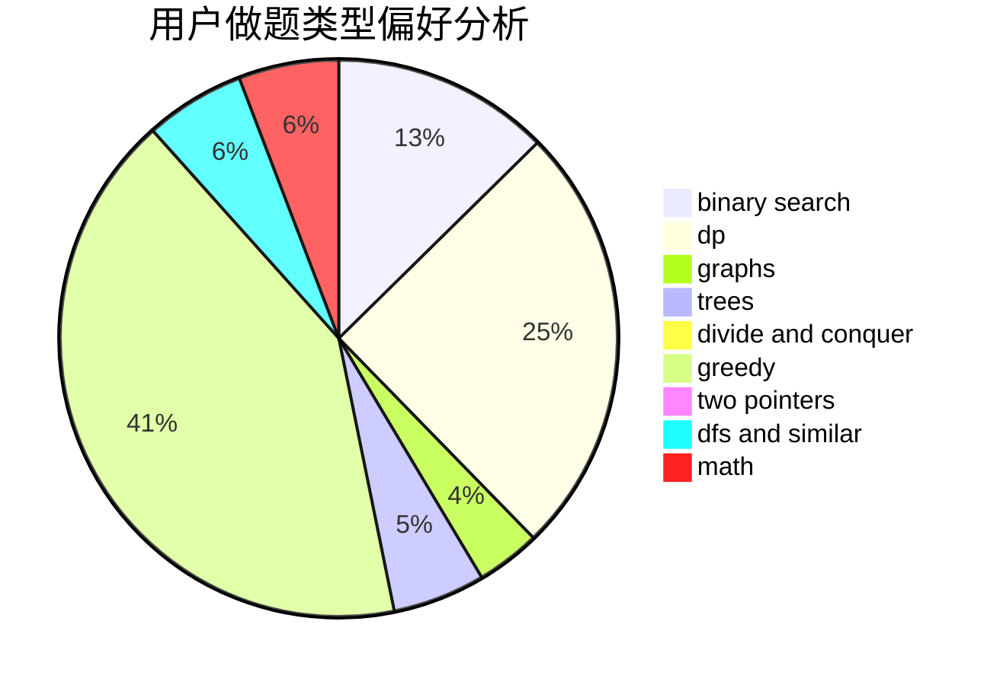

# mdxzydeyayp

<!-- tabs:start -->

#### **用户提交结果分析**

#### **用户做题类型偏好分析**

<!-- tabs:end -->
# 推荐题目
[906C](https://codeforces.com/contest/906/problem/C)
[1272E](https://codeforces.com/contest/1272/problem/E)
[1217E](https://codeforces.com/contest/1217/problem/E)
[219D](https://codeforces.com/contest/219/problem/D)
[798C](https://codeforces.com/contest/798/problem/C)
[883C](https://codeforces.com/contest/883/problem/C)
[1346A](https://codeforces.com/contest/1346/problem/A)
[558A](https://codeforces.com/contest/558/problem/A)
[870C](https://codeforces.com/contest/870/problem/C)
[1197E](https://codeforces.com/contest/1197/problem/E)
