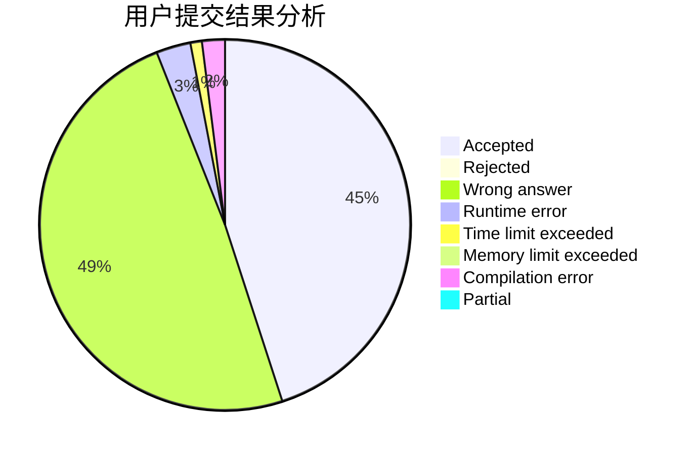
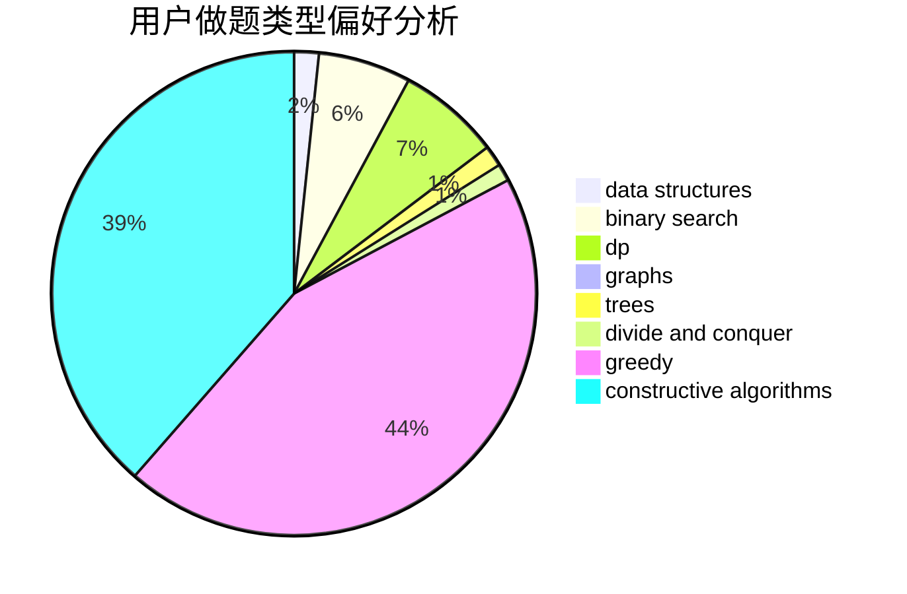
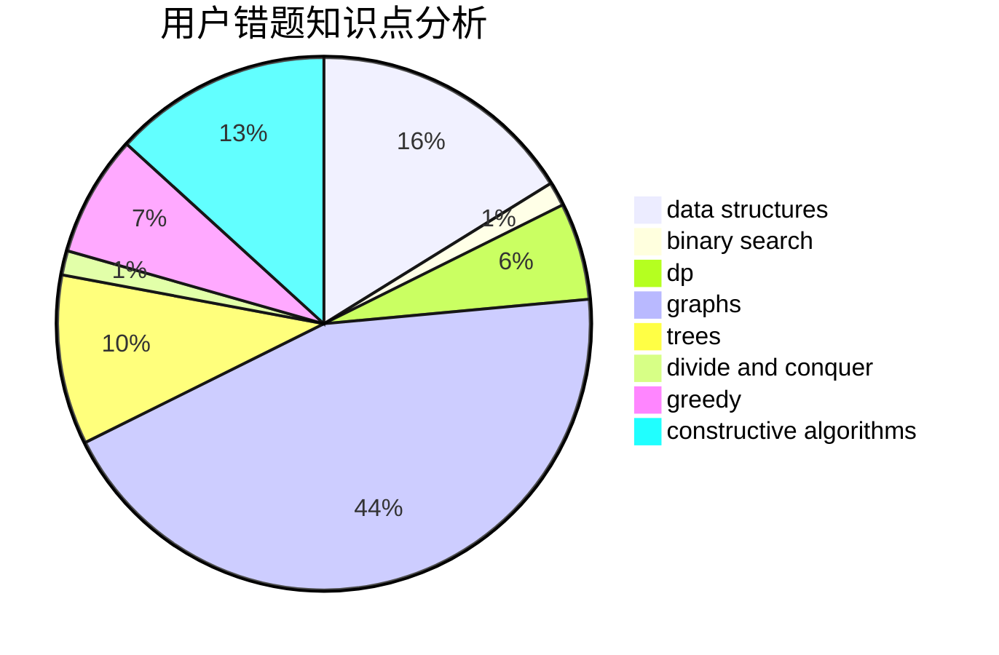

# mdxzydeyayp

<!-- tabs:start -->

#### **用户提交结果分析**

#### **用户做题类型偏好分析**

#### **用户错题知识点分析**

<!-- tabs:end -->
# 推荐题目
[887B](https://codeforces.com/contest/887/problem/B)		brute force,
                        implementation		  
[1267B](https://codeforces.com/contest/1267/problem/B)		nan		  
[1213C](https://codeforces.com/contest/1213/problem/C)		math		  
[198B](https://codeforces.com/contest/198/problem/B)		shortest paths		  
[77E](https://codeforces.com/contest/77/problem/E)		geometry		  
[863A](https://codeforces.com/contest/863/problem/A)		brute force,
                        implementation		  
[1339A](https://codeforces.com/contest/1339/problem/A)		brute force,
                        dp,
                        implementation,
                        math		  
[535C](https://codeforces.com/contest/535/problem/C)		binary search,
                        greedy,
                        math		  
[852D](https://codeforces.com/contest/852/problem/D)		binary search,
                        flows,
                        graph matchings,
                        shortest paths		  
[1191F](https://codeforces.com/contest/1191/problem/F)		dsu,graphs,sortings,trees		  
