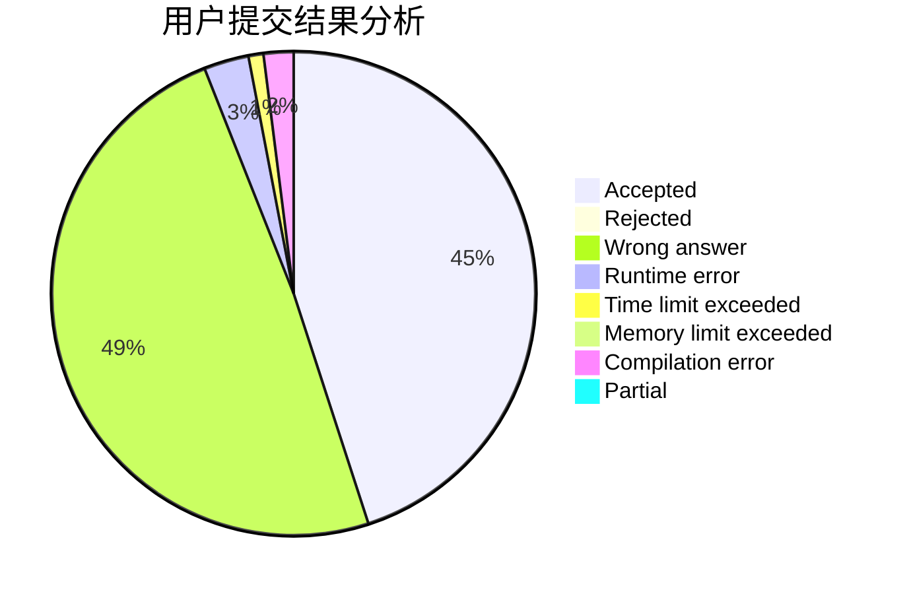
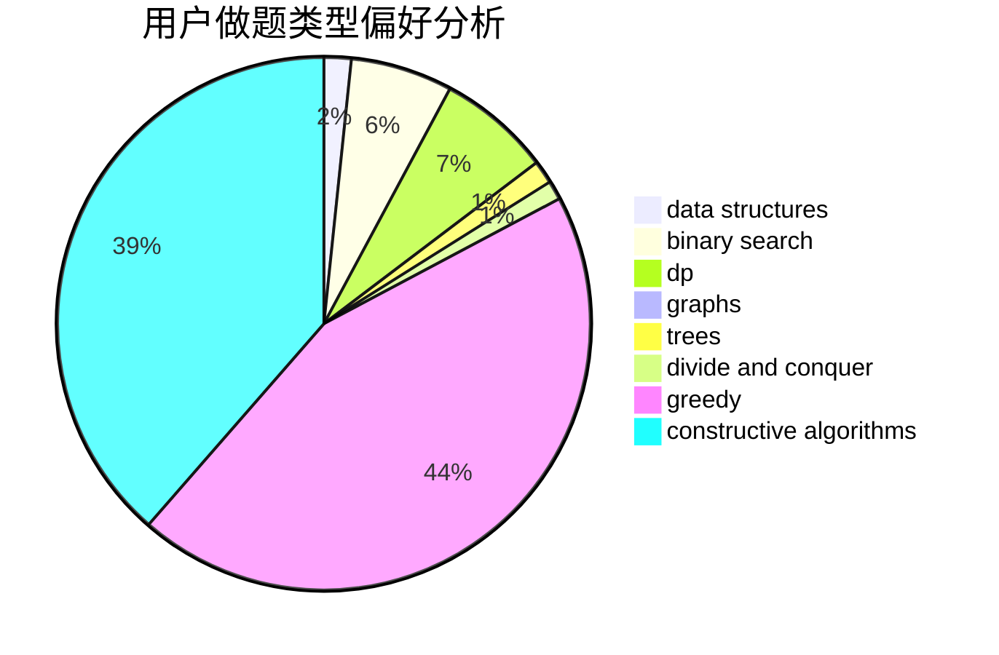
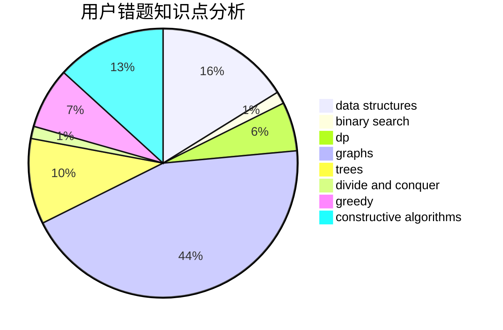

# mdxzydeyayp
<!-- tabs:start -->
#### **用户提交结果分析**

#### **用户做题类型偏好分析**

#### **用户错题知识点分析**

<!-- tabs:end -->
# 推荐题目
[Cubes for Masha](http://codeforces.com/problemset/problem/887/B)		brute force,
                        implementation		  
[Book Reading](http://codeforces.com/problemset/problem/1213/C)		math		  
[Martian Food](http://codeforces.com/problemset/problem/77/E)		geometry		  
[Quasi-palindrome](http://codeforces.com/problemset/problem/863/A)		brute force,
                        implementation		  
[Tavas and Karafs](http://codeforces.com/problemset/problem/535/C)		binary search,
                        greedy,
                        math		  
[Balanced Team](http://codeforces.com/problemset/problem/1133/C)		sortings,
                        two pointers		  
[Balls of Buma](http://codeforces.com/problemset/problem/1267/B)		nan		  
[Average Score](http://codeforces.com/problemset/problem/81/C)		greedy,
                        math,
                        sortings		  
[Door Frames](http://codeforces.com/problemset/problem/910/B)		greedy,
                        implementation		  
[Group Photo 2 (online mirror version)](http://codeforces.com/problemset/problem/529/B)		brute force,
                        greedy,
                        sortings		  
<!-- tabs:start -->
#### **data structures**
[Cubes for Masha](https://codeforces.com/contest/1191/problem/F)		data structures,
                        divide and conquer,
                        sortings,
                        two pointers		  
[Book Reading](http://codeforces.com/problemset/problem/420/D)		data structures		  
[Martian Food](http://codeforces.com/problemset/problem/1108/E2)		data structures,
                        implementation		  
[Quasi-palindrome](http://codeforces.com/problemset/problem/1044/D)		data structures,
                        dsu		  
[Tavas and Karafs](https://codeforces.com/contest/397/problem/E)		data structures,
                        graphs,
                        trees		  
[Balanced Team](http://codeforces.com/problemset/problem/1335/E2)		brute force,
                        data structures,
                        dp,
                        two pointers		  
[Balls of Buma](http://codeforces.com/problemset/problem/1373/G)		data structures,
                        divide and conquer,
                        greedy		  
[Average Score](http://codeforces.com/problemset/problem/932/F)		data structures,
                        dp,
                        geometry		  
[Door Frames](http://codeforces.com/problemset/problem/1492/C)		binary search,
                        data structures,
                        dp,
                        greedy,
                        two pointers		  
[Group Photo 2 (online mirror version)](http://codeforces.com/problemset/problem/1490/G)		binary search,
                        data structures,
                        math		  
#### **binary search**
[Cubes for Masha](http://codeforces.com/problemset/problem/535/C)		binary search,
                        greedy,
                        math		  
[Book Reading](http://codeforces.com/problemset/problem/852/D)		binary search,
                        flows,
                        graph matchings,
                        shortest paths		  
[Martian Food](http://codeforces.com/problemset/problem/1488/D)		*special problem,
                        binary search,
                        greedy		  
[Quasi-palindrome](http://codeforces.com/problemset/problem/1492/C)		binary search,
                        data structures,
                        dp,
                        greedy,
                        two pointers		  
[Tavas and Karafs](http://codeforces.com/problemset/problem/1463/D)		binary search,
                        constructive algorithms,
                        greedy,
                        two pointers		  
[Balanced Team](http://codeforces.com/problemset/problem/1490/G)		binary search,
                        data structures,
                        math		  
[Balls of Buma](http://codeforces.com/problemset/problem/1479/D)		binary search,
                        bitmasks,
                        brute force,
                        data structures,
                        probabilities,
                        trees		  
[Average Score](http://codeforces.com/problemset/problem/1436/E)		binary search,
                        data structures,
                        two pointers		  
[Door Frames](http://codeforces.com/problemset/problem/1461/D)		binary search,
                        brute force,
                        data structures,
                        divide and conquer,
                        implementation,
                        sortings		  
[Group Photo 2 (online mirror version)](http://codeforces.com/problemset/problem/1493/C)		binary search,
                        brute force,
                        constructive algorithms,
                        greedy,
                        strings		  
#### **dp**
[Cubes for Masha](http://codeforces.com/problemset/problem/1156/F)		dp,
                        math,
                        probabilities		  
[Book Reading](http://codeforces.com/problemset/problem/1335/E2)		brute force,
                        data structures,
                        dp,
                        two pointers		  
[Martian Food](http://codeforces.com/problemset/problem/1339/A)		brute force,
                        dp,
                        implementation,
                        math		  
[Quasi-palindrome](http://codeforces.com/problemset/problem/932/F)		data structures,
                        dp,
                        geometry		  
[Tavas and Karafs](http://codeforces.com/problemset/problem/1492/C)		binary search,
                        data structures,
                        dp,
                        greedy,
                        two pointers		  
[Balanced Team](https://codeforces.com/contest/1457/problem/C)		brute force,
                        dp,
                        implementation		  
[Balls of Buma](http://codeforces.com/problemset/problem/1491/C)		brute force,
                        data structures,
                        dp,
                        greedy,
                        implementation		  
[Average Score](http://codeforces.com/problemset/problem/1437/C)		dp,
                        flows,
                        graph matchings,
                        greedy,
                        math,
                        sortings		  
[Door Frames](http://codeforces.com/problemset/problem/1499/B)		brute force,
                        dp,
                        greedy,
                        implementation		  
[Group Photo 2 (online mirror version)](http://codeforces.com/problemset/problem/1491/D)		bitmasks,
                        constructive algorithms,
                        dp,
                        greedy,
                        math		  
#### **graph**
[Cubes for Masha](http://codeforces.com/problemset/problem/1034/B)		brute force,
                        constructive algorithms,
                        flows,
                        graph matchings		  
[Book Reading](http://codeforces.com/problemset/problem/852/D)		binary search,
                        flows,
                        graph matchings,
                        shortest paths		  
[Martian Food](https://codeforces.com/contest/397/problem/E)		data structures,
                        graphs,
                        trees		  
[Quasi-palindrome](https://codeforces.com/contest/1341/problem/F)		constructive algorithms,
                        dfs and similar,
                        graphs,
                        trees		  
[Tavas and Karafs](http://codeforces.com/problemset/problem/1510/C)		dfs and similar,
                        graph matchings,
                        graphs		  
[Balanced Team](http://codeforces.com/problemset/problem/1487/C)		brute force,
                        constructive algorithms,
                        dfs and similar,
                        graphs,
                        greedy,
                        implementation,
                        math		  
[Balls of Buma](http://codeforces.com/problemset/problem/1437/C)		dp,
                        flows,
                        graph matchings,
                        greedy,
                        math,
                        sortings		  
[Average Score](http://codeforces.com/problemset/problem/1470/D)		constructive algorithms,
                        dfs and similar,
                        graph matchings,
                        graphs,
                        greedy		  
[Door Frames](http://codeforces.com/problemset/problem/1476/C)		dp,
                        graphs,
                        greedy		  
[Group Photo 2 (online mirror version)](http://codeforces.com/problemset/problem/1304/D)		constructive algorithms,
                        graphs,
                        greedy,
                        two pointers		  
#### **trees**
[Cubes for Masha](https://codeforces.com/contest/397/problem/E)		data structures,
                        graphs,
                        trees		  
[Book Reading](https://codeforces.com/contest/1341/problem/F)		constructive algorithms,
                        dfs and similar,
                        graphs,
                        trees		  
[Martian Food](http://codeforces.com/problemset/problem/1479/D)		binary search,
                        bitmasks,
                        brute force,
                        data structures,
                        probabilities,
                        trees		  
[Quasi-palindrome](http://codeforces.com/problemset/problem/1511/C)		brute force,
                        data structures,
                        implementation,
                        trees		  
[Tavas and Karafs](http://codeforces.com/problemset/problem/1499/F)		combinatorics,
                        dfs and similar,
                        dp,
                        trees		  
[Balanced Team](http://codeforces.com/problemset/problem/1491/E)		brute force,
                        dfs and similar,
                        divide and conquer,
                        number theory,
                        trees		  
[Balls of Buma](http://codeforces.com/problemset/problem/1466/D)		data structures,
                        greedy,
                        sortings,
                        trees		  
[Average Score](http://codeforces.com/problemset/problem/1495/D)		combinatorics,
                        dfs and similar,
                        graphs,
                        math,
                        shortest paths,
                        trees		  
[Door Frames](http://codeforces.com/problemset/problem/1303/G)		data structures,
                        divide and conquer,
                        geometry,
                        trees		  
[Group Photo 2 (online mirror version)](http://codeforces.com/problemset/problem/1454/E)		combinatorics,
                        dfs and similar,
                        graphs,
                        trees		  
#### **divide and conquer**
[Cubes for Masha](https://codeforces.com/contest/1191/problem/F)		data structures,
                        divide and conquer,
                        sortings,
                        two pointers		  
[Book Reading](http://codeforces.com/problemset/problem/1408/F)		constructive algorithms,
                        divide and conquer		  
[Martian Food](http://codeforces.com/problemset/problem/1373/G)		data structures,
                        divide and conquer,
                        greedy		  
[Quasi-palindrome](http://codeforces.com/problemset/problem/1461/D)		binary search,
                        brute force,
                        data structures,
                        divide and conquer,
                        implementation,
                        sortings		  
[Tavas and Karafs](http://codeforces.com/problemset/problem/1466/G)		combinatorics,
                        divide and conquer,
                        hashing,
                        math,
                        string suffix structures,
                        strings		  
[Balanced Team](http://codeforces.com/problemset/problem/1490/D)		dfs and similar,
                        divide and conquer,
                        implementation		  
[Balls of Buma](https://codeforces.com/contest/1483/problem/C)		data structures,
                        divide and conquer,
                        dp		  
[Average Score](http://codeforces.com/problemset/problem/1491/E)		brute force,
                        dfs and similar,
                        divide and conquer,
                        number theory,
                        trees		  
[Door Frames](http://codeforces.com/problemset/problem/1303/G)		data structures,
                        divide and conquer,
                        geometry,
                        trees		  
[Group Photo 2 (online mirror version)](http://codeforces.com/problemset/problem/1494/D)		constructive algorithms,
                        data structures,
                        dfs and similar,
                        divide and conquer,
                        dsu,
                        greedy,
                        sortings,
                        trees		  
#### **greedy**
[Cubes for Masha](http://codeforces.com/problemset/problem/535/C)		binary search,
                        greedy,
                        math		  
[Book Reading](http://codeforces.com/problemset/problem/81/C)		greedy,
                        math,
                        sortings		  
[Martian Food](http://codeforces.com/problemset/problem/910/B)		greedy,
                        implementation		  
[Quasi-palindrome](http://codeforces.com/problemset/problem/529/B)		brute force,
                        greedy,
                        sortings		  
[Tavas and Karafs](http://codeforces.com/problemset/problem/463/C)		greedy,
                        hashing,
                        implementation		  
[Balanced Team](http://codeforces.com/problemset/problem/215/D)		greedy		  
[Balls of Buma](http://codeforces.com/problemset/problem/508/B)		greedy,
                        math,
                        strings		  
[Average Score](http://codeforces.com/problemset/problem/1031/D)		greedy		  
[Door Frames](http://codeforces.com/problemset/problem/1256/D)		greedy		  
[Group Photo 2 (online mirror version)](http://codeforces.com/problemset/problem/1488/D)		*special problem,
                        binary search,
                        greedy		  
#### **constructive algorithms**
[Cubes for Masha](http://codeforces.com/problemset/problem/1446/E)		constructive algorithms,
                        dfs and similar		  
[Book Reading](http://codeforces.com/problemset/problem/1034/B)		brute force,
                        constructive algorithms,
                        flows,
                        graph matchings		  
[Martian Food](http://codeforces.com/problemset/problem/1012/D)		constructive algorithms,
                        strings		  
[Quasi-palindrome](https://codeforces.com/contest/1341/problem/F)		constructive algorithms,
                        dfs and similar,
                        graphs,
                        trees		  
[Tavas and Karafs](http://codeforces.com/problemset/problem/1408/F)		constructive algorithms,
                        divide and conquer		  
[Balanced Team](http://codeforces.com/problemset/problem/1493/A)		constructive algorithms,
                        greedy		  
[Balls of Buma](http://codeforces.com/problemset/problem/1463/D)		binary search,
                        constructive algorithms,
                        greedy,
                        two pointers		  
[Average Score](https://codeforces.com/contest/1456/problem/B)		bitmasks,
                        brute force,
                        constructive algorithms		  
[Door Frames](http://codeforces.com/problemset/problem/1492/D)		bitmasks,
                        constructive algorithms,
                        greedy,
                        math		  
[Group Photo 2 (online mirror version)](https://codeforces.com/contest/1504/problem/D)		constructive algorithms,
                        games,
                        interactive		  
#### **sortings**
[Cubes for Masha](http://codeforces.com/problemset/problem/1133/C)		sortings,
                        two pointers		  
[Book Reading](http://codeforces.com/problemset/problem/81/C)		greedy,
                        math,
                        sortings		  
[Martian Food](http://codeforces.com/problemset/problem/529/B)		brute force,
                        greedy,
                        sortings		  
[Quasi-palindrome](https://codeforces.com/contest/1191/problem/F)		data structures,
                        divide and conquer,
                        sortings,
                        two pointers		  
[Tavas and Karafs](https://codeforces.com/contest/1496/problem/C)		geometry,
                        greedy,
                        math,
                        sortings		  
[Balanced Team](http://codeforces.com/problemset/problem/1495/A)		geometry,
                        greedy,
                        math,
                        sortings		  
[Balls of Buma](http://codeforces.com/problemset/problem/1497/A)		brute force,
                        data structures,
                        greedy,
                        sortings		  
[Average Score](http://codeforces.com/problemset/problem/1427/A)		math,
                        sortings		  
[Door Frames](http://codeforces.com/problemset/problem/1461/D)		binary search,
                        brute force,
                        data structures,
                        divide and conquer,
                        implementation,
                        sortings		  
[Group Photo 2 (online mirror version)](http://codeforces.com/problemset/problem/1437/C)		dp,
                        flows,
                        graph matchings,
                        greedy,
                        math,
                        sortings		  
<!-- tabs:end -->
