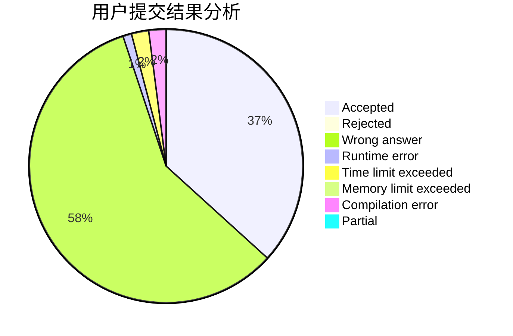
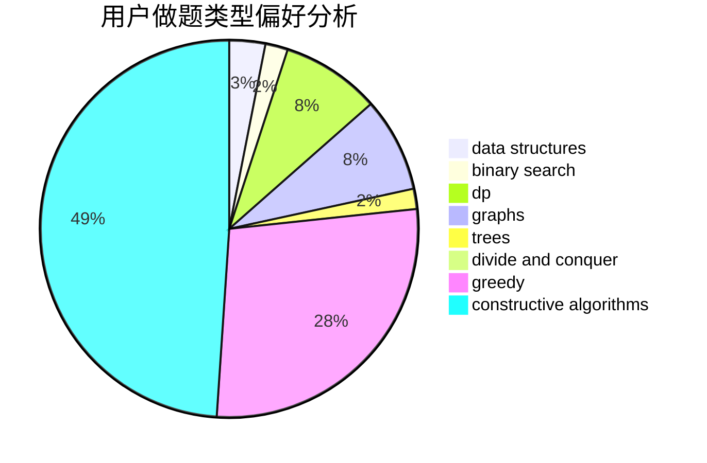
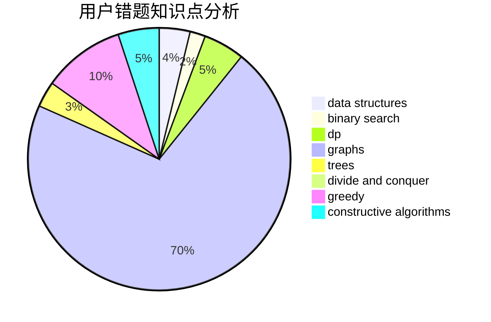

# meant
<!-- tabs:start -->
#### **用户提交结果分析**

#### **用户做题类型偏好分析**

#### **用户错题知识点分析**

<!-- tabs:end -->
# 推荐题目
[Drazil and Park](https://codeforces.com/contest/516/problem/C)		data structures		  
[Creating a Character](http://codeforces.com/problemset/problem/1217/A)		binary search,
                        math		  
[Margarite and the best present](http://codeforces.com/problemset/problem/1080/B)		math		  
[Teams Formation](http://codeforces.com/problemset/problem/878/B)		data structures,
                        implementation		  
[Chain Reaction](https://codeforces.com/contest/667/problem/E)		brute force,
                        geometry		  
[Good String](http://codeforces.com/problemset/problem/1165/C)		greedy		  
[Gravity Flip](http://codeforces.com/problemset/problem/405/A)		greedy,
                        implementation,
                        sortings		  
[Fence](http://codeforces.com/problemset/problem/363/B)		brute force,
                        dp		  
[Parametric Circulation](http://codeforces.com/problemset/problem/925/F)		binary search,
                        flows		  
[Megacity](http://codeforces.com/problemset/problem/424/B)		binary search,
                        greedy,
                        implementation,
                        sortings		  
<!-- tabs:start -->
#### **data structures**
[Drazil and Park](https://codeforces.com/contest/516/problem/C)		data structures		  
[Creating a Character](http://codeforces.com/problemset/problem/878/B)		data structures,
                        implementation		  
[Margarite and the best present](http://codeforces.com/problemset/problem/1313/E)		data structures,
                        hashing,
                        strings,
                        two pointers		  
[Teams Formation](http://codeforces.com/problemset/problem/877/E)		bitmasks,
                        data structures,
                        trees		  
[Chain Reaction](http://codeforces.com/problemset/problem/1187/D)		data structures,
                        sortings		  
[Good String](http://codeforces.com/problemset/problem/1253/E)		data structures,
                        dp,
                        greedy,
                        sortings		  
[Gravity Flip](http://codeforces.com/problemset/problem/1452/G)		data structures,
                        dfs and similar,
                        greedy,
                        trees		  
[Fence](http://codeforces.com/problemset/problem/748/D)		constructive algorithms,
                        data structures,
                        greedy		  
[Parametric Circulation](http://codeforces.com/problemset/problem/1422/F)		data structures,
                        math,
                        number theory		  
[Megacity](http://codeforces.com/problemset/problem/785/E)		brute force,
                        data structures		  
#### **binary search**
[Drazil and Park](http://codeforces.com/problemset/problem/1217/A)		binary search,
                        math		  
[Creating a Character](http://codeforces.com/problemset/problem/925/F)		binary search,
                        flows		  
[Margarite and the best present](http://codeforces.com/problemset/problem/424/B)		binary search,
                        greedy,
                        implementation,
                        sortings		  
[Teams Formation](http://codeforces.com/problemset/problem/492/B)		binary search,
                        implementation,
                        math,
                        sortings		  
[Chain Reaction](http://codeforces.com/problemset/problem/1492/C)		binary search,
                        data structures,
                        dp,
                        greedy,
                        two pointers		  
[Good String](http://codeforces.com/problemset/problem/1463/D)		binary search,
                        constructive algorithms,
                        greedy,
                        two pointers		  
[Gravity Flip](http://codeforces.com/problemset/problem/1490/G)		binary search,
                        data structures,
                        math		  
[Fence](http://codeforces.com/problemset/problem/1479/D)		binary search,
                        bitmasks,
                        brute force,
                        data structures,
                        probabilities,
                        trees		  
[Parametric Circulation](http://codeforces.com/problemset/problem/1436/E)		binary search,
                        data structures,
                        two pointers		  
[Megacity](http://codeforces.com/problemset/problem/1461/D)		binary search,
                        brute force,
                        data structures,
                        divide and conquer,
                        implementation,
                        sortings		  
#### **dp**
[Drazil and Park](http://codeforces.com/problemset/problem/363/B)		brute force,
                        dp		  
[Creating a Character](https://codeforces.com/contest/800/problem/D)		bitmasks,
                        dp		  
[Margarite and the best present](https://codeforces.com/contest/789/problem/C)		dp,
                        two pointers		  
[Teams Formation](http://codeforces.com/problemset/problem/1253/E)		data structures,
                        dp,
                        greedy,
                        sortings		  
[Chain Reaction](http://codeforces.com/problemset/problem/264/C)		dp		  
[Good String](https://codeforces.com/contest/1078/problem/C)		dp,
                        trees		  
[Gravity Flip](http://codeforces.com/problemset/problem/222/E)		dp,
                        matrices		  
[Fence](http://codeforces.com/problemset/problem/1182/A)		dp,
                        math		  
[Parametric Circulation](http://codeforces.com/problemset/problem/1066/F)		dp		  
[Megacity](http://codeforces.com/problemset/problem/734/E)		dfs and similar,
                        dp,
                        trees		  
#### **graph**
[Drazil and Park](http://codeforces.com/problemset/problem/948/A)		brute force,
                        dfs and similar,
                        graphs,
                        implementation		  
[Creating a Character](http://codeforces.com/problemset/problem/1487/C)		brute force,
                        constructive algorithms,
                        dfs and similar,
                        graphs,
                        greedy,
                        implementation,
                        math		  
[Margarite and the best present](http://codeforces.com/problemset/problem/1437/C)		dp,
                        flows,
                        graph matchings,
                        greedy,
                        math,
                        sortings		  
[Teams Formation](http://codeforces.com/problemset/problem/1470/D)		constructive algorithms,
                        dfs and similar,
                        graph matchings,
                        graphs,
                        greedy		  
[Chain Reaction](http://codeforces.com/problemset/problem/1476/C)		dp,
                        graphs,
                        greedy		  
[Good String](http://codeforces.com/problemset/problem/1304/D)		constructive algorithms,
                        graphs,
                        greedy,
                        two pointers		  
[Gravity Flip](http://codeforces.com/problemset/problem/1475/C)		combinatorics,
                        graphs,
                        math		  
[Fence](http://codeforces.com/problemset/problem/553/E)		dp,
                        fft,
                        graphs,
                        math,
                        probabilities		  
[Parametric Circulation](http://codeforces.com/problemset/problem/1495/C)		constructive algorithms,
                        graphs		  
[Megacity](http://codeforces.com/problemset/problem/1510/K)		brute force,
                        graphs,
                        implementation		  
#### **trees**
[Drazil and Park](http://codeforces.com/problemset/problem/877/E)		bitmasks,
                        data structures,
                        trees		  
[Creating a Character](https://codeforces.com/contest/1078/problem/C)		dp,
                        trees		  
[Margarite and the best present](http://codeforces.com/problemset/problem/1452/G)		data structures,
                        dfs and similar,
                        greedy,
                        trees		  
[Teams Formation](http://codeforces.com/problemset/problem/734/E)		dfs and similar,
                        dp,
                        trees		  
[Chain Reaction](http://codeforces.com/problemset/problem/581/F)		dp,
                        trees,
                        two pointers		  
[Good String](http://codeforces.com/problemset/problem/1479/D)		binary search,
                        bitmasks,
                        brute force,
                        data structures,
                        probabilities,
                        trees		  
[Gravity Flip](http://codeforces.com/problemset/problem/1511/C)		brute force,
                        data structures,
                        implementation,
                        trees		  
[Fence](http://codeforces.com/problemset/problem/1499/F)		combinatorics,
                        dfs and similar,
                        dp,
                        trees		  
[Parametric Circulation](http://codeforces.com/problemset/problem/1491/E)		brute force,
                        dfs and similar,
                        divide and conquer,
                        number theory,
                        trees		  
[Megacity](http://codeforces.com/problemset/problem/1466/D)		data structures,
                        greedy,
                        sortings,
                        trees		  
#### **divide and conquer**
[Drazil and Park](http://codeforces.com/problemset/problem/1461/D)		binary search,
                        brute force,
                        data structures,
                        divide and conquer,
                        implementation,
                        sortings		  
[Creating a Character](http://codeforces.com/problemset/problem/1466/G)		combinatorics,
                        divide and conquer,
                        hashing,
                        math,
                        string suffix structures,
                        strings		  
[Margarite and the best present](http://codeforces.com/problemset/problem/1490/D)		dfs and similar,
                        divide and conquer,
                        implementation		  
[Teams Formation](https://codeforces.com/contest/1483/problem/C)		data structures,
                        divide and conquer,
                        dp		  
[Chain Reaction](http://codeforces.com/problemset/problem/1491/E)		brute force,
                        dfs and similar,
                        divide and conquer,
                        number theory,
                        trees		  
[Good String](http://codeforces.com/problemset/problem/1303/G)		data structures,
                        divide and conquer,
                        geometry,
                        trees		  
[Gravity Flip](http://codeforces.com/problemset/problem/1494/D)		constructive algorithms,
                        data structures,
                        dfs and similar,
                        divide and conquer,
                        dsu,
                        greedy,
                        sortings,
                        trees		  
[Fence](http://codeforces.com/problemset/problem/1482/E)		data structures,
                        divide and conquer,
                        dp		  
[Parametric Circulation](http://codeforces.com/problemset/problem/566/C)		dfs and similar,
                        divide and conquer,
                        trees		  
[Megacity](http://codeforces.com/problemset/problem/1428/F)		binary search,
                        data structures,
                        divide and conquer,
                        dp,
                        two pointers		  
#### **greedy**
[Drazil and Park](http://codeforces.com/problemset/problem/1165/C)		greedy		  
[Creating a Character](http://codeforces.com/problemset/problem/405/A)		greedy,
                        implementation,
                        sortings		  
[Margarite and the best present](http://codeforces.com/problemset/problem/424/B)		binary search,
                        greedy,
                        implementation,
                        sortings		  
[Teams Formation](http://codeforces.com/problemset/problem/388/C)		games,
                        greedy,
                        sortings		  
[Chain Reaction](https://codeforces.com/contest/1350/problem/D)		constructive algorithms,
                        greedy,
                        math		  
[Good String](http://codeforces.com/problemset/problem/479/B)		brute force,
                        constructive algorithms,
                        greedy,
                        implementation,
                        sortings		  
[Gravity Flip](http://codeforces.com/problemset/problem/1253/E)		data structures,
                        dp,
                        greedy,
                        sortings		  
[Fence](http://codeforces.com/problemset/problem/1452/G)		data structures,
                        dfs and similar,
                        greedy,
                        trees		  
[Parametric Circulation](http://codeforces.com/problemset/problem/1062/B)		greedy,
                        math,
                        number theory		  
[Megacity](http://codeforces.com/problemset/problem/748/D)		constructive algorithms,
                        data structures,
                        greedy		  
#### **constructive algorithms**
[Drazil and Park](https://codeforces.com/contest/1350/problem/D)		constructive algorithms,
                        greedy,
                        math		  
[Creating a Character](http://codeforces.com/problemset/problem/479/B)		brute force,
                        constructive algorithms,
                        greedy,
                        implementation,
                        sortings		  
[Margarite and the best present](http://codeforces.com/problemset/problem/748/D)		constructive algorithms,
                        data structures,
                        greedy		  
[Teams Formation](http://codeforces.com/problemset/problem/622/D)		constructive algorithms		  
[Chain Reaction](http://codeforces.com/problemset/problem/1493/A)		constructive algorithms,
                        greedy		  
[Good String](http://codeforces.com/problemset/problem/1463/D)		binary search,
                        constructive algorithms,
                        greedy,
                        two pointers		  
[Gravity Flip](https://codeforces.com/contest/1456/problem/B)		bitmasks,
                        brute force,
                        constructive algorithms		  
[Fence](http://codeforces.com/problemset/problem/1492/D)		bitmasks,
                        constructive algorithms,
                        greedy,
                        math		  
[Parametric Circulation](https://codeforces.com/contest/1504/problem/D)		constructive algorithms,
                        games,
                        interactive		  
[Megacity](https://codeforces.com/contest/1483/problem/A)		brute force,
                        constructive algorithms,
                        greedy,
                        implementation		  
#### **sortings**
[Drazil and Park](http://codeforces.com/problemset/problem/405/A)		greedy,
                        implementation,
                        sortings		  
[Creating a Character](http://codeforces.com/problemset/problem/424/B)		binary search,
                        greedy,
                        implementation,
                        sortings		  
[Margarite and the best present](http://codeforces.com/problemset/problem/388/C)		games,
                        greedy,
                        sortings		  
[Teams Formation](http://codeforces.com/problemset/problem/492/B)		binary search,
                        implementation,
                        math,
                        sortings		  
[Chain Reaction](http://codeforces.com/problemset/problem/1187/D)		data structures,
                        sortings		  
[Good String](http://codeforces.com/problemset/problem/479/B)		brute force,
                        constructive algorithms,
                        greedy,
                        implementation,
                        sortings		  
[Gravity Flip](http://codeforces.com/problemset/problem/1253/E)		data structures,
                        dp,
                        greedy,
                        sortings		  
[Fence](https://codeforces.com/contest/1496/problem/C)		geometry,
                        greedy,
                        math,
                        sortings		  
[Parametric Circulation](http://codeforces.com/problemset/problem/1495/A)		geometry,
                        greedy,
                        math,
                        sortings		  
[Megacity](http://codeforces.com/problemset/problem/1497/A)		brute force,
                        data structures,
                        greedy,
                        sortings		  
<!-- tabs:end -->
