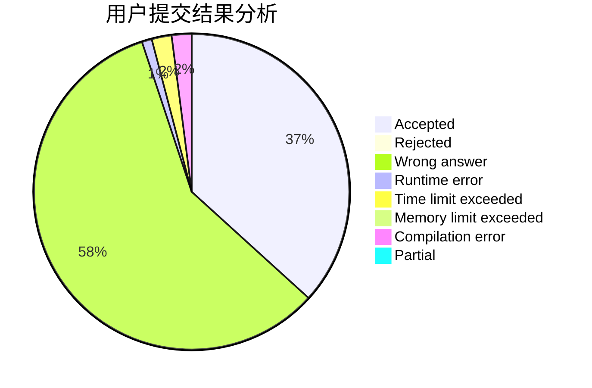
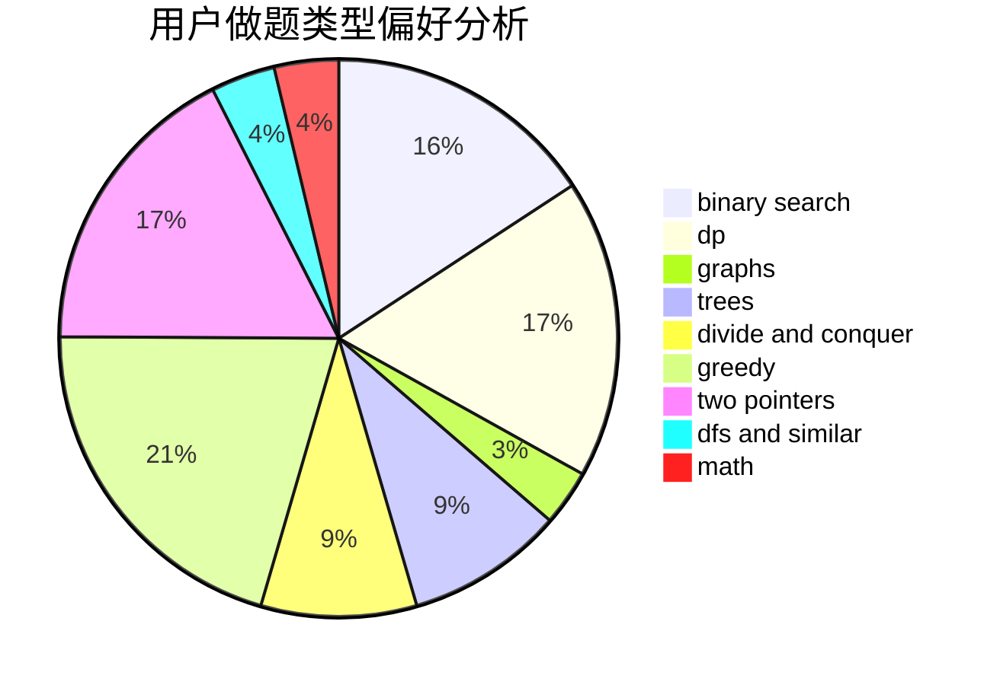

# meant

<!-- tabs:start -->

#### **用户提交结果分析**

#### **用户做题类型偏好分析**

<!-- tabs:end -->
# 推荐题目
[1223E](https://codeforces.com/contest/1223/problem/E)
[543C](https://codeforces.com/contest/543/problem/C)
[637B](https://codeforces.com/contest/637/problem/B)
[49A](https://codeforces.com/contest/49/problem/A)
[447A](https://codeforces.com/contest/447/problem/A)
[1080E](https://codeforces.com/contest/1080/problem/E)
[1167E](https://codeforces.com/contest/1167/problem/E)
[417E](https://codeforces.com/contest/417/problem/E)
[965B](https://codeforces.com/contest/965/problem/B)
[755D](https://codeforces.com/contest/755/problem/D)
