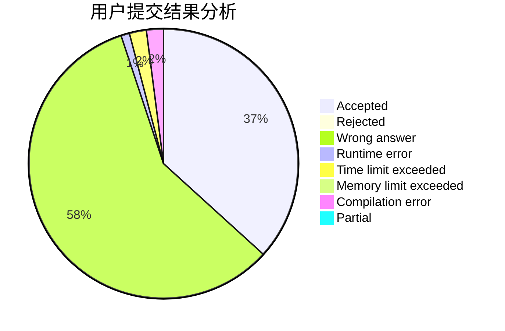
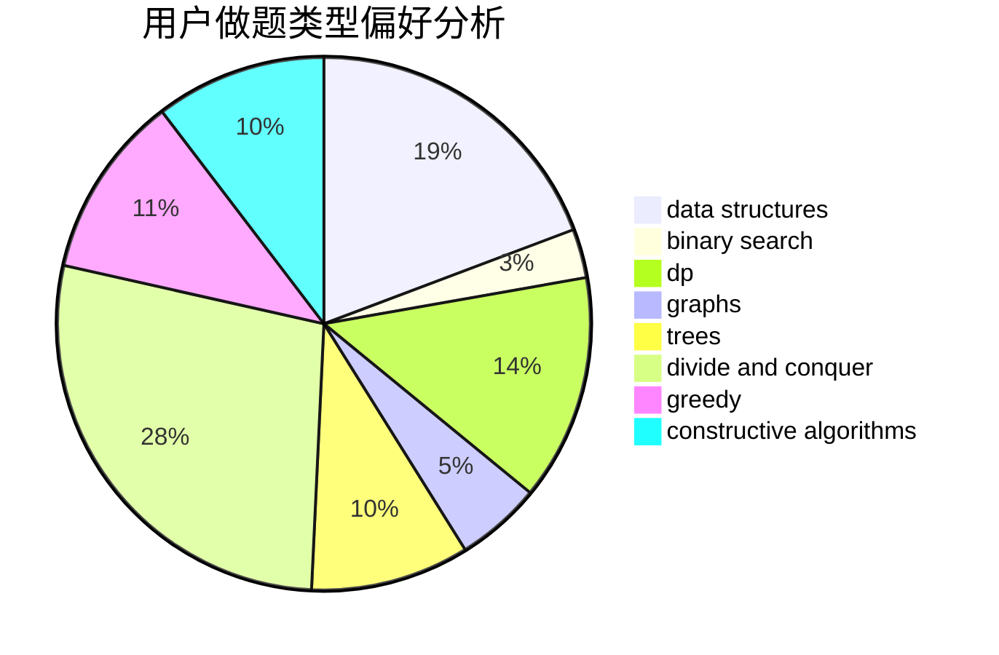
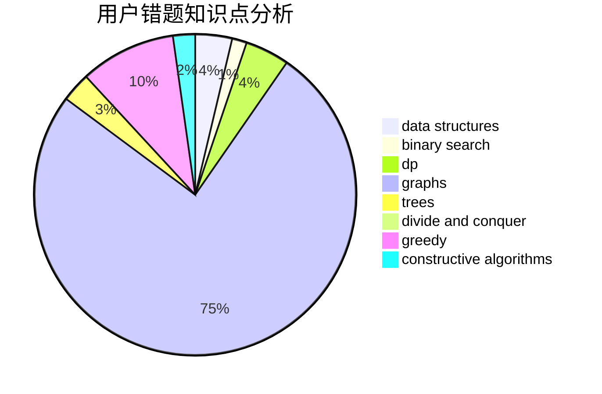

# meant

<!-- tabs:start -->

#### **用户提交结果分析**

#### **用户做题类型偏好分析**

#### **用户错题知识点分析**

<!-- tabs:end -->
# 推荐题目
[1223E](https://codeforces.com/contest/1223/problem/E)		dp,
                        sortings,
                        trees		  
[543C](https://codeforces.com/contest/543/problem/C)		bitmasks,
                        dp		  
[637B](https://codeforces.com/contest/637/problem/B)		*special problem,
                        binary search,
                        constructive algorithms,
                        data structures,
                        sortings		  
[49A](https://codeforces.com/contest/49/problem/A)		implementation		  
[447A](https://codeforces.com/contest/447/problem/A)		implementation		  
[1080E](https://codeforces.com/contest/1080/problem/E)		strings		  
[1167E](https://codeforces.com/contest/1167/problem/E)		binary search,
                        combinatorics,
                        data structures,
                        two pointers		  
[417E](https://codeforces.com/contest/417/problem/E)		constructive algorithms,
                        math,
                        probabilities		  
[965B](https://codeforces.com/contest/965/problem/B)		implementation		  
[755D](https://codeforces.com/contest/755/problem/D)		data structures		  
