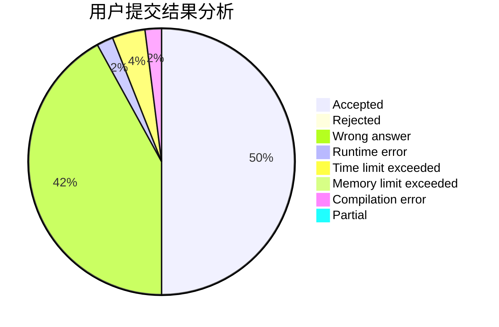
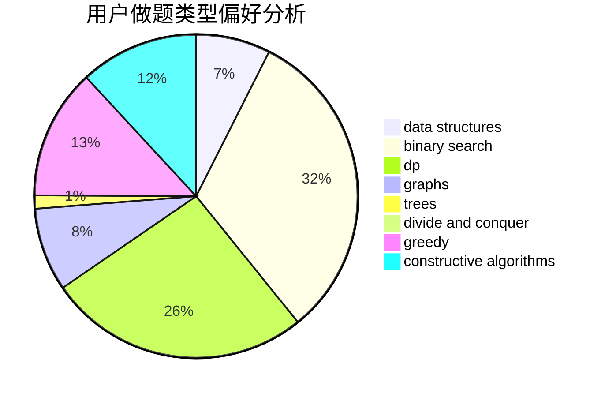
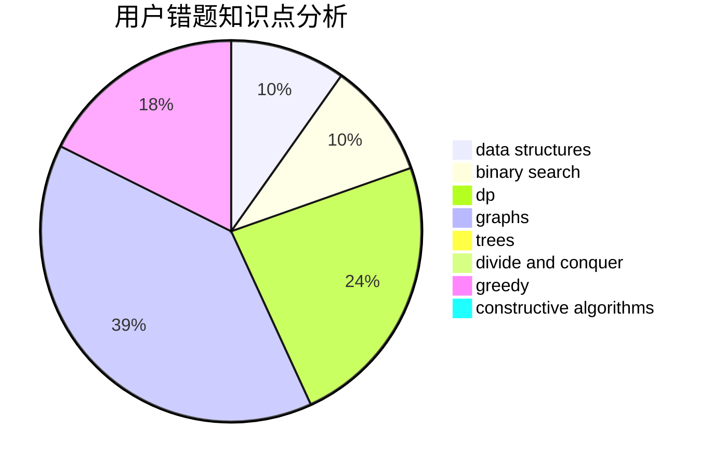

# medium_waxberry

<!-- tabs:start -->

#### **用户提交结果分析**

#### **用户做题类型偏好分析**

#### **用户错题知识点分析**

<!-- tabs:end -->
# 推荐题目
[1475E](https://codeforces.com/contest/1475/problem/E)		combinatorics,
                        math,
                        sortings		  
[1260D](https://codeforces.com/contest/1260/problem/D)		binary search,
                        dp,
                        greedy,
                        sortings		  
[1310B](https://codeforces.com/contest/1310/problem/B)		dp,
                        implementation		  
[1427B](https://codeforces.com/contest/1427/problem/B)		greedy,
                        implementation,
                        sortings		  
[1303G](https://codeforces.com/contest/1303/problem/G)		data structures,
                        divide and conquer,
                        geometry,
                        trees		  
[924A](https://codeforces.com/contest/924/problem/A)		greedy,
                        implementation		  
[439C](https://codeforces.com/contest/439/problem/C)		brute force,
                        constructive algorithms,
                        implementation,
                        number theory		  
[1131D](https://codeforces.com/contest/1131/problem/D)		dfs and similar,
                        dp,
                        dsu,
                        graphs,
                        greedy		  
[463A](https://codeforces.com/contest/463/problem/A)		brute force,
                        implementation		  
[934E](https://codeforces.com/contest/934/problem/E)		dsu,graphs,sortings,trees		  
