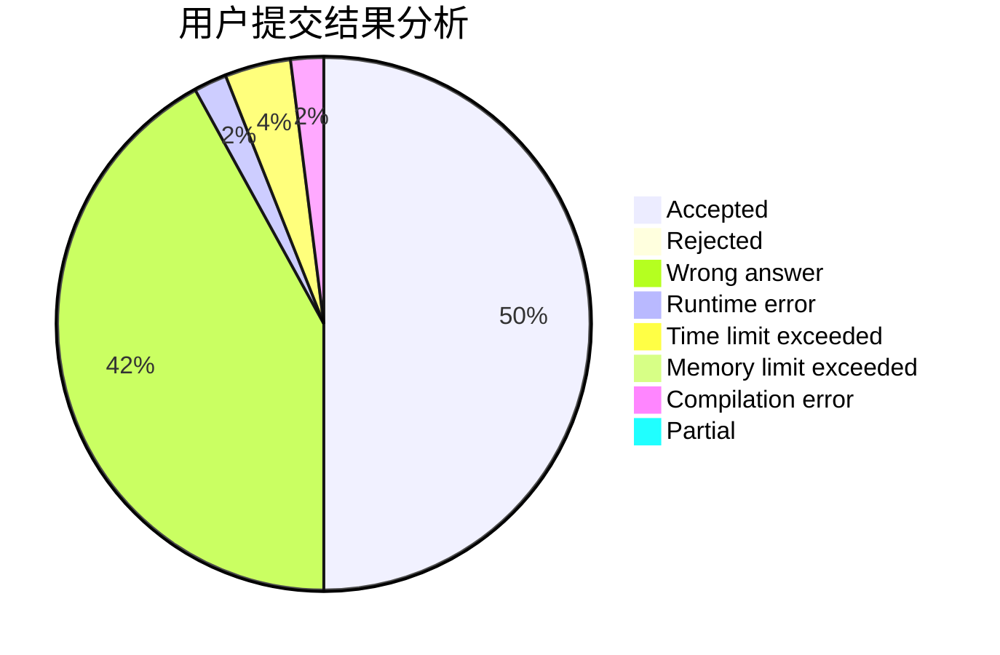
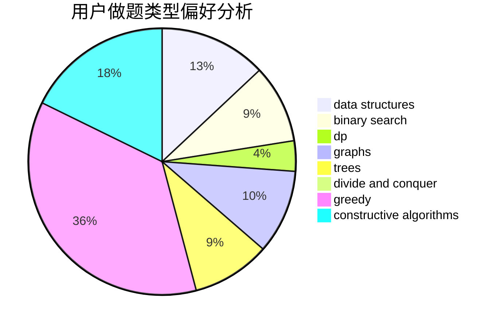
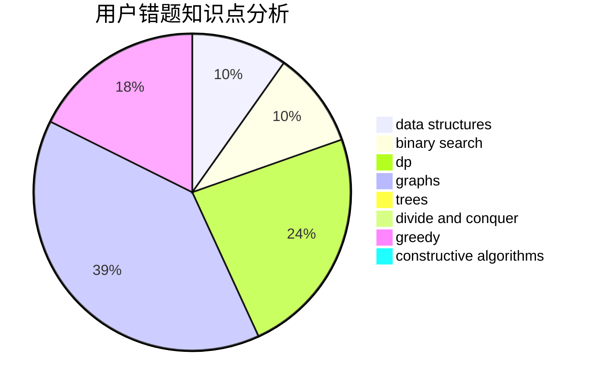

# medium_waxberry

<!-- tabs:start -->

#### **用户提交结果分析**

#### **用户做题类型偏好分析**

#### **用户错题知识点分析**

<!-- tabs:end -->
# 推荐题目
[1484B](https://codeforces.com/contest/1484/problem/B)		dsu,graphs,sortings,trees		  
[1266D](https://codeforces.com/contest/1266/problem/D)		constructive algorithms,
                        data structures,
                        graphs,
                        greedy,
                        implementation,
                        math,
                        two pointers		  
[1316E](https://codeforces.com/contest/1316/problem/E)		bitmasks,
                        dp,
                        greedy,
                        sortings		  
[1435E](https://codeforces.com/contest/1435/problem/E)		dsu,graphs,sortings,trees		  
[1312E](https://codeforces.com/contest/1312/problem/E)		dp,
                        greedy		  
[947D](https://codeforces.com/contest/947/problem/D)		dsu,graphs,sortings,trees		  
[460D](https://codeforces.com/contest/460/problem/D)		brute force,
                        constructive algorithms,
                        math		  
[1133A](https://codeforces.com/contest/1133/problem/A)		implementation		  
[482E](https://codeforces.com/contest/482/problem/E)		data structures,
                        trees		  
[956D](https://codeforces.com/contest/956/problem/D)		dsu,graphs,sortings,trees		  
