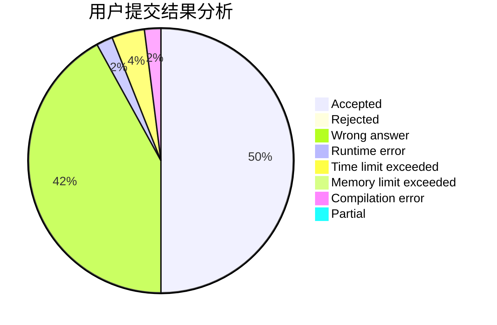
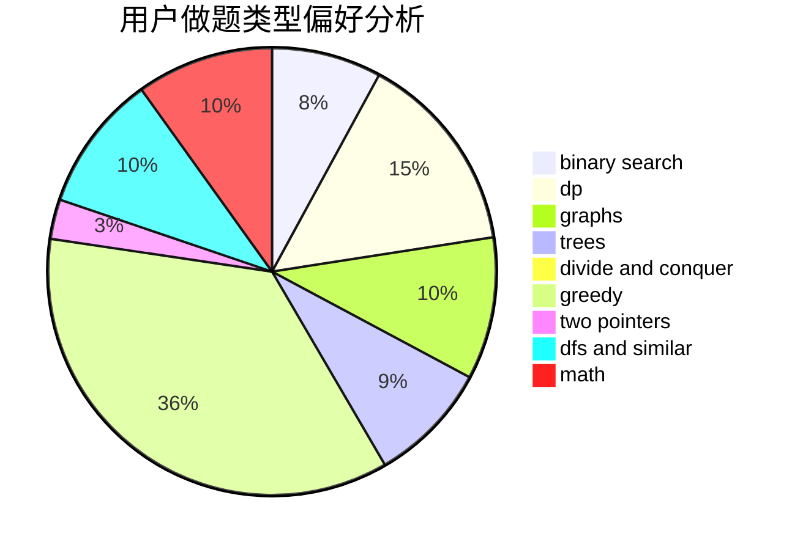

# medium_waxberry

<!-- tabs:start -->

#### **用户提交结果分析**

#### **用户做题类型偏好分析**

<!-- tabs:end -->
# 推荐题目
[1484B](https://codeforces.com/contest/1484/problem/B)
[1266D](https://codeforces.com/contest/1266/problem/D)
[1316E](https://codeforces.com/contest/1316/problem/E)
[1435E](https://codeforces.com/contest/1435/problem/E)
[1312E](https://codeforces.com/contest/1312/problem/E)
[947D](https://codeforces.com/contest/947/problem/D)
[460D](https://codeforces.com/contest/460/problem/D)
[1133A](https://codeforces.com/contest/1133/problem/A)
[482E](https://codeforces.com/contest/482/problem/E)
[956D](https://codeforces.com/contest/956/problem/D)
