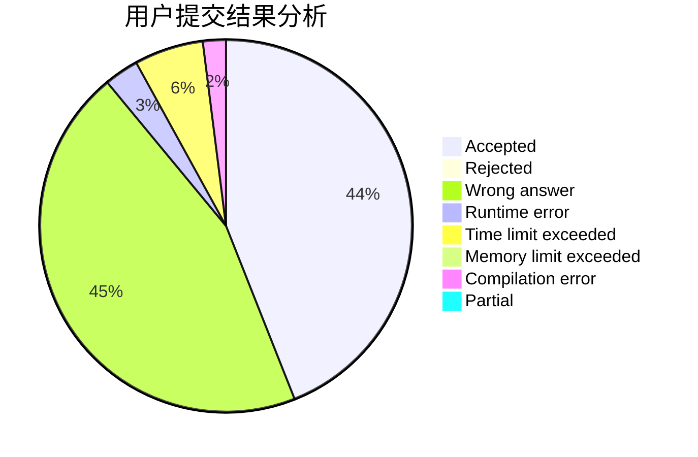
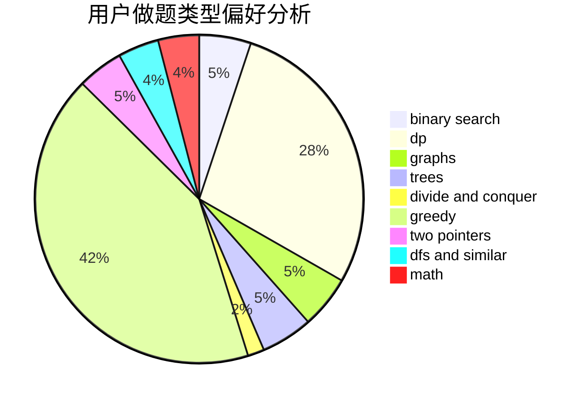

# megumin007

<!-- tabs:start -->

#### **用户提交结果分析**

#### **用户做题类型偏好分析**

<!-- tabs:end -->
# 推荐题目
[1188D](https://codeforces.com/contest/1188/problem/D)
[1397E](https://codeforces.com/contest/1397/problem/E)
[721D](https://codeforces.com/contest/721/problem/D)
[468B](https://codeforces.com/contest/468/problem/B)
[759E](https://codeforces.com/contest/759/problem/E)
[1248B](https://codeforces.com/contest/1248/problem/B)
[11412](https://codeforces.com/contest/1141/problem/2)
[464C](https://codeforces.com/contest/464/problem/C)
[801C](https://codeforces.com/contest/801/problem/C)
[770C](https://codeforces.com/contest/770/problem/C)
