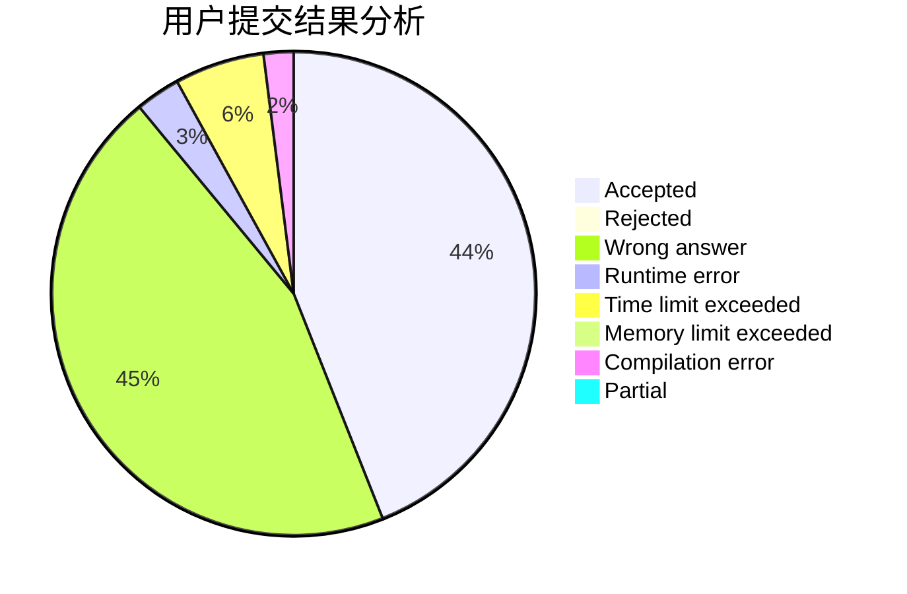
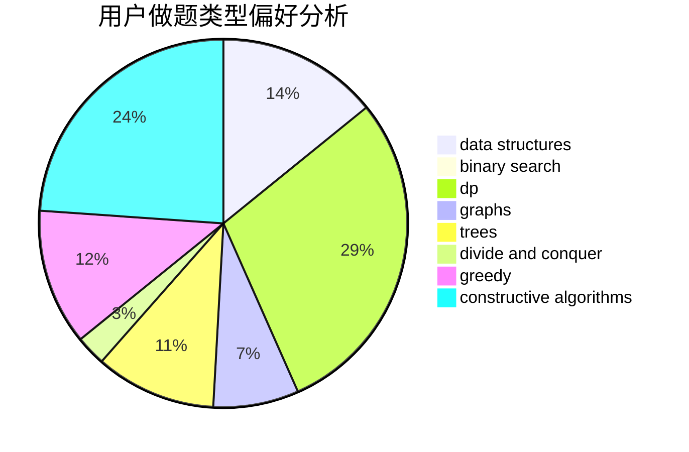

# megumin007

<!-- tabs:start -->

#### **用户提交结果分析**

#### **用户做题类型偏好分析**

#### **用户错题知识点分析**

<!-- tabs:end -->
# 推荐题目
[1188D](https://codeforces.com/contest/1188/problem/D)		dp		  
[1397E](https://codeforces.com/contest/1397/problem/E)		dsu,graphs,sortings,trees		  
[721D](https://codeforces.com/contest/721/problem/D)		constructive algorithms,
                        data structures,
                        greedy,
                        math		  
[468B](https://codeforces.com/contest/468/problem/B)		2-sat,
                        dfs and similar,
                        dsu,
                        graph matchings,
                        greedy		  
[759E](https://codeforces.com/contest/759/problem/E)		dsu,graphs,sortings,trees		  
[1248B](https://codeforces.com/contest/1248/problem/B)		greedy,
                        math,
                        sortings		  
[11412](https://codeforces.com/contest/1141/problem/2)		dsu,graphs,sortings,trees		  
[464C](https://codeforces.com/contest/464/problem/C)		dp		  
[801C](https://codeforces.com/contest/801/problem/C)		dsu,graphs,sortings,trees		  
[770C](https://codeforces.com/contest/770/problem/C)		*special problem,
                        dfs and similar,
                        graphs,
                        implementation		  
