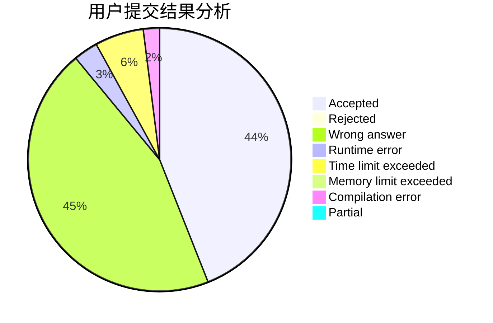
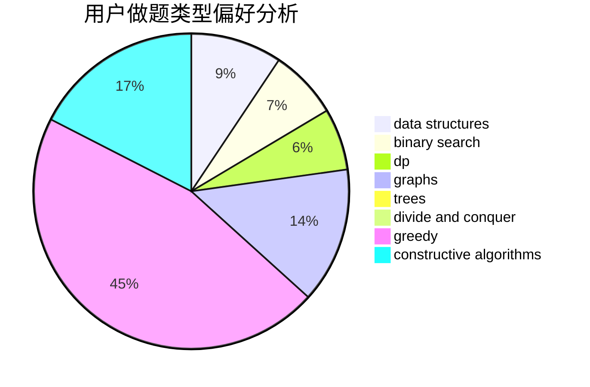

# megumin007

<!-- tabs:start -->

#### **用户提交结果分析**

#### **用户做题类型偏好分析**

#### **用户错题知识点分析**

<!-- tabs:end -->
# 推荐题目
[1184E2](https://codeforces.com/contest/1184E/problem/2)		dfs and similar,
                        graphs,
                        shortest paths,
                        trees		  
[1388B](https://codeforces.com/contest/1388/problem/B)		greedy,
                        math		  
[702F](https://codeforces.com/contest/702/problem/F)		data structures		  
[448B](https://codeforces.com/contest/448/problem/B)		implementation,
                        strings		  
[739A](https://codeforces.com/contest/739/problem/A)		constructive algorithms,
                        greedy		  
[1243B2](https://codeforces.com/contest/1243B/problem/2)		strings		  
[1139E](https://codeforces.com/contest/1139/problem/E)		flows,
                        graph matchings,
                        graphs		  
[444D](https://codeforces.com/contest/444/problem/D)		binary search,
                        hashing,
                        strings,
                        two pointers		  
[784C](https://codeforces.com/contest/784/problem/C)		*special problem,
                        implementation		  
[750F](https://codeforces.com/contest/750/problem/F)		constructive algorithms,
                        implementation,
                        interactive,
                        trees		  
