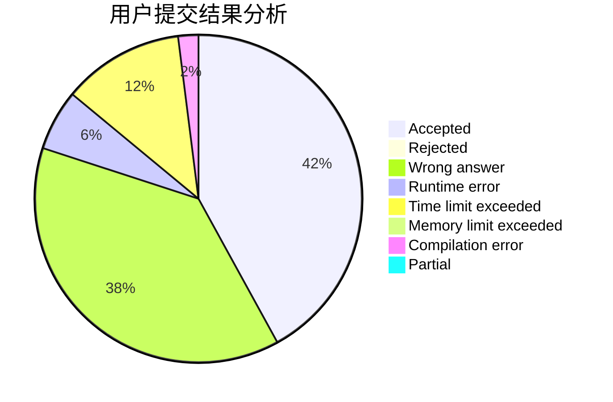
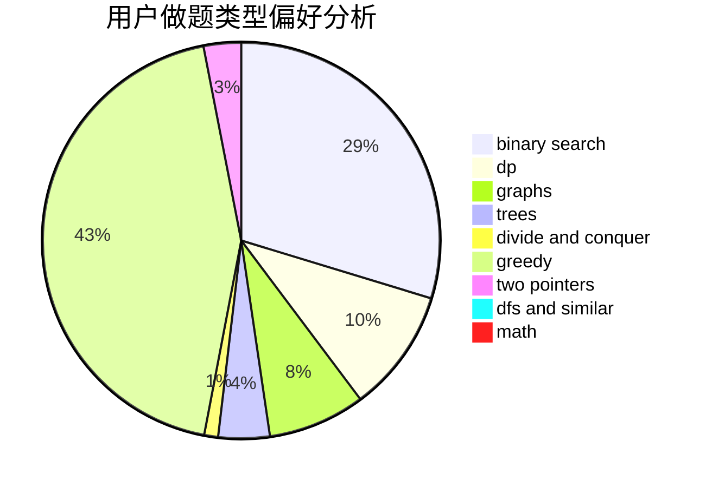

# meguriri

<!-- tabs:start -->

#### **用户提交结果分析**

#### **用户做题类型偏好分析**

<!-- tabs:end -->
# 推荐题目
[627E](https://codeforces.com/contest/627/problem/E)
[1044D](https://codeforces.com/contest/1044/problem/D)
[1290A](https://codeforces.com/contest/1290/problem/A)
[1362E](https://codeforces.com/contest/1362/problem/E)
[699C](https://codeforces.com/contest/699/problem/C)
[793G](https://codeforces.com/contest/793/problem/G)
[908F](https://codeforces.com/contest/908/problem/F)
[273D](https://codeforces.com/contest/273/problem/D)
[466E](https://codeforces.com/contest/466/problem/E)
[1150E](https://codeforces.com/contest/1150/problem/E)
